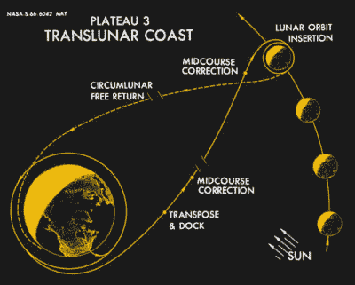
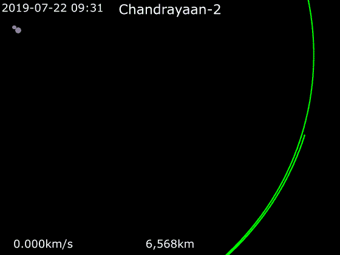
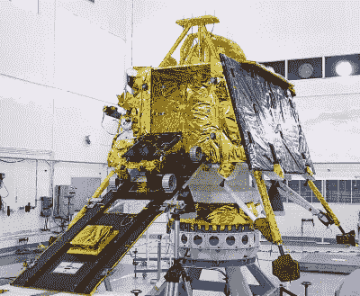

# 印度用月船 2 号一次性发射了月球轨道飞行器、着陆器和漫游车

> 原文：<https://hackaday.com/2019/08/14/india-launched-a-moon-orbiter-lander-and-rover-all-in-one-shot-with-chandrayaan-2/>

7 月 22 日，印度启动了一项雄心勃勃的任务，同时向月球发射轨道飞行器、着陆器和漫游车。“月船 2 号”由国产 GSLV Mk III 火箭从萨迪什·达万航天中心发射，预计将于 8 月 20 日进入月球轨道。如果一切顺利，这次任务的登月舱将于 9 月 7 日着陆。

尝试这种性质的多方面任务是一个大胆的举动，但印度空间研究组织(ISRO)确实有经验的好处。2008 年发射的月船 1 号任务在月球轨道上运行了近一年。该任务还包括所谓的月球撞击探测器(MIP)，它故意撞上沙克尔顿环形山附近的表面。MIP 的设计并不是为了在撞击中幸存下来，但它仍然使印度在已经在月球表面放置物体的国家的短名单中占据了一席之地。

如果以印度航天先驱维克拉姆·萨拉巴伊的名字命名为*维克拉姆*的“月船 2 号”的着陆器组件能够安全着陆月球表面，这将是 ISRO 的一项历史性成就。迄今为止，只有苏联、美国和中国实现了可控登月。今年早些时候，以色列似乎将成为第四个用他们的*贝雷片*宇宙飞船[完成这一壮举的国家，但是最后一秒钟的故障导致飞船坠毁在表面。不幸的是，尽管以色列领先，印度还是意外地获得了梦寐以求的第四名。](https://hackaday.com/2019/04/11/israels-moon-lander-crashed-and-thats-ok/)

离大事件还有几个月的时间，但到目前为止，一切都按照月船 2 号的计划进行。当我们等待飞船成功进入绕月轨道的消息时，让我们仔细看看这个雄心勃勃的任务应该如何进行。

## 机器人不需要冲

Apollo Trans-Lunar Injection

考虑到阿波罗 11 号 50 周年纪念让每个人都再次谈论月球，你可能知道尼尔·阿姆斯特朗、迈克尔·科林斯和巴兹·奥德林没有花几个月时间挤在相对较小的指挥舱里。他们仅用了八天就完成了往返旅行，包括游览月球表面。因此，如果 1969 年只花了几天就到达了月球，为什么 Chandrayaan-2 在 2019 年要花两个月才能完成同样的旅程？

简而言之，加速往返月球是飞船上的人类所必需的。在太空舱里的每一天，宇航员都需要呼吸空气、吃东西和喝水。由于这种人为因素，阿波罗任务采取了可能的最短路线:从地球轨道直接转移到月球的引力影响范围。为了执行这项被称为跨月注入(TLI)的机动任务，他们需要一个极其强大的火箭，可以将航天器加速到必要的速度。进入高耸的土星五号，它仍然保持着有史以来投入运行的最强大火箭的记录。

Chandrayaan-2 projected orbit

公平地说，月球 2 号的质量约为阿波罗飞船的 8.5%，当然不需要像土星 5 号那样强大的火箭来执行类似的 TLI。但是它需要一个比 GSLV Mk III 更强大的火箭，后者是为发射地球同步通信卫星而设计的。将宇宙飞船放入地球同步转移轨道，使其加速到足以到达月球的速度。正因为如此，Chandrayaan-2 将需要通过一系列燃烧来弥补这一差异，这些燃烧旨在在未来几周内逐渐提升其轨道。

这种到达月球的方法对于人类任务来说是完全不切实际的。但是月船 2 号仅有的乘客是维克拉姆号着陆器和 T2 号探测车，没有人抱怨他们乘坐经济舱。值得注意的是，商业发射提供商当然可以将任务放在更直接的月球路线上，但月船 2 号完全是“本土”的，这涉及到民族自豪感的某个方面。

## 月球操作

假设在 8 月 20 日左右成功捕获月球，Chandrayaan-2 将继续进行几次发动机燃烧，以逐渐降低其绕月轨道，最终目标是在 100 公里的高度上实现圆形轨道。飞船的轨道器模块将在这个轨道上停留一年或更长时间，操作一套旨在研究月球表面的仪器，包括高分辨率相机和合成孔径雷达。

*Vikram* lander with *Pragyan* rover visible

当轨道飞行器停留在上方时，*维克拉姆*着陆器将分离并开始准备下降。它将首先调整轨道，以 30 公里的高度飞越月球南部地区，在那里它将扫描表面，寻找合适的着陆点。一旦飞行器完成了一系列的自检，它将进行一次着陆燃烧，这将使它在 9 月 7 日停在南极附近的艾特肯盆地。该地区被选中是因为其相对平坦的地形和有趣的矿藏。

着陆的时间很重要，因为目标是在持续 14 个地球日的太阴日开始时将维克拉姆号放在地球表面。由于预计飞船无法熬过接下来的月夜，着陆的任何延迟都将导致在表面进行科学研究的时间减少。[在农历日着陆太晚，缩短了中国的嫦娥四号任务](https://hackaday.com/2019/01/23/the-short-and-tragic-story-of-life-on-the-moon/)，ISRO 肯定希望通过月船 2 号避免这种命运。

在表面上， *Vikram* 有许多仪器可供使用，包括地震仪和温度探测器。它还携带了由美国宇航局戈达德太空飞行中心建造的激光反向反射器阵列，这将允许轨道卫星在经过头顶时进行精确的距离测量。但是当*号普拉吉安*号火星车的舷梯降下时，这次任务真正的亮点就来了。

类似于美国宇航局部署在火星上的*漫游车*,*Pragyan*将使用 3D 立体相机在月球表面导航，并使用其激光和 x 射线分光镜进行观察。漫游车将行驶到距离*维克拉姆*大约 500 米的地方，使用着陆器作为它和地球上地面控制之间的通信中继。

## 逐步成功

太空旅行已经非常困难，但在另一个世界进行可控着陆并存活足够长的时间进行有用的科学研究更具挑战性。很少有国家能够完成这一壮举，这是有原因的。苏联在 1966 年给人类第一次近距离观察月球表面的机会之前尝试了九次，美国在他们试图让 T2 勘测者 1 号着陆之前就坠毁了几个游侠级探测器。鉴于历史上的先例，当谈到在同一个任务中部署轨道飞行器、着陆器和漫游车时，“雄心勃勃”可能有点轻描淡写。

但重要的是要记住，无论发生什么，印度空间研究组织将能够收集重要的数据，并获得宝贵的现实世界的经验。如果*维克拉姆*下得太猛，或者*普拉吉安的*坡道堵塞，那肯定会令人失望。但这不会是浪费。