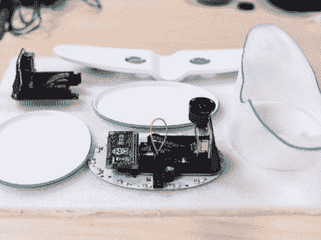

# 问 Hackaday:你会如何为孩子们制作这个飞行追踪器？

> 原文：<https://hackaday.com/2019/08/02/ask-hackaday-how-would-you-build-this-flight-tracker-for-kids/>

你必须把它交给营销人员——他们真的知道如何让你想要某样东西。只需要一点父母的内疚，一点技术上的魔法，然后，你就被锁进了一个你从来不知道自己需要的产品里。

这个儿童飞行追踪夜灯原型就是一个很好的例子。目前由加拿大航空公司 WestJet 开发，这个想法是为旅行的父母提供一种方法，让孩子们知道还有多久妈妈或爸爸才能从他们的旅行中回家。原型展示了一架风格化的喷气式客机，底部有 Neopixel 照明。机翼上的一对投影仪在孩子昏暗的卧室天花板上照亮了一条动画飞行路线，告诉他们任性的父母何时会回来。抛开下面视频中的无聊话题，或许还能克服你对那些仍在急切等待孩子归来的父母的嫉妒，这其实是个不错的主意。

 现在该问:你会如何着手建造这样的东西？更重要的是，你如何让它适用于任何飞机、火车或汽车旅行，而不仅仅是西捷航空公司的航班？看一看页面的“它将如何工作”部分显示了原型的几张照片，这表明硬件端是非常容易的。树莓 Pi Zero W 功能突出，投影仪似乎是 TI 的 DLP2000EVM，我们在之前已经介绍过的[，安装在 riser 卡上。Neopixels、3D 打印外壳和多余的手电筒机身也非常简单。](https://hackaday.com/2018/06/06/pocket-projector-uses-raspberry-pi/)

在软件方面，一个跟踪任何航空公司航班的通用版本需要一个界面，供旅行者定义航班，并检查 FlightAware 之类的 API，或针对您使用的任何交通方式的类似 API。

似乎是一个非常简单的项目。WestJet 声称他们将在今年夏天的某个时候准备好飞行灯；你觉得我们能打败他们吗？

 [https://www.youtube.com/embed/-C00FGmht8w?version=3&rel=1&showsearch=0&showinfo=1&iv_load_policy=1&fs=1&hl=en-US&autohide=2&wmode=transparent](https://www.youtube.com/embed/-C00FGmht8w?version=3&rel=1&showsearch=0&showinfo=1&iv_load_policy=1&fs=1&hl=en-US&autohide=2&wmode=transparent)

感谢[菲利普]的提示。