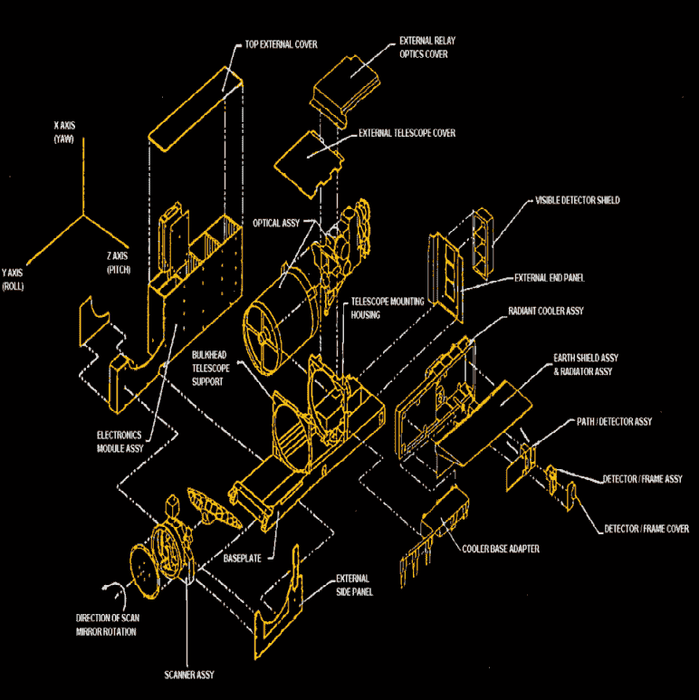
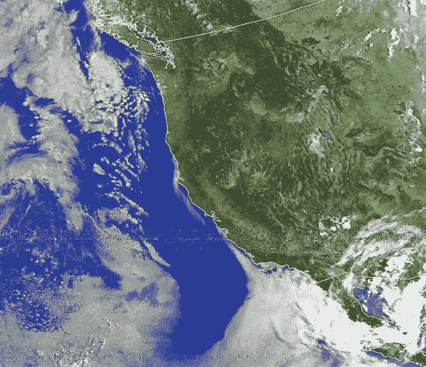
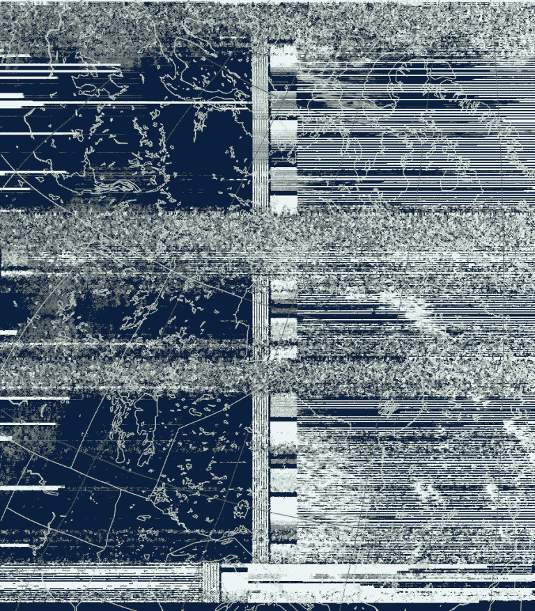

# 从 SDR 看气象卫星的死亡

> 原文：<https://hackaday.com/2019/08/12/the-death-of-a-weather-satellite-as-seen-by-sdr/>

当一颗设计用于两年任务的气象卫星在发射 21 年后开始出现故障时，这个世界将会变成什么样子？我是说，真的——如今的骄傲在哪里？

玩笑归玩笑，NOAA-15 号卫星于 1998 年发射，用于监测地表温度和其他气象和气候参数，最近似乎开始显示出它的年龄。这就是事情的方式，一般来说，卫星退役对公众来说并不重要，除非它在空中壮观而短暂地脱离轨道。

但是 NOAA-15 和她的姐妹卫星在一群狂热爱好者中有着热情的追随者，他们利用自制的天线和廉价的 SDR 接收器，花时间从他们头顶呼啸而过的信号中寻找答案。正是这些爱好者最先注意到 NOAA-15 的灾难，在过去的几周里，随着卫星信号的来去，他们一直忙于悲叹和庆祝。他们与卫星分分合合的浪漫值得一看，正如这只鸟到底出了什么问题一样。

## 天空之眼

NOAA-15\. Source: [Gunter’s Space Page](https://space.skyrocket.de/doc_sdat/noaa-k.htm)

NOAA-15 的传统可以追溯到 20 世纪 60 年代初，当时气象学家意识到，带有红外成像仪的卫星将是收集表面温度、水汽分布和其他参数的好方法，这些数据将用于像样的天气预报。第一颗电视红外观测卫星，简称 TIROS，是极其简单的卫星，携带的东西只不过是一台电视摄像机和一台发射机。但是这些卫星从太空传回了第一张地球照片，并让人们第一次看到了遥感的未来。

四十多年后，气象卫星已经证明了它们的价值，在负责收集天气和气候数据并将其转化为有用产品的美国政府机构国家海洋和大气管理局的支持下，一个令人印象深刻的气象卫星星座投入了使用。NOAA-15 与同卵姐妹 NOAA-16 和 NOAA-17 一起加入了这个星座。

Exploded view of the AVHRR – click to enlarge. Scanner assembly at lower left. Source: [NOAA KLM User Guide](https://www1.ncdc.noaa.gov/pub/data/satellite/publications/podguides/N-15%20thru%20N-19/pdf/0.0%20NOAA%20KLM%20Users%20Guide.pdf)

这些卫星统称为 NOAA KLM，每颗卫星的太阳同步轨道略有不同，每颗卫星都配备了最新的遥感技术。除了因 5G 手机的推出而面临潜在风险的微波探测单元之外，NOAA KLM 卫星还配备了一种称为 AVHRR 的仪器，即高级甚高分辨率辐射计。这台仪器将成为卫星的主力，以可见光和红外的六种不同波长产生地球的图像。

为了产生图像，一个扫描马达旋转一个平的铍镜，它以一个角度安装在一个 8 英寸(20 厘米)的反射望远镜前面。马达以每分钟 360 转的速度旋转镜子，以 1.09 公里宽的条带扫描下面的表面。每个条带的数据被数字化，并通过甚高频无线电链路传输，这是专门设计的，以便低成本的地面站能够直接接收和解码传输。

## 轻松音乐

NOAA KLM 的设计者可能从未想到他们的卫星会比其设计寿命长十倍以上，更不用说当廉价的软件无线电时代到来时，它还会继续服役。但是他们决定开放和接入下行链路是无线电爱好者监听鸟类的关键，起初是在繁荣时期，现在是在萧条时期。

听 NOAA 卫星其实挺容易的；至少从 2012 年的这篇文章开始，我们已经介绍了如何做到这一点。一个最小的地面站的基本设置是一个 SDR 加密狗，很容易从通常的嫌疑人那里得到几块钱；一种天线，可以简单到只有一根插入 SDR 天线插孔的 2 米长的电线；主机上有一个简单的软件工具链，以 [WxToIMG](http://www.wxtoimg.com/) 结束，还有一个应用程序，它不仅能解码从下行链路返回的数据并重组图像，还能告诉你卫星何时到达你的位置。设置可以在此基础上发展，配备更好的天线、灵敏的放大器和更高质量的 SDR，但基本配置仍然非常实惠。

直到今年，从 NOAA-15 收到的图像基本正常。结果因使用的设置而异，信号中总会有一些噪声，但总的来说，图像非常有用。但是 4 月中旬发回地面的图像开始显示出伪像——宽波段的颜色，显然不是简单的射频噪声或其他一些先前看到的干扰。RTL-SDR subreddit 上的线程纷纷猜测原因，最终被 NASA 证实是 AVHRR 的扫描电机出现了某种故障。

## 分分合合

AVHRR 能做什么迟至 7 月 28 日。来源: [r/RTLSDR](https://www.reddit.com/r/RTLSDR/comments/cjllvb/well_i_guess_noaa_15_isnt_back_anymore/) 用户【notipa】

NASA 最初将责任归咎于扫描电机中轴承的润滑剂流失。这并不是一个很大的范围；太空是一个很难做生意的地方。润滑剂问题几乎扼杀了*伽利略*前往木星的任务，而由于日冕物质抛射和其他空间天气现象期间经历的电弧导致的轴承故障已经[导致了几个航天器的死亡](https://hackaday.com/2018/09/11/do-space-probes-fail-because-of-space-weather/)。由于扫描仪电机的转速比设计转速高出约 30 亿转，因此假设这是原因并不为过。

然而，NOAA-15 的问题只是暂时的，扫描仪马达似乎自己松开了。但问题在 7 月下旬再次出现，图像中出现了更多的伪像。美国宇航局发布了对遥测数据的分析，这些数据表明扫描电机产生的电流突然达到 302 mA，扫描组件的温度也有所上升。这表明一个电机停转，可能是由于扫描头中的轴承磨损。AVHRR 不再产生数据，看起来 NOAA-15 的末日终于来临了。

Portrait of a dying satellite. Source: [Karsey Renfert](https://karsey.dev/me/2019/07/23/is-noaa-15-dying/)

AVHRR 于 7 月 25 日恢复运行，连续几天再次产生数据。7 月 30 日，马达再次熄火，这一次 AVHRR 似乎不会恢复到可靠的状态。然而，8 月 7 日有更多的报道称，可靠的图像再次源源不断地传来。

自从 2005 年发射 NOAA-18 和 2009 年发射 NOAA-19 以来，NOAA-15 一直是一颗备份卫星，因此在它缺席的情况下，天气数据仍将流动。这颗注定要毁灭的卫星很可能很快就会退役，当它退役时，一旦它被推进墓地轨道，爱好者们无疑会调整他们的 SDR 来收听。