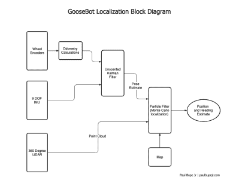

# 设计一个先进的自主机器人:Goose

> 原文：<https://hackaday.com/2019/08/08/designing-an-advanced-autonomous-robot-goose/>

机器人学很难，也许不像天体物理学或理解人类关系那么难，但从头开始设计一个赢得比赛的机器人绝不容易。好吧，所以小保罗·布佩的机器人“鹅”没有赢得比赛，但是我们很想知道它会下什么金蛋。

该机器人的机械结构基于一个相当标准的双轨驱动系统，这使得控制转弯比使用车轮容易得多。为什么要让生活变得更加艰难呢？但我们真正感兴趣的是控制系统的设计以及这些设计选择背后的基本原理。

左边的图表可能看起来很复杂，但本质上该系统是基于两个“大脑”，Teensy 微控制器(MCU)和一个 Raspberry Pi，尽管大多数工作是由 MCU 执行的。MCU 以 96 MHz 的速度运行，足以实时处理来自编码器和 IMU 的数据，从而使机器人能够快速平稳地响应传感器。更复杂和“繁重”的任务，如激光雷达和计算机视觉(CV)在 Pi 上执行，Pi 运行“机器人操作系统”(ROS)，通过几个“节点”与 MCU 通信。

比赛本身要求机器人在一个大盒子的墙壁内绕大圈行进，同时避开特定的物体。显然，GPS 或任何其他形式的航位推算都不会让机器保持在轨道上，所以它严重依赖“激光雷达点云数据”来有效地随时确定机器人的位置。现在我们真的到了设计的关键，所有可用的传感器被组合起来，并输入到一个“粒子滤波算法”:

我们特别喜欢这个项目的一点是，每件事都解释得很清楚，没有太多花哨的术语或缩写。[Paul Bupe，Jr]显然花了时间将整体复杂性降低到更易于管理的概念，这鼓励我们进一步探索。也许[保罗]自己可能有时间为机器人的每个系统制作单独的教程？

我们很可能对这个机器人的名字读得太多了，“鹅”是惊奇队长集市上的“跨物种”猫，最终会产下一大堆蛋。但是这个机器人能帮助小型机器人达到事实上的标准吗？

我们已经在 Hackaday 上看到了其他[竞赛机器人](https://hackaday.com/2019/05/15/2019-cornell-cup-winners-include-autonomous-boat-flapping-uav-and-leaping-rover/)，并希望看到更多！

休息后的视频:

 [https://www.youtube.com/embed/TZl-nySItxE?version=3&rel=1&showsearch=0&showinfo=1&iv_load_policy=1&fs=1&hl=en-US&autohide=2&wmode=transparent](https://www.youtube.com/embed/TZl-nySItxE?version=3&rel=1&showsearch=0&showinfo=1&iv_load_policy=1&fs=1&hl=en-US&autohide=2&wmode=transparent)

