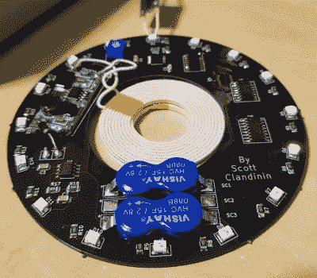

# 超大杯杯垫是派对的生命

> 原文：<https://hackaday.com/2019/08/05/supercap-drink-coasters-are-the-life-of-the-party/>

你可能以前见过嵌入透明塑料杯或杯垫中的多色闪烁 led，它们在高档餐厅中非常常用，这些餐厅还设有电子动画角色和一家礼品店。但是你有没有想过维护这种设备的后勤工作？当拟人化的啮齿动物晚上停止活动时，你会想要清理所有那些闪烁的小玩意儿；但任何连接充电器或插入电池的开口都只是一个等待发生的漏洞。

 【斯科特·克兰丁】已经想出了解决这个问题的办法，这是辉煌的简单和毫不掩饰的过度工程。利用无线充电和超级电容器，[他正在开发一种可以密封在透明树脂中的 LED 杯垫](https://hackaday.io/project/164817-led-coaster-wirelessbatteryless)。

没有插头连接或电池更换，这些杯垫可以永久封装，没有不良影响。尽管超级电容器会随着时间的推移而退化，最终不会保持充电这么长时间，但即使是最保守的估计也能让这些杯垫在十年内继续狂欢。

对于他的原型版本，[斯科特]已经组装了一个简单的充电底座，但我们想象在完全部署的情况下，这种设备可以通过内置在酒吧或桌子上的感应线圈充电。虽然能源消耗可能是一个阻碍，但我们希望看到一个集成无线电接收器的未来版本。然后杯垫可以兼作传呼机，让用餐者知道他们的桌子准备好了。

虽然这种设备显然比传统杯垫厚得多，但即使在早期阶段，它看起来也相当合理。我们喜欢将线圈放在 PCB 内部的同心设计，并想知道是否可以使用类似的切口来使双 15F 超级电容器和充电模块再下沉几毫米。2019 年的 Hackaday 奖完全是关于将一个想法演变成适合生产的设计，这些都是评委们肯定会关注的增量改进。

The [HackadayPrize2019](https://prize.supplyframe.com) is Sponsored by:     