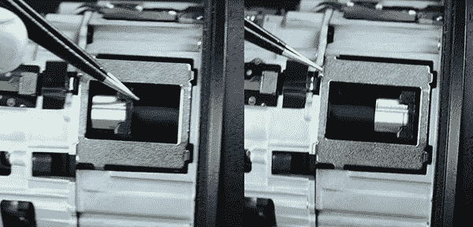

# 昂贵的索尼镜头维修揭示垫片和转移

> 原文：<https://hackaday.com/2019/08/06/expensive-sony-lens-repair-reveals-shims-shifts/>

摄影租赁公司 Lensrentals 有一个价值 2k 的索尼 FE 135mm f1.8 GM 相机镜头返回时出现了一个问题:它有对焦问题。所以，他们决定做一件显而易见的事情，把它拆开。这是对高端相机镜头的一些工程设计的迷人见解。

这可能是一件相当可怕的事情，因为这是一个非常新的镜头，甚至还没有维修手册。这就好比你从未打开过引擎盖，却重新拥有了一辆法拉利。

其中一个有趣的事情是里面有一些调整透镜元件组之间位置的垫片。看起来不管它们的制造公差有多好，有时你只需要在里面放一两个垫片来调整。

The focus motor moving back and forth. Lensrentals.com, 2019.

还有一个引人入胜的对焦机制，前后滑动其中一个元素组来对焦镜头。同样，还有一些手动调节，用螺钉来保持这组透镜元件对齐。

不幸的是，Lensrentals 并没有全力以赴地拆除:当他们发现问题时，他们停止了，其中一个元素发生了变化，影响了整个镜头的性能。这很遗憾，因为相机镜头是微型电机创新的主要驱动力，需要快速准确地移动大量元件来对焦。尽管有一个光圈元件的极好视图，它可以看到镜头如何使用十二个金属叶片来创建一个几乎完美的圆形光圈。

如果你不想拆开自己昂贵的相机镜头，这篇文章非常值得一读。