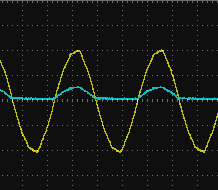

# 嗅闻变压器将有线门铃上线

> 原文：<https://hackaday.com/2019/08/06/sniffed-transformer-puts-wired-doorbell-online/>

肯定不缺少“智能”设备，无论何时有人上门，它们都会给你提供通知，甚至是实时的视听流。但是正如我们以前无数次看到的那样，并不是每个人都对这些产品的运作条款感到兴奋。当送披萨的人出现时，在手机上收到通知不应该需要电子邮件地址、信用卡号码或 DNA 样本。

对尼克·图兰来说，一半的工作已经完成了。他的家里已经有一个传统的有线门铃，他只需[想出一个微创的方法，将其与家庭助理](https://partofthething.com/thoughts/making-my-analog-doorbell-smart-by-simply-attaching-a-7-sensor-to-it/)连接起来。他推断，他可以接入门铃变压器的低压端，观察指示门铃正常工作的波动。ESP8266 有一个 ADC 来测量电压，并有 WiFi 来连接到 Home Assistant，因此它似乎是新旧之间的完美桥梁。

Transformer voltage before and after

当然，就像任何有价值的项目一样，它最终会变得更加复杂。有线门铃通常在 16-24 伏交流电下运行，尼克知道如果他试图把他的 D1 放在电线上，他会释放出致命的魔法烟雾。他需要的是一个分压器电路，可以将低压交流电降低到微控制器可以应付的更低的 DC 电压。

简单的电路[尼克]想出了削减电压的方式，并完全消除了消极的组成部分。因此，原来的 18.75 伏交流电变成了一系列 60 赫兹的 2.4 伏直流电；非常适合馈入微控制器 ADC。有了基线，他就可以编写一些代码来观察信号的变化，以确定铃声何时响起。

或者至少，这是我的想法。虽然该设置在工作台上工作得足够好，但它在现实世界中的性能还有待改进。如果他的房客出手很重，那就很管用。但是快速按一下门铃按钮往往不会被发现。在调查这个问题后，[Nick]发现他需要使用一些软件技巧来确保 ESP8266 能够跟上快速信号。一旦他能够可靠地检测到短时间和长时间的按钮按压，剩下的就是简单地向他的自动化系统发送 MQTT 消息。

相比于我们看到的其他黑客为了弄清楚他们的门铃而不得不跳过的关卡，我们认为[尼克]逃脱得相当容易。这个项目也是一个很好的例子，说明[学习电路设计和无源元件](https://hackaday.com/2018/08/08/memories-of-a-mis-spent-youth-learnabout-simple-electronics/)在 Arduino 时代仍然可以派上用场。

 [https://www.youtube.com/embed/QhbSbNmrc-o?version=3&rel=1&showsearch=0&showinfo=1&iv_load_policy=1&fs=1&hl=en-US&autohide=2&wmode=transparent](https://www.youtube.com/embed/QhbSbNmrc-o?version=3&rel=1&showsearch=0&showinfo=1&iv_load_policy=1&fs=1&hl=en-US&autohide=2&wmode=transparent)

