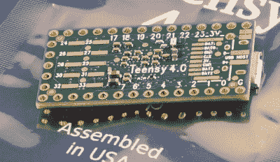
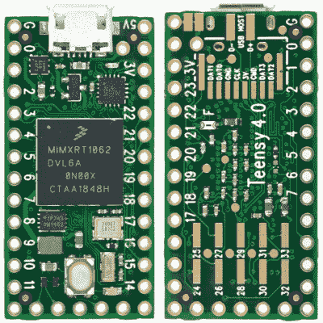

# 新的 Teensy 4.0 打破了基准，实现了自我恢复，回到了更小的形式

> 原文：<https://hackaday.com/2019/08/07/new-teensy-4-0-blows-away-benchmarks-implements-self-recovery-returns-to-smaller-form/>

Paul Stoffregen 再次做到了:[Teensy 4.0 已经发布](https://www.pjrc.com/store/teensy40.html)。作为 Teensy 微控制器开发板系列的最新产品，4.0 恢复了 3.2 的较小外形，而不是较大的 3.5 和 3.6 板。

不要让较小的尺寸欺骗了你；4.0 基于运行频率为 600 MHz 的 ARM Cortex M7。)，这是 2019 年你可以获得的最快的微控制器，对真实世界示例的测试显示，它执行代码的速度比 Teensy 3.6 快 5 倍以上，比 Teensy 3.2 快 15 倍。当然，新板还配有外设，包括两个 480 Mbps USB 端口、3 个数字音频接口、3 条 CAN 总线和多个支持集成 FIFOs 的 SPI/I2C/串行接口。编程？简单:Arduino IDE 有一个名为 Teensyduino 的附加组件，可以“正常工作”。它的建议零售价仅为 19.95 美元；一个受欢迎的价位，但对于微控制器分线板来说并不意外。

该板今天发布，但我有机会在过去几天里在东海岸的一个 Hackaday 实验室试驾了其中的几款。那么，让我们仔细看看。

## 第一印象 

该板表面上看起来与旧的 3.2 相似，至少从顶部看是这样。有常见的双排引脚头，你可以插入试验板，微型 USB 连接器和复位按钮。USB 连接器附近的新红色 LED 为您提供一些状态信息，而传统的“Arduino LED”是橙色的。把这块板翻过来，你会开始看到这块板所拥有的一些额外的力量。除了十多个 GPIO 引脚，还有用于使用 4 位 SDIO 的 SD 卡接口的焊盘，以及用于第二个 480 Mbps USB 接口的 D+和 D-线。未标记的圆形焊盘是制造过程中使用的测试点，从最终用户的角度来看是无连接的。

## 十几岁的孩子。 2 黑仔的一切？

进行硬件审查时，选择正确的比较硬件至关重要。我认为在这种情况下，最好的比较是在两个具有相同外形的主板之间进行；青少年 4.0 和 3.2。我选择不与 Teensy 3.5 和 3.6 进行比较，它们的价格略高，尺寸更大，并且焊接了 SD 卡插槽。

令人难以置信的是，Teensy 4.0 的售价为 19.95 美元，而 Teensy 3.2 的售价为 19.80 美元。额外的 15 美分能买什么？首先是性能。4.0 的 600 MHz 时钟与 3.2 的 72 MHz 时钟并不能说明全部情况。4.0 上的 Cortex M7 是一款双发布超标量处理器，每个时钟周期能够执行多达两条 32 位指令；最初的测试表明，在 Arduino 编译的代码中，这种情况发生的几率在 40-50%之间。此外，Cortex-M7 是首款具有分支预测功能的 ARM 微控制器。在 Cortex M4 上，一个分支总是需要 3 个时钟周期，例如，经过几次循环后，Cortex M7 可以在一个时钟周期内开始执行正确预测的分支。这是最初在超级计算机中首创的技术，你可以用在你的下一个万圣节服装中。

 于是，就有了浮点。经验丰富的嵌入式程序员可能对浮点代码有偏见，这是有充分理由的。如果没有本机浮点指令，这些操作必须被模拟，并且运行非常缓慢。在只支持单精度指令的处理器上，双精度运算也会发生同样的情况。虽然 Cortex-M4 处理器支持单精度浮点，但 Cortex-M7 包括本机双精度指令，因此如果您需要 doubles 提供的额外精度，您不会受到巨大的性能影响:基本上，doubles 似乎只在两倍于 floats 的周期内执行。

该主板上的 Cortex-M7 还支持紧耦合内存(TCM ),可像缓存一样提供快速访问，但没有会使硬实时应用复杂化的不确定性，这是其他高功率微控制器的问题之一。64 位 ITCM 总线可以获取 64 位，而两条专用的 32 位总线(DTCM)每个周期可以从 TCM 获取多达两条指令——这些总线独立于用于与其他存储器和外设通信的主 AXI 总线。Teensyduino 环境自动将代码和静态分配的内存分配到 DTCM 区域，该区域的大小可达 512K，尽管您可以使用一些命令行开关来覆盖默认行为。不通过紧耦合总线访问的存储器针对外设使用 DMA 访问进行了优化。

## 规格表

尽管尺寸很大，但这款主板和它携带的芯片有很多，因此这里有一个精简的规格列表:

*   600 MHz 时的 ARM Cortex-M7
*   1024K RAM (512K 是紧耦合的)
*   2048K 闪存(64K 保留用于恢复和 EEPROM 仿真)
*   2 个 USB 端口，均为 480 兆位/秒
*   3 条 CAN 总线(1 条带 CAN FD)
*   2 I2S 数字音频
*   1 秒/PDIF 数字音频
*   1 个 SDIO (4 位)本地 SD
*   3 个 SPI，均带有 16 字 FIFO
*   3 个 I2C，全部采用 4 字节 FIFO
*   7 个串行端口，均带有 4 字节 FIFO
*   32 个通用 DMA 通道
*   31 个 PWM 引脚
*   40 个数字引脚，全部支持中断
*   14 个模拟引脚，片内 2 个 ADC
*   加密加速
*   随机数发生器
*   日期/时间 RTC
*   可编程 FlexIO
*   像素处理流水线
*   外围交叉触发
*   电源开/关管理

在 600 MHz 时钟下，该板的功耗约为 100 mA。虽然我没有用这里的评估板亲自尝试，但 Paul 指出，它可以超频以提高性能。它还支持动态时钟调整:指令时钟速度与外设分离，因此，如果您改变 CPU 速度，波特率、音频采样速率和定时功能仍能正常工作。

为了最大限度地省电，您可以通过在 On/Off 引脚上添加一个按钮来关闭电路板。按下按钮超过五秒钟将禁用 3.3 V 电源；随后的短暂按下会将其重新打开。然而，这不会影响实时时钟(RTC)功能:将硬币电池连接到 VBAT 终端将保持时间和日期计数器运行。

## 实践基准

| 板 | 核心标记 |
| 青少年 4.0 | Two thousand three hundred and thirteen point five seven |
| 青少年 3.6 | Four hundred and forty point seven two |
| Sparkfun ESP32 的东西 | Three hundred and fifty-one point three three |
| 青少年 3.5 | Two hundred and sixty-five point five |
| M4 大中央车站
(超频 CoreMark: 536.35) | Two hundred and fourteen point eight five |
| Teensy 3.2
(超频 CoreMark: 218.26) | One hundred and twenty-six point seven six |
| arduino 号 | Ninety-four point nine five |
| Arduino Zero | Fifty-six point eight six |
| Arduino Mega | Seven point zero three |

为了看看这东西到底有多快，Paul [将 CoreMark 嵌入式处理器基准移植到 Arduino 环境](https://github.com/PaulStoffregen/CoreMark)。(注意 CoreMark 似乎是[嵌入式微处理器基准协会(EEMBC)](https://www.eembc.org/coremark/download.php) 的注册商标)。这个综合基准测试管理链表、做矩阵乘法和执行状态机代码的性能。他报告了许多董事会的以下分数(数字越大越好)。

我能够验证 Teensy 4.0 和 3.2 的数字；我的 3.6 一定是长出了腿，在某个地方走开了，而且我手边没有任何其他的板来测试。根据我的数据(几乎和上面的一样)，4.0 的速度大约是 3.2 的十倍。

由于 CoreMark 代码是一个“合成”基准，Paul 希望在更真实的场景中测试新的主板。在另一个 GitHub repo 中，[他有一些代码用 2048 位密钥](https://github.com/PaulStoffregen/RSA_signature_speed)做 RSA 签名。这是一个处理器密集型操作，相信我——我不得不在 Lua 中实现一次(不要问！).以下是相同电路板的分数(数字越低越好)。

<caption style="text-align: center;" align="bottom">Lower is better</caption>
| 板 | 秒 |
| 青少年 4.0 | Zero point zero eight five |
| 青少年 3.6 | Zero point four seven four |
| Sparkfun ESP32 的东西 | Zero point five one eight |
| M4 大中央车站 | Zero point eight four |
| 青少年 3.5 | Zero point nine zero nine |
| 青少年 3.2 | One point three two five |
| arduino 号 | One point nine zero one |
| Arduino Zero | Nine point six three eight |

同样，我能够验证 Teensy 3.2 和 4.0 板的数字。在这种情况下，4.0 的速度大约是 3.2 的 15 倍。

如果你有任何这些，或其他 Arduino 兼容的板，克隆一个或两个这些 repos，打开各自的*。我没有从任何一个文件，并测试他们。欢迎在下面的评论中报告结果。

## 15 秒清醒

Teensy 4.0 的新功能之一是自动恢复过程，它可以将主板恢复到已知的良好状态，而无需连接 PC。如果您按住复位按钮 15 秒钟，红色 LED 将闪烁，表示您已进入恢复模式。一旦您松开按钮，红色 LED 将亮起，同时闪存将被擦除，并用传统的 Arduino“闪烁”程序重新写入。一旦重写完成，闪烁程序就会运行，橙色 LED 开始闪烁，就像过去 15 年中所有兼容 Arduino 的产品一样。这是 DFU 模式，不需要主机或已知的工作二进制。这些曾经是基于硬件的恢复的关键组件，现在它们是主板本身的一部分。

你为什么想这么做？简而言之，因为 USB 本身就是一个火车残骸。在一个疯狂蔓延和复杂的协议之上，有潜伏在你的垃圾箱中的没有数据引脚的充电专用电缆，等待绊倒你的操作系统错误([看着你，Windows 7](https://www.youtube.com/watch?v=DRmvUsa2xuU) )，以及一系列其他问题，当事情停止工作时，这些问题会导致严重的头痛。这可能特别容易与 Teensy 4.0 等原生 USB 板混淆；虽然内置的 USB 功能非常强大，并且可以以多种方式使用，但当某些东西停止工作时，你并不总是知道如何回到正轨。现在，你——只要按下按钮。

## 600 MHz 微控制器能做什么？

Paul 设想这个 Teensy 4.0 用于复音音频合成，运行中等复杂的机器学习算法，以及实时音频分析。在许多情况下，数据密集型输入设备的第一级处理现在可以从主机转移到外部微控制器，从而缩小主机系统所需的带宽。对于驱动显示器的项目，内置的像素处理流水线还可以加速图形操作，将这项工作从 CPU 上卸下。

会有一部分黑客仍然想知道为什么我们需要一个 600 MHz 的微控制器；另一部分人昨天就已经需要它了。在此期间，大多数用户会花一些时间来弄清楚这打开了什么门。现实是，我们的工具不仅限制了我们当前的设计，而且在某种程度上也限制了我们的想象力。与您目前使用的微型开发板相比，15 倍的性能提升可以实现一些令人兴奋的新应用，而您，亲爱的读者，就是实现这些应用的人。所以，今晚从工作的地方开车回家，睡在沙发上而不是床上，或者使用任何其他你有的技巧来激发你的大脑的创造力，找出你真正可以用这个东西做什么。这比你用 555 能做的要多得多。就此而言，这比 90 年代大多数计算机能做的要多得多。