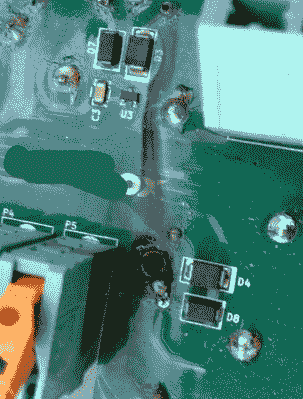

# 电动汽车充电器的事后分析

> 原文：<https://hackaday.com/2019/08/07/a-post-mortem-for-an-electric-car-charger/>

[Mastro Gippo]最近为他的电动汽车购买了一个壁挂式充电器，它看起来很棒，并且具有他想要的所有功能。只有一个问题:那东西在他身上烧掉了。为了找出这个看似高端的硬件是如何如此容易地放弃的，[他把它拆开，试图找出哪里出了问题](http://www.mastrogippo.it/2019/07/design-decisions-and-competition-tesla-openevse-redacted/)。虽然他并不打算诽谤任何人，也不打算说出生产这款充电器的公司的名字，但他肯定会对那些为这一特殊设计开绿灯的人说一些精选的话。

 打开充电器，毫无疑问，里面的东西变得非常温暖。一大块 PCB 上有一个黑色的焦痕，在某些地方看起来好像电路板被烧穿了。经过仔细检查后，[Mastro]认为电路板加热到了焊料在某些连接处液化的程度。这种传导电流使其下方的元件短路，情况越来越糟。

但是所有的热量从何而来？[Mastro]惊讶地发现，尽管产品标签上清楚地说明它适用于高达 32A 的电流，但充电器内的许多组件的额定电流仅为 30 安培。随着组件被推过它们的极限，某些东西必须被放弃。他想知道这样一个设备是如何通过认证过程的；一个很好的问题，我们很想知道答案。

最糟糕的是，看起来设计者可能已经知道有过热的问题。[Mastro]指出，有些散热器并不像你想象的那样固定在元件上，而是直接固定在 PCB 上。我们已经看到当[设计师对过热组件采取漫不经心的态度](http://www.mastrogippo.it/2019/07/design-decisions-and-competition-tesla-openevse-redacted/)时会发生什么，事实上像电动汽车充电器这样的东西设计得如此糟糕是非常令人担忧的。