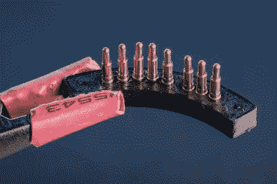

# 极端微距摄影的 3D 打印扩展包括镜头电子控制

> 原文：<https://hackaday.com/2019/08/09/3d-printed-extension-for-extreme-macro-photography-includes-lens-electronic-control/>

微距摄影——拍摄微小事物的艺术——可能是一种昂贵的消遣。好镜头并不便宜，更大的放大倍数会进一步抬高价格。让你的光学系统发挥更大性能的一种方式是伸缩管，它把你的镜头安装在离相机更远的地方，把图像放大一点。回到胶片单反时代，你可以用纸板和胶带制作一个粗糙的现成镜头，但在数码相机时代，镜头已经成为电脑的外围设备，就像光学设备一样。[尼古拉斯·夏洛克]已经解决了这个问题，他为他的佳能创造了一个 3D 打印的伸缩管，它保留了相机和镜头之间的连接。

 这个 300 毫米庞然大物的构造细节远不止是一个由两个螺纹部分组成的塑料桶，两端还有转接板。他使用现成的金属环来安装相机和镜头，但制作电子触点才是有趣的地方。一端使用弹簧针，另一端提供由钉头制成的接触块。在这两种情况下，3D 打印零件都是为了给销钉和钉子提供安装点。组装技术值得一看，不仅因为它的设计，也因为它是一个如何记录我们在一个伟大的黑客中不断寻找的所有有趣细节的例子。

结果不言自明，因为照片提供了令人印象深刻的特写细节。如果你想建造自己的管道，可以在 Thingiverse 上找到。

微距扩展似乎离这里很远，但是我们已经为你带来了一些镜头修复。

[通过[/r/摄影](https://www.reddit.com/r/photography/comments/cmpa2z/i_designed_and_3dprinted_a_massive_300mm_canon/)