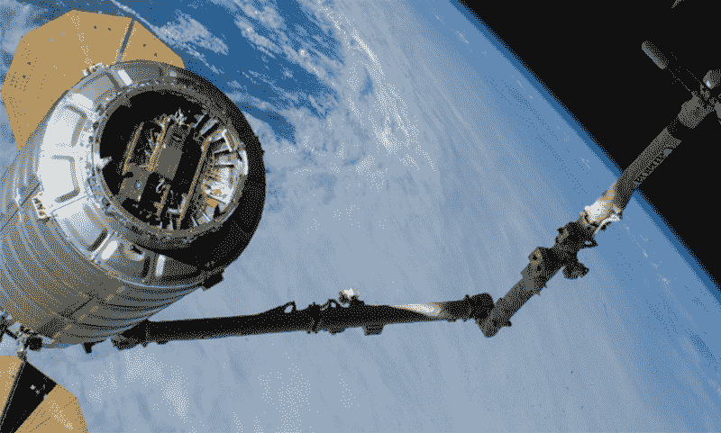

# 你已经拥有的卫星电话:从轨道上看，UbiquitiLink 将像一个手机信号塔

> 原文：<https://hackaday.com/2019/08/26/the-satellite-phone-you-already-own-from-orbit-ubiquitilink-will-look-like-a-cell-tower/>

对于任何曾经在一段偏远的高速公路上抛锚并拼命寻找手机信号的人来说，知道一群通信卫星正在头顶上疾驰而过确实是一种冰冷的安慰。一个人需要专门的设备来接入卫星电话网络，我们中很少有人能够证明卫星电话服务的费用是合理的，更少有人愿意随身携带一块上面有粗天线的砖头作为我们的主电话。

但是，如果一部普通的手机能够以某种方式利用这些卫星从盲区打电话或发短信会怎么样呢？事实证明，这是有可能做到的，一家位于弗吉尼亚州的名为 [UbiquitiLink](https://www.ubiquitilink.com/) 的初创公司正在通过围绕一组卫星运行来填补手机覆盖的所有空白，这些卫星将作为最后的信号发射塔。最棒的是，它可以和普通手机一起使用——不需要砖块。

## 时间，分开

UbiquitiLink 填补死区的计划背后的想法很简单，它基于这样一个事实，即太空并不像它看起来那么遥远；如果你能以某种方式一直向上开，近地轨道只有几个小时的路程。构成 ubilink 网络主干的卫星将位于更高的轨道上，大约 310 英里(500 公里)。尽管如此，在一条大部分不受地面障碍物造成的衰减影响的路径上，这并不算太远(至少就无线电频率传播而言)。

UbiquitiLink 已经做了数学计算，计算出现成的手机几乎没有足够的射频能量通过视线路径连接到卫星，使得轨道基站网络至少是可行的。然而，实现这一点不仅仅是权力的问题。在地面端会涉及到一些软件欺骗。

蜂窝网络都基于多址接入方法，这种方案允许多个用户共享单个蜂窝基站的资源。时分多址(TDMA)是大多数 2G 蜂窝电话网络中使用的多址方法，其中数据流被分配给小区站点和用户之间协商的特定时隙。在 3G 网络中，TDMA 也与码分多址(CDMA)结合使用。尽管这些网络可能会在 4G 和 5G 世界中接近寿终正寝，但 UbiquitiLink 欺骗系统的努力始于 TDMA。

时分系统的问题在于，手机离基站越远，射频波在两者之间传播的时间就越长。即使在接近光速的情况下，延迟也足以让一个时隙重叠到另一个时隙中。这需要一个同步步骤来确定手机离基站有多远，如果手机离基站足够远——大约 35 公里，或 22 英里——信号实际上会在指定的时隙内太迟到达。即使手机中的发射器可以覆盖 35 公里以上的距离，那么远的信号也会被毫不客气地丢弃。

## 愚弄你的手机

这似乎排除了轨道蜂窝基站的使用，轨道蜂窝基站总是比允许的最远连接远一个数量级。然而，UbiquitiLink 已经获得了一项技术的专利，这项技术相当于卫星上的虚假广告。TDMA 网络使用定时提前信号来告诉小区内的移动电话它们离基站有多远，反过来，电话使用该信号来延迟其传输的定时，以便其信号到达时隙中的正确点。由于发送时间提前量取决于基站，UbiquitiLink 的轨道基站只需发送一个与 20 公里外的发射塔相对应的常量值。手机认为它已经锁定了一个弱塔，但没关系。

UbiquitiLink 改进的 cell tower 软件还必须适应平台高速带来的多普勒频移。但除此之外，轨道基站的硬件和软件与安装在地面发射塔上的差不多。不同轨道蜂窝基站之间以及卫星和地面之间的回程连接显然将是无线的，但从几乎所有方面来看，UbiquitiLink 网络将只是一个发射到轨道上的经过最小程度修改的蜂窝塔星座，支持地面上的 bog 标准手机。

## 扔掉垃圾

该系统的 TDMA 版本的初始[测试](https://www.nasa.gov/mission_pages/station/research/experiments/explorer/Investigation.html?#id=7844)发生在 2018 年 11 月一个测试系统在商业再补给服务(CRS)任务中被送上国际空间站之后。第二年 2 月，在向天鹅座补给飞船装载垃圾之前，国际空间站的宇航员组装并测试了 UbiquitiLink 测试平台。飞船脱离轨道并在大气层中燃烧，但这是在整整两周的轨道测试时间之后。UbiquitiLink 能够将新西兰和福克兰群岛的手机连接到测试平台，证实了他们的软件更改有效。

Buh-bye, Cygnus. CRS-17 Cygnus spacecraft undocks from the ISS in February of 2019\. The UbiquitiLink test package (gold boxes) can be seen inside the adapter. Source: NASA

进一步的测试定于今年夏天进行，另一个测试平台将与 6 月下旬飞往国际空间站的 CRS 任务一起交付给国际空间站。这一次，天鹅座将有一个持续时间更长的任务，给 UbiquitiLink 长达六个月的时间来测试他们的系统。假设一切顺利，这将为发射实际运行的卫星打开大门。

 [https://www.youtube.com/embed/-ccnWvynQWA?version=3&rel=1&showsearch=0&showinfo=1&iv_load_policy=1&fs=1&hl=en-US&autohide=2&start=41&wmode=transparent](https://www.youtube.com/embed/-ccnWvynQWA?version=3&rel=1&showsearch=0&showinfo=1&iv_load_policy=1&fs=1&hl=en-US&autohide=2&start=41&wmode=transparent)

像 Starlink 和其他希望从高空提供饱和连接的微卫星公司一样，UbiquitiLink 计划建立一个由数千颗卫星组成的星座，这些卫星将覆盖地球的大部分表面。但他们相信，即使是一个由半打卫星组成的小星座，用户仍将每隔几个小时处于信号范围内。当然，打一个电话是不够的，但发几条短信就足够了，这可能是在穷乡僻壤或大海中央获得援助所需要的一切。支持真正远程物联网传感器和系统的可能性是无限的。

UbiquitLink 的系统效果如何，以及它能否在拥挤的太空无线提供商市场中生存下来，还有待观察。但是通过让用户不再需要购买任何特殊的硬件，该公司很可能已经给了他们自己相对于其他人的竞争优势。