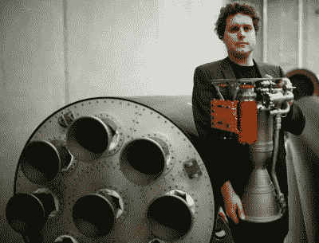
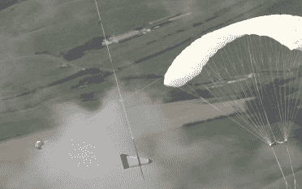

# 火箭实验室着眼于快速重复使用，用直升机在半空中拦截火箭

> 原文：<https://hackaday.com/2019/08/22/rocket-lab-sets-their-sights-on-rapid-reusability-by-snagging-rockets-in-mid-air-with-a-helicopter/>

不久前，轨道火箭根本没有得到重用。在他们的推进剂在前往轨道的旅程中耗尽后，他们逐渐耗尽并落回海洋，在那里他们因撞击而消失。火箭是一次性的，因为任何人都知道，制造另一个比试图重复使用它们更便宜更容易。航天飞机已经证明了航天器及其助推器的重复使用是可能的，但降低成本和提高发射频率的承诺从未实现。如果有什么不同的话，航天飞机通常被认为证明了可重用性在理论上比在现实世界中更有意义。

Rocket Lab CEO Peter Beck with Electron rocket

但那是在 SpaceX 开始例行着陆并重新发射猎鹰 9 号助推器的第一级之前。公司外部没有人真正知道通过重复使用节省了多少钱，但不可否认的是，从着陆到返航的周转时间越来越短。此外，通过在同一个助推器上执行多达三次飞行，SpaceX 展示了一种在业内无与伦比的发射节奏。

因此，当发现其他发布提供者感受到开发他们自己的可重用程序的压力时，也就不足为奇了。最新宣布他们打算回收并最终重新飞行他们的车辆的是火箭实验室，尽管首席执行官彼得·贝克承认他最初反对这个想法。他确实改变了他的论调。根据在过去几次飞行中收集的数据，该公司现在相信他们有一个可重复使用的计划，该计划与他们的小型电子运载火箭的独特限制相兼容。

贝克认为，目标不一定是省钱。在犹他州举行的小型卫星会议上，他解释说他们真正追求的是增加飞行频率。现在，他们每个月可以制造和发射一枚电子，尽管他们最终希望每周生产一枚火箭，但即使每个内核重复使用一次，也会对他们的年发射能力产生巨大影响:

> 如果我们能快速、可靠、频繁地将这些系统送上轨道，我们就能有更多的创新，创造更多的机会。所以发射频率是电子可重复使用的主要驱动力。假以时日，希望我们也能明显降低价格。但我们这么做的根本原因是发射频率。即使我能把舞台拿回来一次，我也已经有效地把我的生产率提高了一倍。

但是，有一个条件。电子太小了，无法支持着陆腿的增加，也没有多余的推进剂在下降过程中使用发动机。简而言之，微型火箭无法自行着陆。因此，火箭实验室认为，回收电子的唯一方法是在电子到达地面之前将其从空气中抢走。

## 轻量级可重用性

SpaceX 的猎鹰 9 号的可重复使用性代价相当大。在所需的额外硬件和需要为再入和着陆燃烧储备的推进剂之间，火箭的有效载荷容量减少了 40%。为了适应这一点，同时又不损害飞行器的有效载荷能力，SpaceX 公司一直在逐步扩大和升级设计。当它在 2010 年首飞时，猎鹰 9 号高 47.8 米(157 英尺)，起飞质量为 333，400 公斤(735，000 磅)；今天飞行的版本已经被拉伸到 70 米(230 英尺)长，重达 549，054 公斤(1，210，457 磅)。

对于着眼于中型和重型电梯市场的 SpaceX 来说，这种车辆扩张与他们的目标非常吻合。但是火箭实验室并不打算与这种规模的飞行器竞争。他们的电子火箭长度只有 17 米(56 英尺)，最大有效载荷能力为 225 千克(496 磅)，是一种完全不同的类型。该公司专注于为所谓的“小卫星”市场提供定制发射能力。这些较小的卫星将被认为是第二甚至第三优先，如果它们是由一个较大的火箭发射的话，但是在电子方面，它们是主要的任务。

Electron and Falcon 9 to Scale

不幸的是，操作这样一个小火箭的现实是，几乎没有对飞行器进行修改的余地。他们在火箭上增加的每一盎司额外硬件都会减少他们已经很小的有效载荷能力。即使电子可以节省推进剂来执行推进着陆燃烧，可展开着陆腿的质量损失也是不可接受的。如果火箭实验室能够从他们的 3D 打印卢瑟福引擎中挤出更多的推力，他们将会有一些喘息的机会，但不会太多。因此，为了恢复的目的，对电子的任何改变都需要特别小。

在这个项目的早期，火箭实验室不愿意透露这些修改会带来什么。我们可以从他们发布到 YouTube 频道的渲染视频中得知，第一阶段将使用 ballute 减速器将电子降至亚音速，此时将部署翼伞来进一步降低火箭的速度。这并不完全不同于 SpaceX 公司现已废弃的回收猎鹰 9 号第二级的计划。但是我们看不到的是，电子需要什么样的热屏蔽才能在重返大气层的高温下生存，或者它在返回地球的途中将使用什么样的稳定和引导方法；可能是因为火箭实验室自己还不太清楚。

 [https://www.youtube.com/embed/enndCzvZpZk?version=3&rel=1&showsearch=0&showinfo=1&iv_load_policy=1&fs=1&hl=en-US&autohide=2&wmode=transparent](https://www.youtube.com/embed/enndCzvZpZk?version=3&rel=1&showsearch=0&showinfo=1&iv_load_policy=1&fs=1&hl=en-US&autohide=2&wmode=transparent)

## 钩住下落的火箭

即使假设火箭实验室将电子升级到可以在重返大气层时生存的程度，并部署其减速设备，他们仍然需要找到一种方法让它完整地降落在地面上。正如渲染视频所示，现在的计划是通过驾驶直升机飞越下降的火箭并抓住它，从空中抢夺电子。这听起来像是詹姆斯·邦德电影中的情节，但实际上这可能是火箭实验室整个计划中最简单的部分。

事实上，计划的这一部分似乎已经完成。2017 年，洛克希德·马丁公司(自 2015 年以来一直是火箭实验室的战略投资者)与 PDG 航空服务公司合作，进行了一次鲜为人知的模拟火箭级的空中直升机回收，相似之处很难忽视。在火箭实验室的渲染图中，用来抓住火箭翼伞后面的引导电缆的装置似乎与洛克希德·马丁测试视频中看到的[相同，这真的让整个事情看起来像一次低调的彩排。](https://www.youtube.com/watch?v=3LhBG-J7PDU)

  Rocket Lab’s rendered concept  Lockheed Martin’s real-world test

在比较了两个视频之后，回收过程中的一个不清楚的因素是电子将如何安全地降到地面。在洛克希德·马丁公司的测试中,“火箭”被毫不客气地投放到它的人造引擎上，但这显然不适用于实际的飞行硬件。事实上，在电子被带回等待的飞船之前，官方火箭实验室的视频逐渐消失，这可能意味着该公司仍然没有解决这一部分。不过，如果你有发射和回收轨道火箭的技术手段，弄清楚如何轻轻地把它降低到船的甲板上应该不会构成太大的挑战。

## 更快更便宜

任何可重复使用的发射系统的基本目标是，与为每次任务简单地建造一个新的助推器相比，随后的再次点火更加经济，耗时更少，在这样一个要求苛刻的领域，即使相对较小的收获通常也被认为是成功的。但是理想情况下，两次发射之间花费的时间和金钱越少越好。为此，电子的独特性质可能使其特别适合所谓的“快速重复使用”:这是一个概念，其中火箭的回流频率几乎与商业飞机一样，只需要在执行下一次任务之前进行检查和加油。

电子取消了传统上用于液体火箭的复杂的气体发生器和涡轮装置，取而代之的是使用电力驱动的泵作为燃料和氧化剂。结合其相对简单的 3D 打印引擎和车辆的小巧，在飞行之间根本不需要检查太多。举例来说，一个较小的团队可以检查电子的每一英寸，所花的时间只是一个大得多的团队彻底检查猎鹰 9 号所需时间的一小部分。

迄今为止，SpaceX 已经证明从着陆到重新起飞的周转时间为两个多月，但火箭实验室可能会将这一时间缩短到几周。考虑到两家公司都声明了在恢复后的几天内重整旗鼓的最终目标，他们的工作已经完成。但是，即使他们从来没有完全达到这个崇高的目标，但很明显，将用过的火箭扔进大海的日子即将结束。