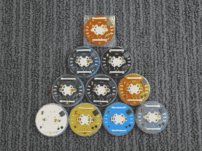
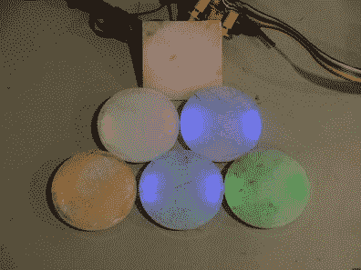
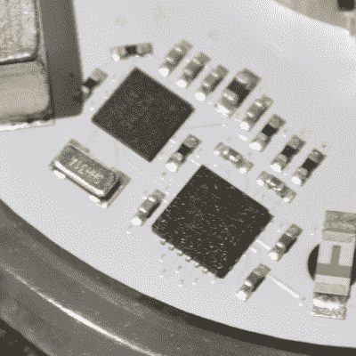
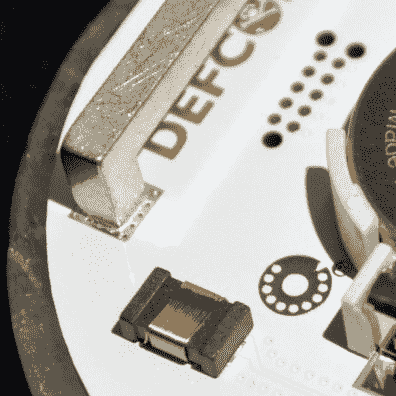
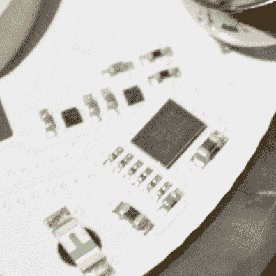
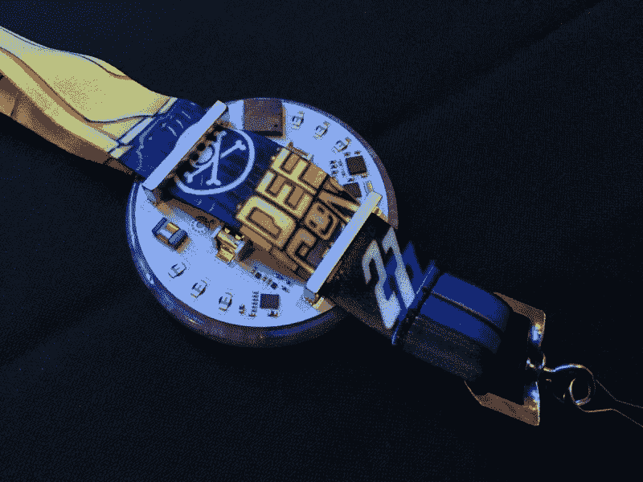
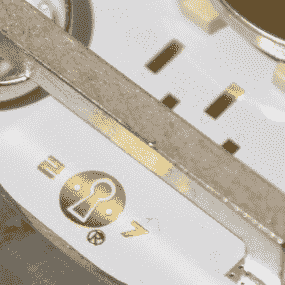
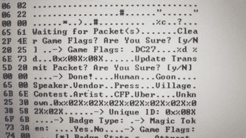

# 先看 DEF CON 27 官徽；金并回来了！

> 原文：<https://hackaday.com/2019/08/08/first-look-at-def-con-27-official-badge-kingpin-is-back/>

拉斯维加斯为每个人准备的第一个大惊喜是今年的 DEF CON 徽章是一个电子徽章。电子徽章和非电子徽章交替使用是 DC 的传统做法。去年，我们有一个由玩具制造商设计的奇妙的电子徽章，所以我期待一些更被动的东西，比如几年前的黑胶唱片徽章。学习其他的东西是多么令人惊喜啊！

第二个惊喜是徽章制造商本人。这个设计是对昔日时光的一种回归，因为乔·格兰德又一次站了出来。老兵们都知道他叫金并，他的徽章制作遗产根深蒂固。让我们跳进去看看。

## 五金器具

    

由于制造的复杂性，总部位于美国的工厂以 99%的成品率生产了 26，500 个徽章。时间表是令人难以置信的紧张，乔格兰德从阿尔法原型(没有博奇电线！)到生产只用了七天。他必须在这段时间内编写并验证所有的低级驱动程序，并且在没有首先测试不可避免的板修订的情况下投入生产。

 徽章的形状足够简单，只是一个直径约 3 英寸的小型 PCB 圆盘。这个徽章的定义视觉因素是厚厚的扩散。这是来自巴西的石英晶体，由中国的一家宝石和珠宝公司专门为徽章切割和抛光。对于人类徽章(定期会议与会者)来说，它只是一个白色的圆盘，但更罕见的变体看起来有点花哨。

在印刷电路板的背面，你会发现所有的好东西。一侧有一个微控制器和 LED 驱动器(Kinetis KL27 和 TI LP5569 ),为反向安装的 LED 供电。在电路板的另一边，有一个芯片提供徽章互动功能。将两个这样的徽章放在一起(大约 2 英尺远)，它们就会传输数据。你不需要物理连接它们，去年的徽章有时会遇到麻烦，因为连接器有令人不快的断裂倾向。

电源由一个 CR2032 硬币电池提供。板上的两个 LDO 提供为所有芯片供电所需的 1.3 V 和 1.8 V 电压。有六个反向安装的 LEDS(一些是多色的，一些是单色的，取决于徽章的变化)，乔向我保证有足够的果汁让他们运行整个周末。

## 无线的魔力不在于

  Coil for RX/TX  Chip-scale radio module

徽章之间的通信使用磁场，而不是无线电频率！无线电芯片很特别，恩智浦的 NXH2261UK 使用近场磁感应(NFMI)来接收和发射电路板上的线圈。这是无线通信，但它不发射无线电频率——你不能用 SDR 监听它。这个概念在消费品中很少见，最常见的是你会在助听器中发现它。这种芯片级 BGA 是 Joe 在设计中使用的最小封装。

## 不同颜色的挂绳连接器

Lanyard mounting example via [@joegrand](https://twitter.com/joegrand/status/1159360002911379457)

今年有一种新颖的连接挂绳。电路板上焊接了两个接线片，而不是电路板上的一个孔。这些器件通常用作高压应用中的跳线。你应该把挂绳穿过这两个凸耳，把真正的钩子留在非官方徽章的挂绳上。Joe Grand 可能没有包含“低劣”附加组件的标题，但他仍然设法完全接受了定制硬件徽章文化——当然，他在这种文化的起源中发挥了重要作用。

## 难题

谜题的第一个明显的部分是你通过持有不同种类的徽章获得的解锁，如发给暴徒、演讲者、艺术家、记者等的徽章。我假设这导致固件解锁，慢慢揭示了这个难题。

  Offset pads for serial connection  Terminal dump by charliex

人们已经在努力解开内在的秘密。[charliex]发现了串行焊盘，它们是 SMD 0.1”引脚接头的交替封装。他报告了一个 UART (1.8v 逻辑电平)，并在他的 Twitter 账户上透露了一些来自终端的转储。他还发布了固件的转储，我被告知所有徽章上都是一样的，以及他的 GitHub 上硬件[的精彩特写图片。](https://github.com/charlie-x/defcon27)

## 解开这个徽章！

黑一枚徽章需要一个村子。[点击此魔法链接](https://hackaday.io/project/167009/token/c55289bd-cefb-40d8-95b3-416fd0127006?redirect=messages)自动加入 Hackaday.io 上的徽章解决项目，您可以[在此查看项目](https://hackaday.io/project/167009-def-con-27-official-badge-hacking)。

为你试图在徽章上解决的每个挑战创建新的项目日志。进入[公共聊天室](https://hackaday.io/messages/room/282110)讨论正在发生的事情。欢迎所有人，你不需要在这里参加。向手里有徽章的人询问更多信息，并应对想到的挑战！只要确保你尽可能快地发布新信息。