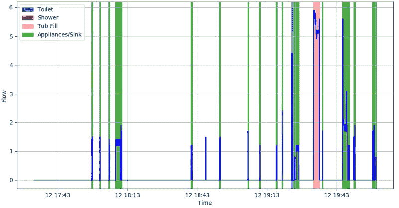

# 家庭用水数据挖掘；你的水表太了解你了

> 原文：<https://hackaday.com/2019/08/14/data-mining-home-water-usage-your-water-meter-knows-you-a-bit-too-well/>

普通人已经变得对我们生活的监视反乌托邦感到压抑和舒适。不管是好是坏，他们已经开始接受这样一个事实，即他们生活中的数据不断被收集和分析。我们正处于这样一个阶段，相当多的人认为他们的智能手机正在窃听他们的私人谈话，并根据听到的关键词定制广告，但他们不太可能对他们实际上关掉手机的想法感到足够困扰。

但是，即使是我们当中最注重隐私的人也不会认为我们的用水量是什么大秘密。毕竟，通过研究你用了多少水，人们能学到什么呢？好吧，[正如【Jason Bowling】用他迷人的水表数据研究](https://shortcircuitsandinfiniteloops.blogspot.com/2019/08/experiments-in-classifying-residential.html)所证明的，事实证明你可以通过观察用水模式学到很多东西。通过每秒轮询一个全屋的水流量计，并通过各种机器学习算法运行结果数据，[Jason]发现在这个看似无害的数据流中隐藏着大量的个人信息。

关键是你家里的每一个用水设备都有一个可识别的“指纹”，只要有足够的时间，就可以被识别和跟踪。像制冰机或洗碗机这样总是使用相同水量的电器是噪音中明显的尖峰。但是[Jason]能够发现更细微的差别，比如家里的哪个厕所在什么时候被冲了。

此外，如果你观察数据的时间足够长，你甚至可以开始识别家庭中个人的信息。想知道家里有几个孩子吗？监控经常洗澡，而不是一直充满浴缸将是一个好的开始。想知道某人的睡眠有多宁静吗？统计一下马桶一夜之间被冲了多少次可以给你一个想法。

就[杰森]所发现的隐私含义而言，我们有点害怕。特别是因为我们已经[看到了如何使用 RTL-SDR](https://hackaday.com/2017/12/21/read-home-power-meters-with-rtl-sdr/) 来检测电表。但从另一方面来说，他的文章很好地展示了如何让机器学习在最不可能的应用中发挥作用。他收集的关于使用 Python 对时间序列数据进行分类并创建可视化的信息无疑会引起任何有大数据问题并希望解决这些问题的人[的兴趣](https://hackaday.com/2015/05/18/ask-hackaday-the-internet-of-things-and-the-coming-age-of-big-data/)。