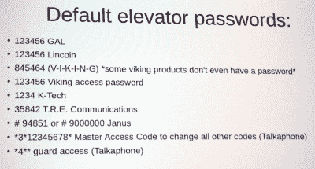

# 那些电梯紧急呼叫按钮实际上很简单

> 原文：<https://hackaday.com/2019/08/10/those-elevator-emergency-call-buttons-are-actually-pretty-janky/>

我们都盯着电梯里那个有电话图标的按钮，非常自信地认为，如果电梯在飞速上升到 42 层时突然急刹车，一个简单的按钮就能拯救你。平心而论，这可能是真的。但是整个系统并不像大多数人认为的那样强健。

周五在 DEF CON 27 上，[Will Caruana]上台谈论了电梯上的电话交谈。1968 年，呼叫按钮作为真正的电话听筒首次出现在电梯上，最终从 1976 年开始成为强制功能。不幸的是，他们使用的技术还没有发展到那种程度。当 DTMF(按键音)和语音菜单系统出现时，电梯上的电话模块确实受益。但在大多数情况下，它们是普通的老式电话服务(POTS)前端。

[威尔]利用空闲时间在楼层间按呼叫按钮并询问电话号码。这是社会工程学的最低标准，表明自己是电梯维修技师，并询问他的电话号码。他的经验是，电话另一端的人几乎每次都会毫无疑问地给你那个号码。你能用电话号码做什么？事实证明相当多。

 城堡的钥匙就在电梯手机的用户手册里。这些设备由多家制造商提供，都有一个默认密码，而[威尔]的经验是，没人会更改它们。这意味着一旦你有了电话号码，你就可以拨入并使用默认密码来重新编程系统的工作方式。这不会让你直接控制电梯，但它会让你与里面的人说话，甚至改变呼叫号码，以便下次按下那个小按钮时，它会呼叫你，而不是它打算拨打的电话服务。也就是说，如果系统一开始就设置正确的话。他提到，找到没有在系统中设置位置的电梯并不太难——如果你确实需要帮助，可能很难弄清楚你实际上在哪个电梯里。也有这样的例子，他们给大楼的 24 小时维护人员打电话，对于没有注册的困倦人员来说，这是一个令人困惑的经历。

想超越呼叫按钮，深入挖掘 pwning 电梯的秘密？[威尔]建议看[离经叛道的奥拉姆]和[霍华德·佩恩]的《希望 X 谈》叫做 [*电梯黑客:从地坑到顶层公寓*](https://www.youtube.com/watch?v=rOzrJjdZDRQ) 。