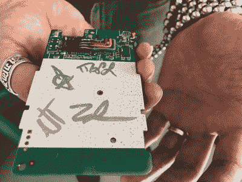
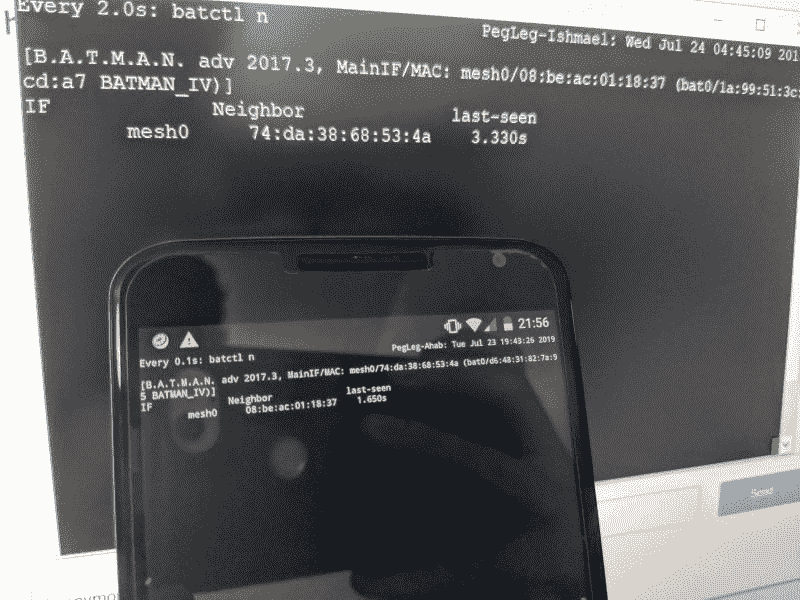
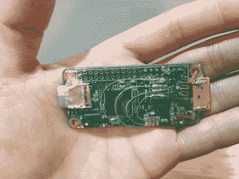
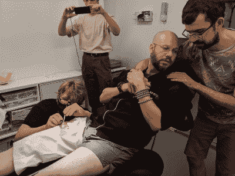

# Pegleg:植入皮下的树莓 Pi(不会到你附近的商店)

> 原文：<https://hackaday.com/2019/08/29/pegleg-raspberry-pi-implanted-below-the-skin-not-coming-to-a-store-near-you/>

本月早些时候，一群生物黑客在他们的腿上安装了两个 Rasberry Pis。虽然这听起来像是最前沿，但这些计算机已经是一个名为 [PegLeg](http://pegleg.org/) 的项目的 v2。可以说，我有幸亲眼看到了这两个版本。第一个版本大得吓人——一个 wifi 路由器捐赠的主板，大约有一个 Altoids 罐那么大。这提醒我们，技术的尖端和前沿之间的界线一直在向前移动，而这一条则牢牢地站在前沿。

这条线是如何移动的？有时候，这只是一个聪明人在漫长的一周中能完成什么的问题。今年 5 月，在为期三天的名为 Grindfest 的生物黑客大会上，有人说了这样的话，“如果……”任何在创客空间或黑客大会上呆过一个小时的人都知道这些对话是如何进行的。事情进展得非常激烈，而不是在笑声中结束。

路由器丢弃了所有不重要的组件。USB 端口:接地。塑料外壳:可回收。电池:改变用途。亚马逊最快的交付带来了一个 Qi 无线线圈，从体外为植入物供电，以及最小的 64 GB 的 u 盘。PegLeg 版本的唯一接收者是[Lepht Anonym]，他使用代词‘它’。[Lepht]在专注于技术植入的生物黑客中享有盛誉，他们经常使用术语“研磨机”，不要与约会应用程序或电动工具混淆。

## V1:植入路由器板

Pegleg v1 before application of the protective coating

[mixl Laufer]、[Nick Titus]和[Zac Shannon]是执行精细解构的实践者，因此没有什么可以阻止涂层粘附。任何进入体内的东西都必须保护好，否则会有麻烦。Cass 为这种场合开发了一种生物相容的树脂，在 peg 之前，这种配方已经过严格的测试。[Cass]是加州的一名护士，他在自己的家里举办 Grindfest，在那里他有一个实验室和一个手术室，这会让一些黑客羡慕不已。

Notice: Far below is a picture of [Mixæl] receiving his implant. It is a fabulous picture by [Seth Rosenblatt] who wrote about it on [The Parallax](https://the-parallax.com/2019/08/12/defcon-biohackers-johnny-mnemonic-pegleg/), but the image may disturb some people.

[Nick Titus]负责优化硬件和减少故障点。天知道当我们建造的东西停止工作时，我们首先检查我们自己的工作，并让一个人检查每个焊点和应力点。这种尽职调查(以及其他)对于植入来说是明智的。

> 每次我在硬件上做另一个 mod，我都会试着再测试一次，赌注就会增加。
> ——【mixl】

我拍了一些照片，而[mixl]双手抱着未涂层的 v1，就像它是一只小鸟一样。我知道这是未来历史的一部分，它的重要性将永远伴随着我。在[Lepht]的坚持下，成员们甚至在丝网印刷上签了名，Lepht 在十周后报告说植入物没有任何问题。真正的植入发生在 Grindfest 正式结束之后，但这个过程确实让[Lepht]错过了航班，而且航空公司对一个刚做完手术的人也不友好。

## 树莓派 Zero 的皮肤下去了

## 

但是，这年头谁还在用路由器 PCB？今天的棋盘是小小的树莓派零。在 DEF CON 27 上，我看到并持有 Pegleg v2，它缩小到 Pi0W (Raspberry Pi Zero W ),带有 Qi 接收器、电容器、wifi 加密狗和 0.5 TB 的存储空间。其中三个是在会议期间植入的。

[Lepht]的模型进入了它的手臂，靠近一个车纹身，但最后两个进入了[mixl]和[Cass]的大腿上部，他们根据 Qi 电池组在他们最喜欢的裤子口袋中的位置来规划这个位置。[Cass]植入了两个设备，所以如果你认为你是金属，问问你自己是否可以在你自己的大腿上安装一台计算机。

## 分散的文件共享和这些植入的其他技巧

每个 Pegleg 运行一个 PirateBox 的发行版，因此当它通电时，任何拥有 WiFi 设备的最终用户都可以连接到一个匿名聊天室、文件服务器和安装手术的视频(如果所有者保留它的话)。如果没有支持，PirateBox 将面临消失的威胁，因此如果这是您的难题，请启动它们。独立的服务器不需要互联网接入，而是依靠网状网络来连接用户。植入记忆和网络看起来像科幻小说，说到科幻，这些生物黑客[引起了【威廉·吉布森】](https://twitter.com/GreatDismal/status/1160978524959694848)的注意，他对人类携带加密数据有一两个想法。有人记得强尼吗？

> 如果我们有一个网状网络，它可能最终取代集中式互联网，并拥有所有我们认为互联网会拥有但现在由于集中化而缺乏的东西。它可以很容易地被关闭、审查、监视……而且访问它是要花钱的。
> ——【mixl】

This Pi0W has bubbles under the coating, a defect that means it will not become an implant.

硬件不是从 v1 到 v2 的唯一变化。软件是由[Zac]修改的，他制作了 Pegleg 发行版并使网状网络运行起来。对他的工作最好的描述是“软件研究、配置和测试”，但是技术奇才也足够了。

多个单位在[Nick]的手下通过工具车间，他还组织后勤，他亲切地称之为“湿愤怒的猫放牧。”说真的，试着让一群黑客定期做同样的事情。硬件优化仍然是他最关心的问题，[Nick]能够告诉我第二个版本中焊点的数量(14 个)，如果你不需要网状网络，只需要 6 个就可以了。

## 我们在计算影响方面的现状

我和[尼克]谈论了整个过程。他觉得植入一条腿是一种表达方式，而不仅仅是逻辑上的需要。他还建议任何对在家制作植入物感兴趣的人应该尽量避免使用电池，他详细说明了包含可充电电池的复杂性，以及它们的发热问题、膨胀和压缩泡沫，然后才停止自己的传教。了解构成植入物的整个系统是至关重要的。例如，他发现了一些缺失的管理功能，这些功能可以让匿名用户随意上传文件，但却无法删除。

This image shows the Pi being inserted under the skin of the thigh. Those who are not squeamish may click to embiggen.

已经有了第三版的计划，目标是使它的面积和邮票一样大，但是更厚。通过[金属皮肤贴花](https://hackaday.com/2016/08/16/skin-bling-wearable-electronics-from-golden-temporary-tattoos/)和其他硬件平台进行无线充电的研究是他们的未来。没有 Kickstarter 或任何货币化的计划，但你可以在[他们的网站](http://pegleg.org/)上免费找到确切的配方。如果你认为 peg 是有史以来最酷的东西，他们接受捐赠，如果你认为 [PirateBox](https://piratebox.cc/doku.php) 值得一些爱，他们需要开发者，如果他们要继续运营的话。

从好的方面来说，当你说，“我不要馅饼了，它直接到了我的臀部，”你可以想到那些让圆周率直接到他们大腿的人。

感谢[cyberlass]和[SmokeLegend]的提示。