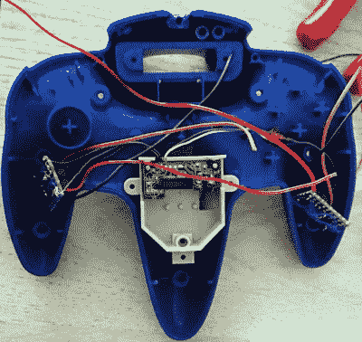

# 完善蓝牙 N64 控制器

> 原文：<https://hackaday.com/2019/08/17/perfecting-a-bluetooth-n64-controller/>

不管你喜欢它还是讨厌它，任天堂 64 控制器似乎不会去任何地方。忠实的粉丝仍在寻找将独特的三叶控制器与现代系统配合使用的方法，直到他们完美复制原始体验，他们才会满意。[[Shyri Villar]一直致力于完善原创和现代硬件的结合](https://hackaday.io/project/167105-n64-bluetooth-gamepad)，看起来非常有前途。

 当【Shyri】发现你可以从一个由 8BitDo 制造的现代第三方蓝牙 N64 控制器中取出内部部件，并将它们放入原来控制器的外壳中时，该项目开始了。这将让你回到原来的按钮，总体上更真实的重量和感觉。不幸的是，这通常意味着抛弃 8BitDo 的原始 N64 操纵杆。

Shyri 想要做的是将 8BitDo PCB 安装到一个原始的 N64 控制器中，但调整任天堂的操纵杆以与它通信。不幸的是，由于最初的操纵杆使用光学编码器，而 8BitDo 版本使用电位计，因此存在语言差距。

为了消除这种差异，操纵杆的 X 和 Y 维度都有自己的 PIC12F675 微控制器和 X9C103S 数字电位计。微控制器从原始操纵杆的编码器中读取 X 和 Y 值，并使用数字电位计为 8BitDo 提供预期的模拟输入。现在，电子器件被夹在控制器侧面“翅膀”中的两片 perfboard 固定，但希望我们将来能看到定制的 PCB。

如果你更感兴趣的是带着你值得信赖的 N64 控制器回到过去，那么你可能会有兴趣[了解更多关于一个黑客如何设法把它连接到 MSX](https://hackaday.com/2019/08/12/an-msx-with-a-nintendo-controller/) 的信息。