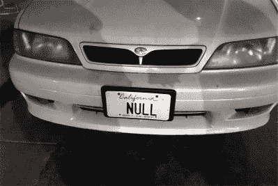

# 本周安全:黑帽、防御大会和补丁星期二

> 原文：<https://hackaday.com/2019/08/16/this-week-in-security-black-hat-def-con-and-patch-tuesday/>

Blackhat 和 DEF CON 刚刚结束，本周是补丁星期二。我们今天有很多故事要讲。

先是[一些轻松的恶作剧](https://arstechnica.com/cars/2019/08/wiseguy-changes-license-plate-to-null-gets-12k-in-parking-tickets/)。显然是受到了小鲍比【[和](https://xkcd.com/327/)的启发，德鲁吉申请了“无效”的虚荣车牌。一年过去了，没有任何问题，但很快就到了他更新注册的时候了。在线登记表拒绝承认“NULL”是有效的车牌。直到他收到一张停车罚单，并收到一张 12000 美元的账单，这场闹剧才真正开始。似乎加州停车罚单收集系统不能正确区分“null”和 NULL 值，所以每张没有牌照的罚单现在都无意中与他的牌照相关联。

在对 Ars Technica 文章的评论中，建议将“NULL”简单地添加到不允许使用的梳妆盘列表中。一位精明的读者指出，追踪不允许牌照的系统可能同样会因“空”值而阻塞。

## 黑掉一架 F-15

令人惊讶的是，[空军官员从一架 F-15 战斗机上带来了可信的飞机信息下载站(TADS)的样本](https://www.stripes.com/news/us/hackers-just-found-serious-vulnerabilities-in-f-15-fighter-jet-1.594248)，研究人员显然能够以无数种方式破坏这些设备。这与美国军方多年来一直采用的通过模糊来保障安全的方法大相径庭。

明年的 DEF CON 参与承诺会更好，因为空军计划将研究人员带到一架真实的飞机上，邀请他们以各种可以想象的方式对其进行妥协。

## 星期二补丁

微软每月一次的 Windows 安全补丁发布会于本周开始，真是太棒了。首先是一对可远程利用的远程桌面漏洞，CVE-2019-1222 和 CVE-2019-1226。据推测，这些漏洞是在今年早些时候针对 BlueKeep 漏洞发起的 RDP 代码审查中发现的。这里重要的区别在于，这些 bug 会影响多个版本的 Windows，直到并包括 Windows 10。

## 什么 CTF

还记得塔维斯·奥曼迪和他的记事本攻击事件吗？我们终于有了[故事的剩余部分](https://googleprojectzero.blogspot.com/2019/08/down-rabbit-hole.html)！去阅读整本书，这是一个伟大的故事，发现一些奇怪的东西，然后把它拆开寻找漏洞。

Microsoft Windows 有一个模块 MSCTF，它是文本服务框架的一部分。CTF 的缩写代表什么？那不清楚。似乎 CTF 负责处理键盘布局，并根据选择的键盘类型翻译击键。同样清楚的是，每次应用程序构建一个窗口，该应用程序也连接到一个 CTF 进程。至少从 2001 年开始，CTF 就已经是微软代码库的一部分了，从那以后代码变化相对较少。

CTF 不做任何验证，所以攻击者可以连接到 CTF 服务，并声称是任何进程。Tavis 发现他可以有效地尝试调用任何与同一个 CTF 服务对话的程序的任意函数指针。由于现代 Windows 中内置了一些额外的安全措施，通往实际危害的道路相当曲折，但最终，任何 CFT 客户端都可能受到危害，包括记事本。

Tavis 发现最有趣的 CFT 客户是登录屏幕。他在文章中演示的漏洞是锁定计算机，然后破坏登录，以生成具有系统权限的进程。

每台 Windows 机器上都运行着这种未知服务，这再次提醒我们操作系统应该是开源的。

## 生物星 2 号

Biostar 2 是一个集中的生物识别访问控制系统，被全球数千个组织和许多国家使用。两名以色列安全研究人员[发现控制整个系统的中央数据库是未加密和不安全的](https://www.vpnmentor.com/blog/report-biostar2-leak/)。23gb 的安全数据是可用的，包括超过一百万个指纹。这些数据以明文形式存储，而没有经过适当的哈希处理，因此密码和指纹直接被泄露。这些数据似乎是通过直接暴露在互联网上的 Elasticsearch 实例获得的，并且是通过端口扫描发现的。

如果您接触过 Biostar 2 系统，您需要假设您的数据已经被破坏。虽然密码可以更改，但指纹是永久的。随着生物认证变得越来越普遍，这是一个未开发的副作用。