# 从 NFC 名片到 FPGA 立方体，从头骨徽章到子弹带，这是 DEF CON 早餐会上的硬件

> 原文：<https://hackaday.com/2019/08/17/nfc-business-cards-to-fpga-cubes-skull-badges-to-bandoliers-heres-the-hardware-from-breakfast-at-def-con/>

周日我们在 DEF CON 吃了有史以来最丰盛的早餐。事实上，规模如此之大，以至于精心制定的计划立即出了差错。

这是我们举办该活动的第五年，它以一些硬件展示和讲述拉开了 DEF CON 的最后一天。我们真的以为我们已经把一切都搞清楚了，因为这次我们实际上在巴黎酒店预订了一个房间。前三年，我们只是在分配空间——要求每个人都出现在这个地方，这将成为一个事件。去年，我们计划在硬件黑客村举行，但赌场阻止我们在那天早上带糕点，我们最终在一个直到下午才开门的用餐区露营。

上周末，我们预定了一家咖啡馆，点了糕点和咖啡。唯一的问题是你们都太牛逼了。我们有几百人到场，但咖啡馆不想让我们站着，这就把我们的空间限制在了座位的数量上。不用担心，按照传统，我们来到赌场楼层的休息区，尽情享受！

这是在这次聚会上出现的一些硬件。

## 最佳徽章乐队 Banywhere！

 [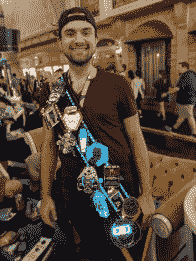](https://hackaday.com/2019/08/17/nfc-business-cards-to-fpga-cubes-skull-badges-to-bandoliers-heres-the-hardware-from-breakfast-at-def-con/dc-27-badge-bandolier-2/)  [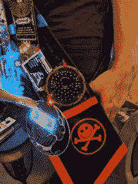](https://hackaday.com/2019/08/17/nfc-business-cards-to-fpga-cubes-skull-badges-to-bandoliers-heres-the-hardware-from-breakfast-at-def-con/dc-27-badge-bandolier-logo/) Great logo where bandolier comes together [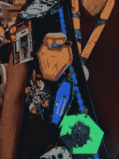](https://hackaday.com/2019/08/17/nfc-business-cards-to-fpga-cubes-skull-badges-to-bandoliers-heres-the-hardware-from-breakfast-at-def-con/dc-27-badge-bandolier-badges/) Beautiful badge collection  Bandolier has power regulation

我最喜欢的 DC 27 的作品是这个由[ [LqqkOut](https://twitter.com/lqqkout) ]建造的徽章腰带。那些对#Badgelife 着迷的人在 DEF CON 上花了很多时间试图获得所有徽章。很明显，这是同时佩戴它们的最佳方式。皮革腰带有一个网眼层，可以用拉链将徽章挂在上面，这样徽章就不会掉下来。索环允许电力从弹带内部传递，一组巨大的锂电池为多个调节器供电，这些调节器可以调整到所需的电压。

## 野外的黑色徽章

 [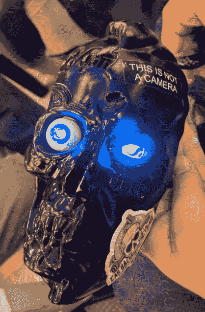](https://hackaday.com/2019/08/17/nfc-business-cards-to-fpga-cubes-skull-badges-to-bandoliers-heres-the-hardware-from-breakfast-at-def-con/dc-27-black-badge-from-dc-24/)  [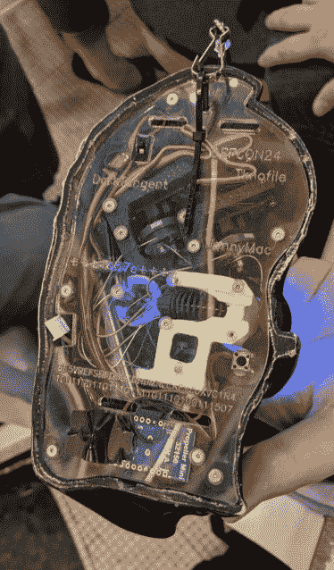](https://hackaday.com/2019/08/17/nfc-business-cards-to-fpga-cubes-skull-badges-to-bandoliers-heres-the-hardware-from-breakfast-at-def-con/dc-27-black-badge-from-dc-24-rear/) 

当您赢得 DEF CON 的精英级挑战之一时，您将获得一个黑色徽章，允许您终身免费参加 DEF CON。我很少在野外看到这些，很高兴看到这个黑色徽章，它是[[compukidmike](https://twitter.com/compukidmike)在 DC24 赢得 2017 年 CTF 汽车黑客村后获得的。

 <https://hackaday.com/wp-content/uploads/2019/08/black-badge-DC-24.mp4?_=1>

[https://hackaday.com/wp-content/uploads/2019/08/black-badge-DC-24.mp4](https://hackaday.com/wp-content/uploads/2019/08/black-badge-DC-24.mp4)

最关键的细节是其中一个被照亮的眼球能够伸出头骨。但是等等，还有更好的！一旦伸长，那只眼睛就能向四面八方张望。徽章是[ [LosT](https://twitter.com/1o57) ]的作品，这位长期的 DEF CON 字谜大师，他做了一件聪明的事情:背面是透明的丙烯酸树脂，所以你可以看到发生了什么。一系列鲍登电缆将眼球连接到一些伺服电机。这是一个不可思议的机制，在现实生活中看到它是一个令人愉快的惊喜！

## 名片、皮带、立方体和面板

 [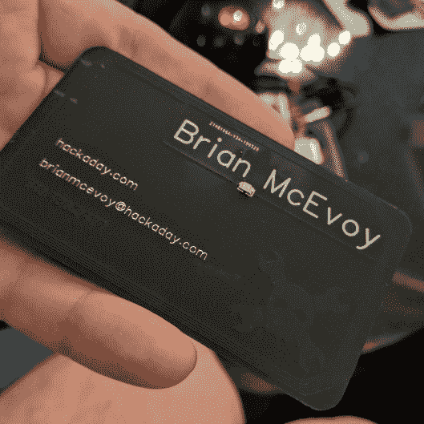](https://hackaday.com/2019/08/17/nfc-business-cards-to-fpga-cubes-skull-badges-to-bandoliers-heres-the-hardware-from-breakfast-at-def-con/dc-27-business-card/)  [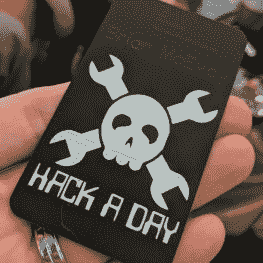](https://hackaday.com/2019/08/17/nfc-business-cards-to-fpga-cubes-skull-badges-to-bandoliers-heres-the-hardware-from-breakfast-at-def-con/dc-27-business-card-old-school/)   

Hackaday 自己的(Brian McEvoy)出现了，并带来了我所见过的最好的 Hackaday 名片。它是带有黑色哑光阻焊膜的 PCB。[Brian]利用了铜层作为黑色第二色调的技巧。这使得白色丝网的使用真正脱颖而出。名片检测 NFC 和 RFID 读取器场；把它放在手机背面，LED 就会亮起。

 [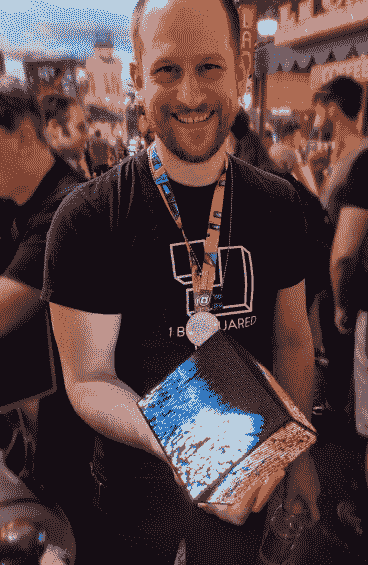](https://hackaday.com/2019/08/17/nfc-business-cards-to-fpga-cubes-skull-badges-to-bandoliers-heres-the-hardware-from-breakfast-at-def-con/dc-27-icebreaker-fpga-led-cube/)  [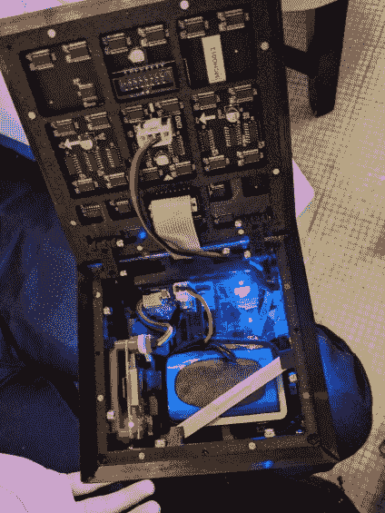](https://hackaday.com/2019/08/17/nfc-business-cards-to-fpga-cubes-skull-badges-to-bandoliers-heres-the-hardware-from-breakfast-at-def-con/dc-27-icebreaker-fpga-led-cube-internals/)  [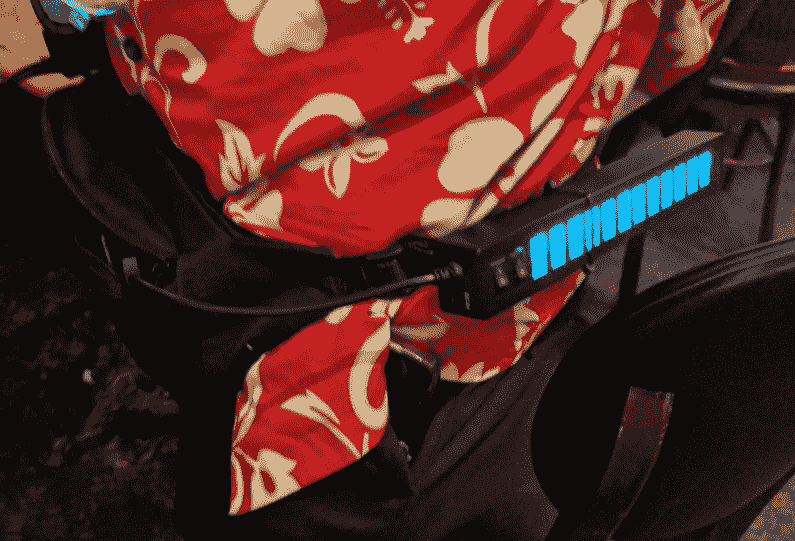](https://hackaday.com/2019/08/17/nfc-business-cards-to-fpga-cubes-skull-badges-to-bandoliers-heres-the-hardware-from-breakfast-at-def-con/dc-27-usb-charging-fanny-pack/) 

威士忌海盗队的一名成员带着一个非常特别的腰包来参加聚会。你可以尽情取笑它的外形，但它有两个巨大的电源组和两个 USB 充电带，可以为 24 个设备供电。这让他在漫长的会议结束后成为舞会上的美女。

彼得·埃斯登-坦普斯基(Piotr es den-Tempski)一直在世界各地推销他最近发布的名为“破冰者”的 FPGA 平台。演示硬件是一个令人难以置信的间距动画 RGB 立方体。我很高兴能看到内部，看看(鲍勃·米勒)是如何一丝不苟地建造这个东西的。[还没看到它跑起来](https://twitter.com/hackaday/status/1159267182267625472)？你应该在关注 [@Hackaday](https://twitter.com/hackaday) ！

 [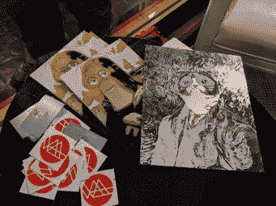](https://hackaday.com/2019/08/17/nfc-business-cards-to-fpga-cubes-skull-badges-to-bandoliers-heres-the-hardware-from-breakfast-at-def-con/dc-27-strange-parts-art-panels/) PCB panel art from Strange Parts [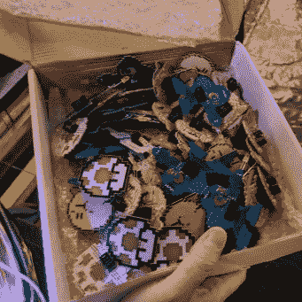](https://hackaday.com/2019/08/17/nfc-business-cards-to-fpga-cubes-skull-badges-to-bandoliers-heres-the-hardware-from-breakfast-at-def-con/dc-27-big-box-o-add-ons/) Big box ‘o add-ons [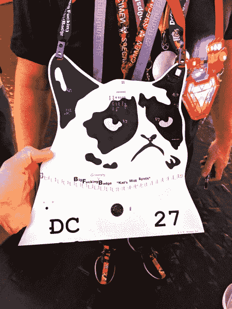](https://hackaday.com/2019/08/17/nfc-business-cards-to-fpga-cubes-skull-badges-to-bandoliers-heres-the-hardware-from-breakfast-at-def-con/dc-27-grumpy-cat/) Huge grumpy cat badge

我的朋友斯科特·艾伦(Scotty Allen)带着最大的 PCB 板出现在 meetup 上。他们两个都是“艺术”，但这是模因艺术，所以…无论如何，他的脖子上还挂着一只脾气暴躁的大猫。模因是电路板的最终目标吗？

任何人在寻找真棒徽章附加来到正确的地方。人们用小电路板制造降雨。我特别喜欢这一整箱的 1Up、Kirby、Megaman 和 Mario 附件。

## 《黑客日》中的一个小插曲

 [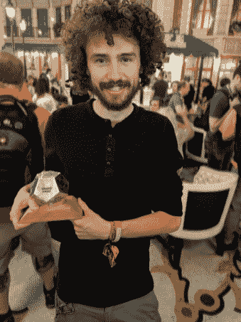](https://hackaday.com/2019/08/17/nfc-business-cards-to-fpga-cubes-skull-badges-to-bandoliers-heres-the-hardware-from-breakfast-at-def-con/dc-27-hackaday_prize-dexter/) James Wigglesworth [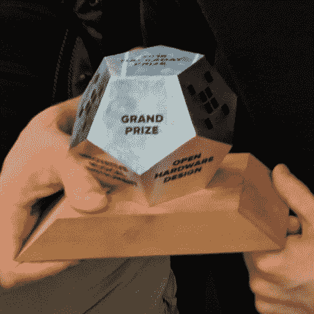](https://hackaday.com/2019/08/17/nfc-business-cards-to-fpga-cubes-skull-badges-to-bandoliers-heres-the-hardware-from-breakfast-at-def-con/dc-27-hackaday_prize-dexter-trophy/) 2018 Hackaday Prize trophy

看到 Hackaday 被那些让这个社区变得不可思议的人们炫耀，我总是感到一阵兴奋。[James Wigglesworth]今年一直在各地进行 Dexter 的现场演示，这是一只赢得 2018 年 Hackaday 奖的机器人手臂。但我觉得他带着奖杯出现在早餐会上真的很酷，很少有人能看到它！

没有举办这项活动的最佳地点。在离会场近的地方举行会有趣得多，但不要在酒店的舞厅里。我们将继续努力改进我们的方法，以获得最佳位置，但是正如您所看到的，重要的是人，我们很荣幸看到第五届 DEF CON 早餐会如此有趣的兴奋和活力！