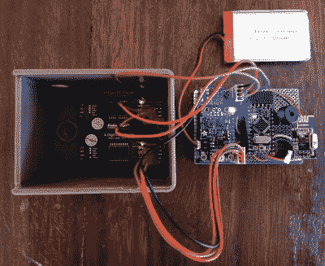

# 使用这些开源的 Arduino 蜂鸣器进行游戏

> 原文：<https://hackaday.com/2019/08/20/game-on-with-these-open-source-arduino-buzzers/>

计划在下一次聚会上玩黑客危险游戏？你需要一些合适的蜂群来完成体验，但是当你可以建造的时候为什么还要购买呢？[【Flute Systems】发布了一个开源的基于 Arduino 的 DIY 游戏蜂鸣器](https://flutesystems.blogspot.com/2019/08/wireless-quiz-buzzer.html)系统，它将有助于立即提升你的游戏。总比在房间里大喊大叫强。

该设计尽可能容易复制:只要你有一台 3D 打印机来运行蜂鸣器和基站的外壳，你就可以毫无问题地跟着做。该项目的其余部分由模块化组件组成，这些组件用跳线和 perfboard 的碎片组装在一起。诚然，这可能不是最优雅的解决方案，但对于初学者和老员工都可以完成的项目，还是有一些值得一提的。

 每个蜂鸣器由一个 Arduino Pro Mini 3.3 V、一个 nRF24L01 组成，当然还有顶部的一个大按钮。每一个都由 110 mAh 的 3.7 V LiPo 电池供电，尽管[Flute Systems]指出，当前版本的蜂鸣器实际上无法充电。你需要把电池拿出来，偶尔手动充电。令人欣慰的是，印刷外壳具有一个非常聪明的扭锁机制，这使得它很容易打开任何时候你需要戳在内部。

基站使用 Pro Mini 的 5 V 版本，配有 Adafruit PowerBoost 1000C，以提高其 2，000 mAh 电池的电压。当然，它也有一个 nRF24L01，还增加了一个蜂鸣器和两个四位七段 LED 显示屏。[Flute Systems]表示，基站可以运行大约 5 个小时。

这种设置的一个特别好的特征是八位数字显示器允许基站按照接收的顺序显示每个按钮的号码。因此，你可以看到所有八个按钮被按下的时间顺序，而不仅仅是显示谁先进入。为这种能力设计巧妙的应用程序是留给读者的练习。

当然，制作蜂鸣器的方法不止一种。如果你不喜欢[Flute Systems]的方式，那么[看看这个版本，它使用 900 MHz 无线电和有机发光二极管来显示结果](https://hackaday.com/2016/10/08/wireless-trivia-game-buzzers-using-hoperf-rfm69/)。