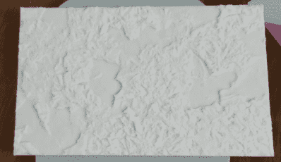
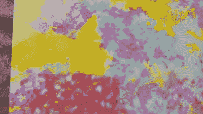

# Lithophanes 用彩色层抛弃了单色

> 原文：<https://hackaday.com/2019/08/20/lithophanes-ditch-the-monochrome-with-a-color-layer/>

3D 打印的石版画很棒，虽然有点单色。[Thomas Brooks](在[Jason Preuss]的帮助下)用一款制作彩色版画的工具[改变了这一切，但有一个问题:你需要一台能够制作多色版画的打印机。](https://lithophanemaker.com/Color%20Lithophane.html)

一个视频(嵌入在下面)以一个介绍开始，但从 1:26 分左右开始走过整个过程[。lithophane 是作为一个单件打印的，从正面看起来像大多数其他 3D 打印的 lithophane，但背面不同。背面(底部印刷层)由多个 STL 文件组成，每种颜色一个文件，共同创建了一个颜色过滤器。当从背后照亮时，光线穿过一切，产生一幅色彩鲜明的图像，而这是石膏像通常不具备的。](https://youtu.be/wO3KbI8k5HA?t=86)

As seen from the front, which is the top printed layer.

The back of the lithophane is printed in multiple colors, and acts as a color filter.

演示打印是用配有 Palette 2 的打印机创建的，Palette 2 是一种配件设备，可以将不同线轴上的细丝拼接在一起，以创建多色打印，但我们认为带有 MMU(多材料升级)的 Prusa 打印机也应该可以做到这一点。

[Thomas]已经有了很多关于如何改进流程的想法，但这些早期结果很有希望。需要礼物吗？Lithophanes 加上 LED 灯条就成了很棒的灯，[加上一个便宜的时钟机芯就增加了一点额外的东西](https://hackaday.com/2018/04/03/rotating-lithophane-box-turns-with-time/)。

 [https://www.youtube.com/embed/wO3KbI8k5HA?version=3&rel=1&showsearch=0&showinfo=1&iv_load_policy=1&fs=1&hl=en-US&autohide=2&wmode=transparent](https://www.youtube.com/embed/wO3KbI8k5HA?version=3&rel=1&showsearch=0&showinfo=1&iv_load_policy=1&fs=1&hl=en-US&autohide=2&wmode=transparent)

