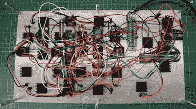

# 你不知道你需要的热变色显示屏

> 原文：<https://hackaday.com/2019/08/19/the-thermochromic-display-you-didnt-know-you-needed/>

我们喜欢在 Hackaday 展示数据的独特方式，这种由[Moritz v. Sivers]创造的巧妙的热变色显示器完全符合要求。利用变色液晶片和对安装在其上的板的仔细温度控制，他建造了一个巨大的七段显示器，它可以彩色地(尽管有点慢)显示当前的温度和湿度。

 一张张温度敏感的液晶有点像展平了的情绪年轮；它们开始是黑色的，但是当加热时，它们的颜色会变成鲜艳的红色、绿色和蓝色。这些床单可能是你在博物馆礼品店看到的那种模糊的科学玩具，但在这里[莫里茨]已经将它们独特的属性付诸实践。

为了达到这种效果，他首先用铜切割出每一段。由于其方便的自粘背衬，水晶片被应用到片段上，多余的部分被小心地修剪掉。然后通过导热环氧树脂将每个片段安装到 TES1-12704 Peltier 模块上。TB6612FNG 电机控制器和一组 Arduino Nano 用于控制珀尔帖模块，根据需要升高和降低它们的温度，以获得所需的效果。

休息之后你可以在视频里看到最终的结果。这无疑是我们见过的经典七段显示器中最有吸引力的变化之一。事实上，我们甚至可以说它可以被视为艺术装置。通过自身加热来显示当前温度的设备的想法当然有其深思熟虑的一面。

这实际上不是我们看到的第一个利用这一概念的展示，尽管它是迄今为止最大的。早在 2014 年，我们就推出了一款小型柔性显示屏，它使用 n [根彩色电线在一片液晶上“打印”数字](https://hackaday.com/2014/01/24/diy-curved-display-makes-use-of-cool-thermochromic-properties/)。

 [https://www.youtube.com/embed/JUFnYjrVmVQ?version=3&rel=1&showsearch=0&showinfo=1&iv_load_policy=1&fs=1&hl=en-US&autohide=2&wmode=transparent](https://www.youtube.com/embed/JUFnYjrVmVQ?version=3&rel=1&showsearch=0&showinfo=1&iv_load_policy=1&fs=1&hl=en-US&autohide=2&wmode=transparent)

