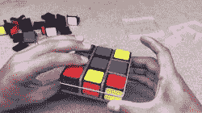

# 这个魔方灯有一些严重的复古风格

> 原文：<https://hackaday.com/2019/08/24/this-rubiks-cube-lamp-has-some-serious-retro-style/>

The reassembly is handled with super glue and acrylic to diffuse the light.

有一个简单的方法向你的朋友和家人表明你是一个成功的、有教养的社会成员——用流行文化来装饰你的家。一幅经典的尤达油画或者一张塔伦蒂诺电影海报都是不错的选择。或者，考虑给自己做一盏时髦的魔方灯。

构建从分解立方体开始，就好像你要作弊，然后按照正确的顺序重新组装。相反，立方体被挖空，为电子设备腾出空间。在里面，安装了一个覆盖着 led 的乒乓球，以及锂电池和一个从 USB 电源组抄袭来的电源板。整个组件用胶水和磨砂丙烯酸重新粘合在一起，充当复古风格的网格状扩散器。电源按钮甚至偷偷藏在其中一个方块里！

这是一个甜蜜的复古建筑，可以成为任何时髦休息室的绝佳点缀。在 Hackaday，我们是独立发光立方体的忠实粉丝——我们之前报道过[核动力](https://hackaday.com/2019/02/11/tritium-tesseract-makes-a-nifty-nightlight/)和[无限设计](https://hackaday.com/2018/12/29/infinity-cube-is-gorgeous-yet-simple/)。休息后的视频。

 [https://www.youtube.com/embed/IhmDpzcVnjI?version=3&rel=1&showsearch=0&showinfo=1&iv_load_policy=1&fs=1&hl=en-US&autohide=2&wmode=transparent](https://www.youtube.com/embed/IhmDpzcVnjI?version=3&rel=1&showsearch=0&showinfo=1&iv_load_policy=1&fs=1&hl=en-US&autohide=2&wmode=transparent)

