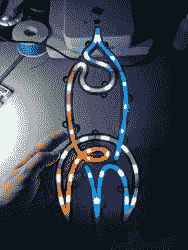

# 火箭夹克在 CCCamp 2019 看起来很帅

> 原文：<https://hackaday.com/2019/08/20/rocket-jacket-looks-sharp-for-cccamp-2019/>

制作自己的衣服可能很有趣，但如果你能在组合中加入一些发光二极管，并赋予“发光”一词新的含义，那就更好了。[[Arturo 182]为 CCCamp2019 定制的火箭夹克就是这样做的。](https://hackaday.io/project/167191-cccamp-2019-led-rocket-jacket)

We’re getting kind of a stained-glass vibe here.

为了制作这款夹克，一个 3D 打印框架被制作成 CCCamp 火箭标志的形状。然后用热胶水填充作为扩散器，并安装 WS2818B 发光二极管。Digispark 用作微控制器，其紧凑性非常适合可穿戴应用。然后，该组件被缝入帽衫的背面，内部使用纸板作为支撑物，以帮助保持物品平坦并支撑硬件的重量。

在这种应用中，热熔胶作为扩散器非常有用，并且由于在结构中使用了可寻址的 led，动画很容易制作。这是获得霓虹般外观的一个很好的方式，我们完全期待在未来看到更多这种闪闪发光的可穿戴设备！