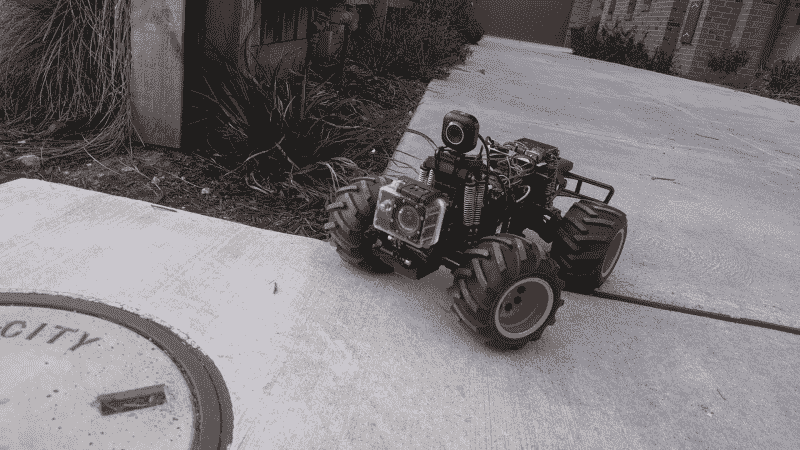
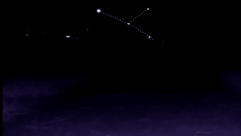
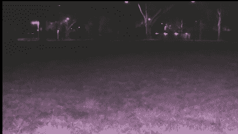

# 4G 漫游者和测试任务的好处

> 原文：<https://hackaday.com/2019/09/12/a-4g-rover-and-the-benefits-of-a-shakedown-mission/>

许多个月前，在 20 世纪 90 年代的一个昏暗的夜晚，年轻的列文拜访了他的堂兄。作为一名熟练的 AMOS 程序员，他成功地让他的 Amiga 500 控制了一辆 RC 汽车，只需要一大堆继电器和诡计。一切都很好，但只有一个问题——一旦汽车离开房间，就没有办法看到发生了什么。

> 你为什么不在上面装个摄像头？然后你可以开着它去任何地方！
> 
> ——列文

这将继续启发 TKIRV 项目大约 20 年后。该项目的目标是建造一辆配备有摄像头的漫游车，可以在地球上的任何地方通过蜂窝数据网络进行控制。在即将到来的重大探险中，该飞行器将接收太阳能电池板，使其能够在遥远的土地上长时间运行，而不必返回基地充电。

该项目继续朝着这个目标前进，但随着漫游车接近完成，带它出去兜风的诱惑越来越大。起初是一次令人兴奋的短途旅行，实际上为漫游者的进一步发展积累了大量有用的知识。

## 准备工作

TKIRV’s original webcam was one of the first areas highlighted for upgrades.

[早在 2016 年的早期测试中](https://hackaday.com/2017/09/12/video-streaming-like-your-raspberry-pi-depended-on-it/)就已经告诉了我们很多关于火星车在野外表现的信息。我们了解到，我们的 MJPEG 网络摄像头分辨率很低，并且在给定的视频质量下使用了过多的带宽。这促使我们将平台升级到 Raspberry Pi 摄像机，使用 H264 编解码器能够拍摄高达 1080p 的视频。这还配备了红外发光二极管，使夜间驾驶。同样显而易见的是，我们的开/关马达控制使得我们很难在狭小的空间内行驶。随着[升级到 PWM 有刷电机控制器](https://www.youtube.com/watch?v=5VPgZP4i8TY)，运动可以被减速到爬行。最后一分钟的黑客会议导致添加了一个粗糙的伺服系统来左右摇动摄像机。这极大地帮助了漫游车通过和绕过障碍物。

## 目标…不完全是火星，但几乎一样有趣

为什么让太空机构享受所有的乐趣，我们可以在地球上驾驶机器人平台，感觉就像在另一个星球上航行一样困难。计划中的任务是从家到当地的足球椭圆形场地的旅行，主要目标是使用机载摄像机定位和识别足球目标，次要目标是成功返回基地。由于这次任务是在郊区进行的，遇到行人的可能性不大，所以我们派出了一名跑步者，以减少在发生事故时丢失车辆的可能性，但有严格的指示，不要干涉任何其他情况。

在八月一个凉爽干燥的夜晚，我们在十二点前集合，准备好机器。电池充满电，跑步者和基地之间建立了语音通讯。TKIRV 充满活力，我们出发进入黑夜。

## 测试任务很容易发现你的弱点:

在您认为项目已经完成之前，在真实环境中测试您的构建是多么的有帮助，我怎么强调都不为过。现实世界的条件总是挑战你对事情应该如何发展的概念，并且在过程中调整路线远比带着设计回到绘图板要好。

很明显，方向盘很快向右倾斜。由于钢筋混凝土底盘的设计，机械调整是非常困难的，但这个很容易通过重置代码中转向的中立位置来纠正。

导航被证明是一个令人头疼的问题，它完全基于我们对该地区的了解以及我们通过昏暗的视频所能看到的东西来找到目标。地标很难识别，因为我们的发光二极管只能将光线投射很短的距离。反光的街道标志是最容易辨认的东西，但回想起来，一个更大的红外光源会给出更好的结果。我们的相机离地面也很低，很难看到更远的东西。同样清楚的是，我们需要在不熟悉的领域为未来的任务实施 GPS，因为从离地面如此低的平台上阅读街道标志是不可能的。

Streetlamps appear almost like constellations in the sky. Lights will guide you home!

在我们的测试中，一个有趣的观察结果是，街灯在我们的摄像机画面顶部以亮点的形式出现。当距离足够远时，我们可以将它们用作导航信标，就像水手通过星星导航一样。不管你周围是不是一片黑暗——只要把路灯稳定地保持在你的视野范围内，你就能笔直地向前行驶了！手头有这个工具有助于弥补航向指示器或指南针的缺乏。

Vision from the TKIRV rover while driving down the footpath. Motion blur was a major problem, making it difficult to drive for more than a few seconds at a time.

这台漫游者被视频的主要振动问题所困扰。这在晚上尤其明显，当我们在人行道上跳跃时，我们的视线变得模糊不清。然而，无人机视频是一个东西，投资一个昂贵但有效的 3 轴框架是我们将在未来版本中测试的解决方案。

## 相机有调整是有原因的

Changing camera settings made it much easier to see what we were doing. More lights are still probably in order, though.

一旦我们到达足球场，由于视野有限，仍然很难从外围的栅栏上看到球门。在这一点上，对相机设置的一些修补极大地改善了事情。增加亮度让我们能更清楚地看到我们所在的位置。对这些调整的更好控制应添加到控制设置的未来版本中。

我们还需要将电池状况添加到数据流中。如果没有电池电量的读数，我们就不知道油箱里还有多少电量。在草地上高速行驶是一项耗电很大的工作，我们的遥测线路开始出现信号中断。

这促使我们考虑进一步改进电力系统。通过为控制硬件和驱动电机使用单独的电源，当电池耗尽时，从电机汲取的过量电流将不再能够切断我们的命令和控制链路。尽管我们奋力向前，但我们再也无法抵抗电池不可避免的损耗。在第四次低电压重启后，我选择结束任务，据说是在 50 米线附近。

## 宝贵的学习经历

总的来说，虽然我们没有成功实现我们的主要目标，但所吸取的经验教训对项目的未来是非常宝贵的。除了太阳能发电系统的开发，我们现在还有一个升级清单。

我们迫不及待地想让这辆车为它的下一次冒险做好准备，迫不及待地再次坐在指挥椅上。期待在未来从 TKIRV 令人兴奋的冒险中听到更多的故事！

 [https://www.youtube.com/embed/V-ydreWvPLc?version=3&rel=1&showsearch=0&showinfo=1&iv_load_policy=1&fs=1&hl=en-US&autohide=2&wmode=transparent](https://www.youtube.com/embed/V-ydreWvPLc?version=3&rel=1&showsearch=0&showinfo=1&iv_load_policy=1&fs=1&hl=en-US&autohide=2&wmode=transparent)

