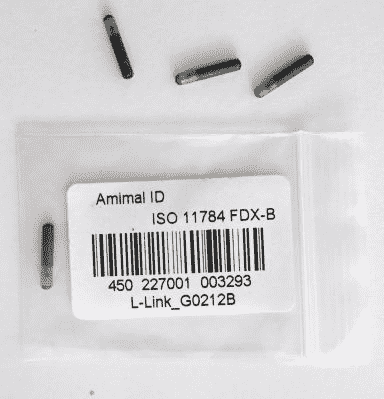
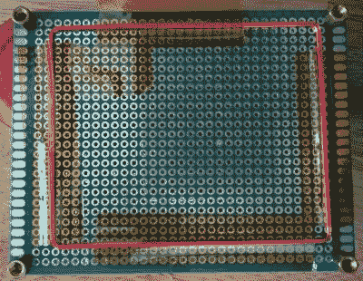
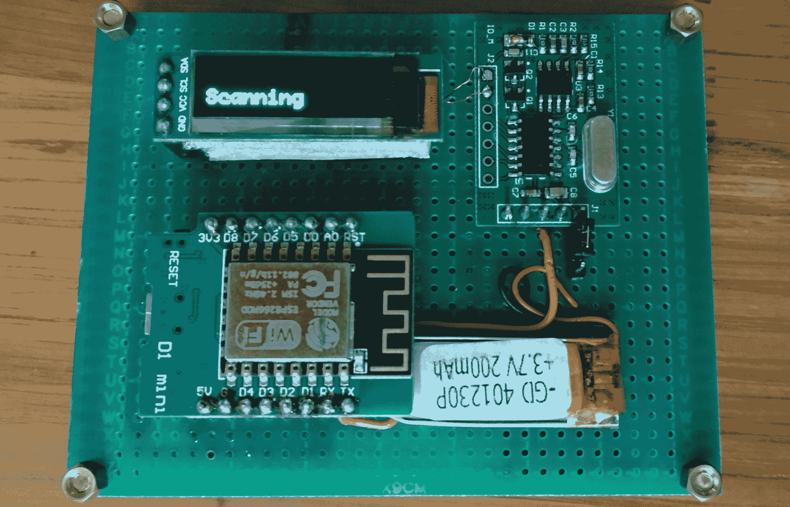
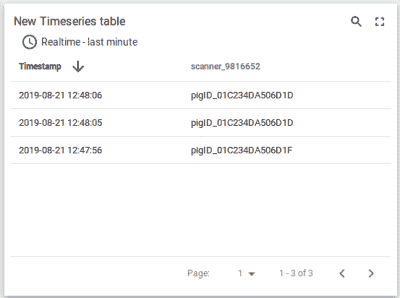

# 跟踪猪:建立一个可注射的家畜跟踪系统

> 原文：<https://hackaday.com/2019/08/27/following-pigs-building-an-injectable-livestock-tracking-system/>

我经常被要求设计客户和员工跟踪系统。有很多方法可以做到这一点，这是工程学和伦理学的一个有趣的交叉——在不同的背景下收集哪些信息是合理的，匿名化并安全地存储这些信息，以及在根本上整个系统是否应该存在。

在光谱的一端，一个简单地计算一天中不同时间在你的餐馆中的人数的系统是相当无害的，并且允许你提供更好的服务。另一方面，当你不为移动应用付费时，通常意味着你的私人数据是被买卖的产品。就我个人而言，我发现整个“快速移动和打破东西”的态度，以及对用户数据隐私的普遍忽视，已经创造了一个非常有害的技术场景。所以直到不久前，我拒绝建造侵入式跟踪系统——然后我收到了一个无法搁置的请求……



The small form factor of the injectable tags is quite nice. The rather large needle used to insert them, less so.

一个在大型农业公司工作的朋友想要一个可注射的 RFID 系统来跟踪猪从出生到屠宰的全过程。我在各种建议的消费者跟踪系统旁边展示了系统架构。我从一头猪看向消费者，然后又从消费者看向一头猪，按照奥威尔的原型，很难说哪个是哪个。有一件事是清楚的:我将放弃我的费用，并建立一些演示硬件…我太高兴了，否则做什么！

你们中的许多人会从新闻报道中听说过可注射的 RFID 标签，这些报道描述了有人在自己身上植入一个用来打开车门的标签。从根本上说，这些是用一卷电线紧紧包裹的微小 RFID 芯片，封装在一个比米粒稍大的惰性包装中。市场上的大多数设备仅用于兽医，并且非常便宜，尽管也有一些用于人类。如果你对这类事情感兴趣，那么你正在为自己(或者一只宠物)建立一个牲畜追踪系统，下面的一些可能对你有用！

## 了解跟踪植入物

与您可能熟悉的 13.56MHz NFC / RFID 系统不同，这些用于宠物和牲畜的可植入系统通常在 125kHz 载波频率下工作。他们也有自己定义的通信标准， [ISO 11784](http://en.wikipedia.org/wiki/ISO_11784_%26_11785) 。我看到只有几个高频标签可用，所以我去淘宝上买了最便宜/最好的阅读器和几个低频可注射标签。我最终得到了类似于这个的[，但是有更多未标记的 IC。请注意，对于人类使用，您可能不需要我在这里使用的可注射标签，因为它们不支持加密或 NFC。](http://dx.com/p/125khz-serial-uart-rf-id-card-reader-for-arduino-green-blue-2067143)



The antenna is just a square coil of magnet wire.

阅读器并不是一个令人印象深刻的设备——一个带有磁线天线的原板，很容易断裂，需要在测试期间重新焊接。它提供 9600 波特串行通信输出。我有一个加载了 NodeMCU 的 WeMos ESP8266 开发板，我选择用它来管理器件。

这里最难的部分是串行端口，需要在两种波特率之间切换，以便将代码加载到 ESP8266 和从植入式标签读取器接收数据。在启动时，ESP8266 期望以 115200 波特进行通信，并执行通过串行端口发送给它的任何东西。当从阅读器接收数据时，它需要以 9600 波特运行，并且绝对不执行接收到的任何东西…因为‘file . format’是一个可爱的名字，我们希望支持它。因为稍后我会将设备连接到互联网，所以我们在设备连接到 Wi-Fi 时保持默认的串行端口设置:

```

-- Connection parameters
wifi.setmode(wifi.STATION)
wifi.setphymode(wifi.PHYMODE_B)
station_cfg={}
station_cfg.ssid="SSID here"
station_cfg.pwd="password here"
station_cfg.save=true
wifi.sta.config(station_cfg)
wifi.sta.connect()

-- Only run serial monitor once connected
mytimer = tmr.create()
mytimer:register(1000, tmr.ALARM_AUTO, function() if wifi.sta.getip()==nil then print("Connecting...") else dofile('serial.lua') end end)
mytimer:start()

```

然后在 Wi-Fi 连接建立后，我们使用下面名为“serial.lua”的文件中的代码来切换串行端口设置，使其工作在 9600 波特，并且不会尝试执行任何接收到的内容。然后我们开始扫描:

```

-- initialize serial port to run at 9600 baud and not execute input
uart.setup(0, 9600, 8, uart.PARITY_NONE, uart.STOPBITS_1, 0)
print("Scanning")
data = ""

-- When serial data comes in, the data is preceded by an octothorpe, and split into two lines separated by a newline character. Strip those out.
uart.on("data", "#",
    function(data)
    data = string.gsub(data, "#", "")
    data = string.gsub(data, "\n", "")
    print(data)
    data = ""
    end, 0)

```

这将创建一个大致如下的工作流，每次我将串行设备连接到 ESP8266 时都会遵循该工作流:

1.  将 Esplorer 的波特率设置为 115200
2.  当设备连接到 Wi-Fi 时，向设备发送 file.remove("init.lua ")并重置
3.  将更新的代码加载到设备(init.lua 和 serial.lua)
4.  将 Esplorer 的波特率设置为 9600 并重置
5.  看看会发生什么，根据需要重复

现在，当我们将一个可植入的标签与阅读器接触时，它会正确地输出存储在上面的 ID。我注意到的第一件事是，它的范围非常短，甚至比 13.56MHz 的 RFID 门禁卡还短:标签必须完全接触天线才能被读取，有时需要尝试两三次。部分原因可能是我的阅读器和标签的质量有问题，但是植入式标签中的微型天线不太可能与门禁卡中更大、更好定向的天线相比。总的来说，这些可植入标签似乎是一种令人难以置信的短程技术，[即使使用更高频率的 NFC 系统](http://hackaday.com/2014/10/08/using-a-standard-coil-for-nfc-tag-implant-reading)。

对于任何有这些植入物的人来说，这可能是个好消息，因为我很难拦截你的设备上的通信，因为这需要手术才能移除。另一方面，与目前使用的远程耳朵或脚踝标签相比，它在跟踪牲畜方面几乎没有用处。

## 建立一个原型，让客户同意

下一步是为演示清理它。这些年来，我艰难地学会了一件事，那就是当有人让你演示一个原型时，他们关心的是与你完全不同的事情。对于所有的硬件演示，我尽量让设备成为一个独立的、自包含的单元，以避免分心。我至少有一个明亮的有机发光二极管屏幕，脂肪袋电池，一个 USB 充电电路，和一个连接电源的跳线。电池和充电电路很简单(它只是一个模块和任何备用的小袋电池)，添加有机发光二极管屏幕[非常容易](http://hackaday.com/2018/05/02/using-blockchain-explorer-apis-on-nodemcu)。



USB charger is on the reverse side of the top board. A second PCB is attached below it to cover the soldering work, and the antenna is on the verso of that second layer.

我还使用了两层绿色穿孔板，以便隐藏焊接痕迹，并使用黄铜垫片，以便它远离任何表面。总的来说，这将焦点从无聊的问题，如为什么要通过 USB 电缆插入我的电脑(只是为了电源)，转移到更有趣的问题，如性能和成本。

## 这个植入物不是未来



最终，原型证明了可注射 RFID 并不是跟踪牲畜的最佳方式，因为与现有解决方案相比，该系统的范围非常小——即使在阅读器和标签之间有 0.5 毫米的塑料隔板，阅读器也很复杂，而目前使用的耳朵和脚踝标签的工作范围超过几十厘米。

尽管如此，我还是把它连接到了 [ThingsBoard](http://thingsboard.io) 上，因为拥有一个猪联网设备很有趣。对于我剩余的可注射标签的非手术替代用途有什么建议吗？想到了在一个[丙烯酸环](http://hackaday.com/2019/04/25/rfid-payment-ring-made-from-dissolved-credit-card)中嵌入一个用于低安全性用途。