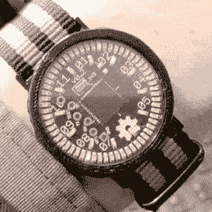

# 让数字手表回归模拟时代:走进 Charliewatch

> 原文：<https://hackaday.com/2019/08/22/returning-digital-watches-to-the-analog-age-enter-the-charliewatch/>

由[Trammell Hudson]设计的[Charlie watch](https://trmm.net/Charliewatch)是那些在设计和简洁方面都很漂亮的[项目之一。在看到[Travis Goodspeed]的基于德州仪器(ti)MSP 430 SoC 的 GoodWatch21 数字手表项目后，[Trammell]决定如果它更模拟一些会更好。这是通过使用](https://www.flickr.com/photos/osr/albums/72157672268216747/)[cc 430 f 5137 irgzr](https://www.ti.com/store/ti/en/p/product?p=CC430F5137IRGZR)(MSP 430 系列的一个简单成员)和一整串使用 [Charlieplexing](https://en.wikipedia.org/wiki/Charlieplexing) 驱动的 0603 SMD LEDs 来实现的。

这种历史悠久的方法使用很少的 I/O 引脚来控制许多 led，使得控制 72 个 led 而不使用 72 个专用引脚成为可能。密度使动画看起来令人惊叹，数字自然融化，留下独特的模拟魅力。

一颗传统的蓝宝石水晶从一家钟表匠那里以大约 14€的价格购得，表带也是如此。其余的都是原创作品，3D 打印表壳的多次迭代决定了晶体、PCB 和 CR2032 硬币电池叠层的完美契合。表带本身将元件牢固地固定在外壳中，计时由 32.768 kHz 时钟晶体和微控制器的 RTC 外设处理。

无论在白天还是黑夜都可以看到发光二极管。Charlieplexing 的本质意味着只有少数几个 led 会同时点亮，这对电池寿命来说是一个奇迹。[Trammell]告诉我们，在硬币电池需要更换之前，它可以运行大约 6 个月。

它是完全开源的，项目文件可以在[项目的 Github](https://github.com/osresearch/charliewatch) 页面上获得。我们希望看到一大批这样的手表出现在所有即将到来的电子产品活动中。只要确保你戒掉咖啡因，因为手动放置所有这些发光二极管的过程看起来令人生畏。