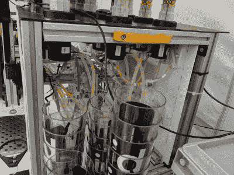

# UbaBOT 混合了 50 种鸡尾酒来解渴

> 原文：<https://hackaday.com/2019/08/22/ubabot-mixes-up-50-cocktails-to-quench-cccamp-thirst/>

[Steffen Pfiffner]混乱交流营期间的帐篷充满了比酒精本身更伟大的东西带来的快乐。他带来了一个机器人调酒师，在调制大约 50 种鸡尾酒配方中的一种时提供服务。

 [这个项目](https://events.ccc.de/camp/2019/wiki/Projects:UbaBot)是五个朋友的作品，他们来自德国南部的康斯坦茨湖(博登湖)，靠近瑞士和奥地利的边境。就像许多项目一样，它开始于一些深夜饮酒。这五个人辛苦地调制比你最普通的食物更复杂的饮料，并决定将他们的劳动转向机器人制造。

自 2012 年以来，该项目经历了五次修订，最近一次该团队称之为 Uba BOT。令人高兴的是，在机器前面左右移动的杯子托盘是用应变仪连接的。这为机器人提供了一种方式来感知杯子的存在，以避免将配料分配到整个吧台。它还提供了一个反馈回路，以验证添加到杯中的液体量和冰量。一旦所有的东西都在杯子里，一个旋转式牛奶起泡机将自己降低到搅拌东西的位置。

一个树莓 Pi 控制着 18 个泵，这些泵既分配液体又混合液体。该团队仍在努力寻找一种可靠的方法来分配碳酸混合物，由于泡沫过于兴奋，迄今为止这一直是一个挑战。这个软件最初是基于调酒师的，但是就像这些事情经常发生的那样，它已经有了自己的生命。你第一次想喝酒时，你注册一个 RFID 标签，记录你的身高、体重和年龄，它会根据时间和你访问机器人的次数来跟踪你估计的血液酒精含量。该固件还跟踪每种成分的状态，以提醒肉类酒吧服务员何时需要更换瓶子。

休息后加入我们，看看引擎盖下是什么的解释，并观看 Uba BOT 混合麦泰。

 [https://www.youtube.com/embed/FKQlkkbVhNw?version=3&rel=1&showsearch=0&showinfo=1&iv_load_policy=1&fs=1&hl=en-US&autohide=2&wmode=transparent](https://www.youtube.com/embed/FKQlkkbVhNw?version=3&rel=1&showsearch=0&showinfo=1&iv_load_policy=1&fs=1&hl=en-US&autohide=2&wmode=transparent)

