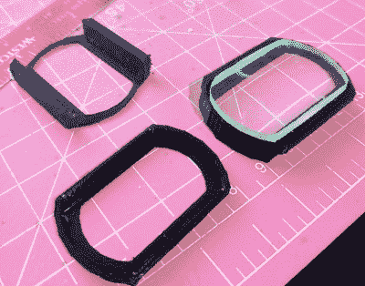

# Glia 正在制造开放式医疗设备，你可以帮忙

> 原文：<https://hackaday.com/2019/08/25/glia-is-making-open-medical-devices-and-you-can-help/>

Glia 项目旨在创建一套免费的开源医疗设备，可以在需要的时间和地点以低廉的价格轻松组装。在世界的某些地方，甚至像听诊器和止血带这样的基本工具也很难获得，尤其是在战争或内乱时期。但是有了 3D 打印机和团队的开源设计，一个特设工厂可以在地球上的任何地方开始生产这些救生工具。

 Glia 成员【Tarek Loubani】最近写了一篇博客文章，讨论该团队的最新发布:[一个只需 5 美元](https://medium.com/@trklou/a-clinical-grade-libre-open-source-otoscope-a61a0a6295e6)就可以建造的耳镜。即使你不认识这个名字，你也几乎肯定见过他们中的一个在使用。耳镜是用来观察耳朵内部的，在诊断疾病，尤其是儿童疾病方面有着不可估量的价值。不幸的是，虽然这种标志性的设备在技术层面上非常简单，但专业质量的版本可能要花费数百美元。

公平地说，要组装这款设备，你需要的不仅仅是 3D 打印零件。最终产品需要一些电子元件，如电池座、翘板开关和 LED。它还需要一个定制的镜头，尽管 Glia 团队已经提前考虑到了这一点，并提供了可打印夹具的文件，允许您将较大的镜头切割成他们耳镜所需的大小。在这种情况下，你可能不得不用你现有的东西即兴创作，这是一个非常聪明的设计元素。

到目前为止，该团队对耳镜的表现非常满意，但他们遇到了一点后勤障碍。事实证明，该项目的早期工作是在基于网络的 TinkerCAD 中完成的，这不太符合团队保持一切免费和开放的目标。他们希望在 FreeCAD 或 OpenSCAD 中重新创建 STL 时得到一些帮助，以便以后更容易修改。因此，如果你是一名自由/开源软件 CAD 大师，并且想要获得一些正面的回报，[请前往 GitHub 页面，为项目](https://github.com/GliaX/Otoscope)使用这些技能。

我们之前报道过 Glia 用 3D 打印止血带治疗枪伤的工作，这个项目导致[Tarek]在加沙试图实地测试设计时被狙击手射杀。如果这不是对开源硬件原则的承诺，我们不知道什么是。

 [https://www.youtube.com/embed/9h2voI1ipZM?version=3&rel=1&showsearch=0&showinfo=1&iv_load_policy=1&fs=1&hl=en-US&autohide=2&wmode=transparent](https://www.youtube.com/embed/9h2voI1ipZM?version=3&rel=1&showsearch=0&showinfo=1&iv_load_policy=1&fs=1&hl=en-US&autohide=2&wmode=transparent)

