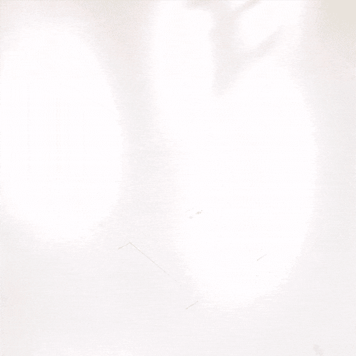

# 使用这些可打印的附件加快您的 Jetson Nano 游戏

> 原文：<https://hackaday.com/2019/08/26/step-up-your-jetson-nano-game-with-these-printable-accessories/>

发现自己有一个闪亮的新 NVIDIA Jetson Nano，但厌倦了每当电缆被拉断时它就在你的桌子上滑动？你需要一个立场！如果有一个方便的选项库，任何人都可以打印出来，将这个巨大的单板计算机连接到几乎任何东西上。但是等等，有！[Madeline Gannon]准确命名的[jetson-nano-accessories repository](https://github.com/madelinegannon/jetson-nano-accessories)支持您可能期望的更广泛的安装选项，具有模块化互连启动能力！

像 [Jetson Nano](https://hackaday.com/2019/03/18/hands-on-new-nvidia-jetson-nano-is-more-power-in-a-smaller-form-factor/) 这样的设备是一个非常不可思议的小模块系统(SOM)，当你考虑到它可以由一个无聊的 USB 电池供电时，就更是如此了。安装在 NVIDIA 的默认载板上，整个组件比树莓 Pi 要大得多。Nano 拥有巨大的计算能力和对 实时计算机视觉的明显偏好，是一款想要走向世界的设备！ 输入这些配件。

他们的核心是一个易于印刷的插槽和标签模块化联锁系统，方便各种附件。有些用螺栓将载板固定在背板上(如 [园艺钉](https://github.com/madelinegannon/jetson-nano-accessories/tree/master/gardening) )。其他包含夹子，将所有东西固定在一起，挂在 [电池和自行车](https://github.com/madelinegannon/jetson-nano-accessories/tree/master/bicycle-mount) 上。是的，桌子、三脚架等也有无聊的支架。我们提到过我们喜欢好的文档吗？点击任何一种安装类型，查看更详细的描述、装配说明，甚至标注尺寸的图纸。这是一套非常专业的实用工具集。