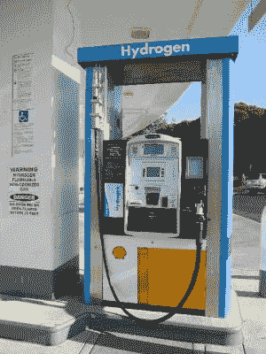
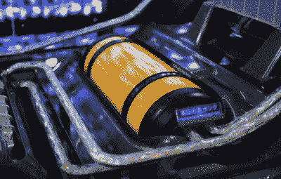
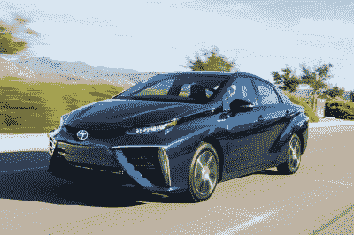
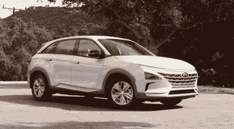

# 氢能汽车还在发生吗？

> 原文：<https://hackaday.com/2019/09/04/are-hydrogen-cars-still-happening/>

Potentially coming to a service station near you.

在每个评论区，总有一个。不管是电动汽车，不管技术发展到什么程度，总会有一种。

> “只有 500 英里的射程？电动车没用！我，还有我认识的每个人，每天至少要开 502 英里！不得不花 3 分钟以上的时间来充电，这完全是对我整个生活方式的冒犯。根本不实用，永远也不会实用。”

是的，这是真的，电动汽车的行驶里程有限，充电时间比汽油或柴油驱动的汽车要长一点。进步继续快速进行，但对一些人来说还不够。

对这些顽固分子来说，氢燃料电池汽车可能有一些吸引人的好处。通过让氢气通过质子交换膜，可以清洁地发电，副产品只有水。这项技术很有希望为车辆提供动力，但迄今为止还没有完全进入我们的日常生活。那么，氢作为运输燃料是怎么回事，我们什么时候能看到它们在地面上大量出现呢？

## 最后，一种清洁燃料？

据我们目前所知，氢是宇宙中最丰富的元素，在我们的海洋中也大量存在。通过电解水和其他化学方法很容易获得，但它还没有被用作主流燃料。氢有很多好处，但也有一些关键的缺点，这些都影响了它在汽车中的潜在用途。

### 赞成的意见

Hydrogen can be produced relatively cleanly, if renewable energy is used.

氢很容易找到——每个水分子都有两个氢原子在那里，随时可以被取走。以纯净形式获得它的最简单的方法是通过电解，当由可再生能源供电时，这可能是一个相对清洁的过程。在许多过程中，它也可以用作燃料，同时产生最小的污染。当用于燃料电池发电时，唯一的副产品是纯水。随着防止不可逆转的气候危机的比赛日益临近，这些特性使得氢成为未来能源需求的极具吸引力的选择。

就汽车而言，作为一种液体燃料，氢在电池技术上有很大优势。给油箱加满油只需几分钟，即使是充电最快的电动汽车也不可能做到。这有望缓解长途旅行的压力，并消除范围焦虑的幽灵。

### 骗局

Storage of hydrogen for transport use requires placing it under immense pressure in specially designed tanks. The official engineering term is that it’s “a bit of a pain”.

氢非常易燃，这是人类通常在其液体燃料中珍视的东西。然而，加上包含微小原子的难度，这种易燃性在处理氢气时是一个巨大的风险。此外，以紧凑和实用的方式储存氢用于运输和能源使用需要将其置于巨大的压力下，这进一步加剧了问题。

到目前为止，氢还面临着基础设施这个典型的先有鸡还是先有蛋的问题。路上行驶的氢燃料汽车很少，所以没有动力投资氢燃料补给站网络。相反，由于加油站很少，对氢燃料汽车的需求也很少。

这些问题也延伸到了分销领域。与可以通过简单电线传输的电力不同，氢必须通过油轮或管道输送。对于卡车来说，安全储存又是一个问题，同时携带氢气也需要消耗能量。管道带来了进一步的问题，因为氢往往会导致金属脆化，需要特殊管理才能安全输送。我们以前讨论过这个话题，讨论了英国家用氢气的潜力。

## 比赛的现状

The Toyota Mirai.

The Hyundai Nexo.

有一长串阻碍氢气进入主流的障碍。除此之外，汽车行业已经在电池电动技术上投入了大量资金。随着电池电动汽车续航里程的增加和充电时间的缩短，氢燃料电池汽车的主要竞争优势正在被侵蚀，这一切都发生在它们真正上市之前。

尽管如此，今天市场上仍有氢燃料汽车。现代公司目前正在欧洲销售他们的新型 Nexo 燃料电池汽车，澳大利亚和加利福尼亚的销量有限。自 2014 年以来，丰田一直在拥有合适基础设施的市场上销售 Mirai 未来组合，自 2008 年以来，本田的 FCX Clarity 也在一系列有限租赁计划中提供。到目前为止，汽车制造商对这些汽车保持着严格的控制，因为在没有加氢站的地区销售它们仍然不切实际。与电动汽车不同，在客户家中安装加油站也不是一个真正的选择，这进一步限制了推广。

燃料电池汽车的价格也非常高——Nexo SUV 的零售价约为 6 万美元。这主要是由于燃料电池技术的高成本，它严重依赖铂，还没有享受到规模经济的好处。虽然像用燃料电池废气泡茶这样的特技很有趣，但消费者的需求似乎仍然太低，无法推动更广泛的接受。

## 未来的潜力

If fuel cells ever become common in off-road vehicles, expect some truly compelling survivalist tales.

随着电动汽车充电站开始像野火一样蔓延，每一款新车型的里程都在增加，电池电动汽车似乎有着不容置疑的领先优势。话虽如此，仍有许多边缘情况下，廉价的氢可能会在市场上找到自己的位置。

电池电动汽车非常适合每天只短途旅行的城市通勤者。与此同时，对于那些经常被困在街头停车的人来说，访问充电基础设施可能会令人难以置信地沮丧。那些公寓里有停车位的人可能也很难游说安装充电器。对这些人来说，每周简单地加满油的想法比每周花一个小时坐在加油站更容易接受。

另一个可能被氢充分利用的领域是大型车辆。公共汽车和卡车经常在一天内行驶很长的距离。司机和操作者也不总是有时间让一辆车停下来充电几个小时。在这些应用中，氢可以作为减少排放的简单方法。此外，这些车辆中的许多是在为许多车辆服务的仓库中操作的，这些仓库已经被设置用于加油。对于像这样的单个燃料补给点来说，在现场安装氢基础设施相对简单。

燃料电池也有可能成为电池电动汽车的增程器。无论是作为一个附加模块，还是在订购时作为一个选项，将燃料电池集成到电动汽车中很容易，使其能够进行更长的旅行，而不必充电过长时间。

虽然氢气看起来不会很快将电池电动汽车赶出市场，但它可能会在市场上找到自己的位置。无论是在重型运输中，还是作为电池的替代品，它可能还会存在一段时间。只有时间会证明一切！