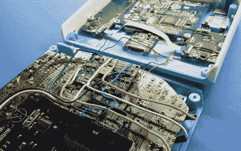

# 修剪 Dreamcast 板使完美的便携

> 原文：<https://hackaday.com/2019/08/27/trimmed-dreamcast-board-makes-for-perfect-portable/>

在过去一年左右的时间里，我们已经看到了一系列基于“修整”Wii 主板的便携式游戏系统，这些主板实际上已经被缩减到原始大小的几分之一。事实证明，大部分电路板专用于非必要功能，核心 Wii 系统包含在一个特定区域内，可以用一只稳定的手隔离。但正如[Gman]在他的最新作品中所展示的，同样的概念也可以应用到世嘉 dream cast 上。

当然，这不仅仅是用钢锯锯 Dreamcast 主板。[Gman]必须用相当多的额外硬件来补充调整后的系统，例如他最初为便携式 Wii 项目设计的电源管理板。

 其他部件都是专门为这个项目建造的。例如，有一个定制的 PCB 处理使用 PIC32MZ 微控制器仿真 Dreamcast 控制器的[。他还使用 LM49450 通过 I2S 从主板上提取数字音频，完全绕过模拟输出。](https://gmanmodz.com/2019/08/16/bit-banging-the-dreamcast-controller/)

虽然目前没有功能，但[Gman]还包括一个 SPI 有机发光二极管显示器和模拟系统独特视觉存储单元(VMU) 的[基本功能所必需的硬件，就在系统的前面。当他解决了软件方面的问题后，我们期待着看到他在将来重新审视这个特性。](https://hackaday.com/2017/07/17/completely-owning-the-dreamcast-add-on-you-never-hadcompletely-owning-the-dreamcast-add-on-you-never-had/)

受任天堂 2DS 启发的外壳是完全 3D 打印的。带有纹理 PEI 床的 Prusa i3 用于实现系统前面板上华丽的斑驳外观，而按钮是在 Form 2 SLA 打印机上完成的。有了由印刷纽扣制成的模具，[Gman]就能使用各种颜色铸造出最终的作品，直到他找到自己满意的组合。

如果你不是世嘉团队的成员，而是想破解你自己的任天堂硬件小版本，那么只需看看这个内置在 Altoids 罐中的功能齐全的 Wii 就行了。