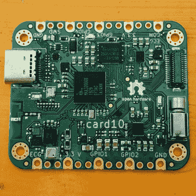
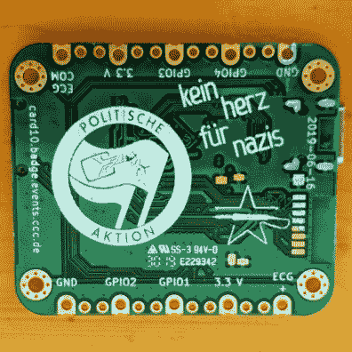
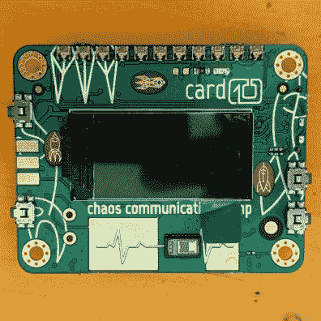
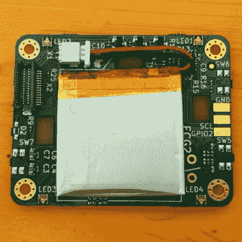
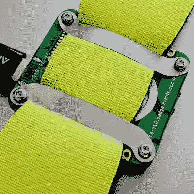
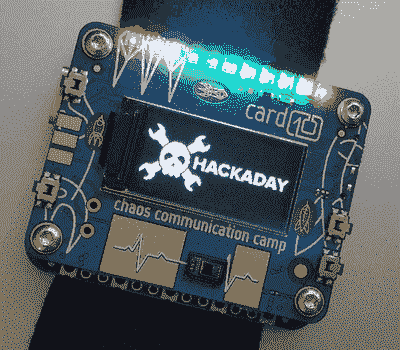
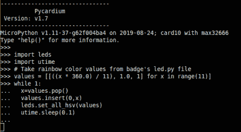

# 动手操作:CCCamp2019 徽章是一个传感器游乐场，不要被误认为是手表

> 原文：<https://hackaday.com/2019/08/29/hands-on-cccamp2019-badge-is-a-sensor-playground-not-to-be-mistaken-for-a-watch/>

上周末，5000 人聚集在柏林北部的一块空地上，在一个精心组织的炎热而尘土飞扬的仙境中露营。2019 年混沌通信营的可选但官方的[徽章在群众中扩散有点慢，因为徽章团队继续集结，而营地在他们周围肆虐。但是随着每一枚徽章变得栩栩如生，每一个黄昏绽放的闪光徽章变得更加快乐，因为成千上万枚徽章被绑在了它们的卡片上。](https://card10.badge.events.ccc.de)

然而，你不应该被愚弄，这不是手表…事实上，计时是一个附加的事后想法。当然，你可以把它戴在手腕上，但两个用于监测心脏健康的心电图(ECG)传感器是你对这个温和的外形中包装的打鼾龙的第一个暗示。问题中的芯片是 MAX30001 和 MAX86150(其主要作用是作为脉搏传感器，但也做心电图)。我们的高分辨率 ADC 正等着被误用，开发人员利用这一点，在 USB-C 连接器上为外部设备保留了一些额外的引脚。

有一个 10€的套件可以让你将一些电极垫(那些带凝胶的白色圆圈和一个与你身体电信号的固体接口)焊接到一根牺牲 USB-C 电缆上。请记住，心电图只是测量电脉冲，您可以选择如何对其做出反应。在研讨会期间，一名徽章开发人员将垫子放在他的太阳穴上，并使用 card10 徽章来感应左/右眼的运动。缺德！但是在这两个小印刷电路板上有更多的传感器在等着你。

Card10 由两块电路板组成，两块电路板之间用高度足以隐藏 200 毫安时锂电池的支架隔开。用户界面是一个彩色 LCD 屏幕，四个极小的按钮在顶部 PCB 的左右两侧成 90 度角启动，以及许多 led——有些很明显，有些不太明显。

## 更多硬件之上的硬件

    

当需要破解这个徽章的时候，硬件是一个不断给予的礼物。有加速度计吗？哦，非常正确——这就是最疯狂的地方。我一直在玩 BHI160，它既是加速度计又是陀螺仪，在编写时查找零件号，我发现还有一个我不知道的 BMA400 加速度计。嘿，你猜怎么着？还有一个 BME680 用于测量温度和湿度——哼哼，这两个都很常见——哦，对了，它还能测量气压和空气质量。什么？！？怎么会有董事会的空间，更不用说预算了？

    

嘿，你知道 MAX32666 Cortex-M4F 处理器运行在 96 MHz，在这个东西的中心有 512 kB 的 RAM 吗？[一个内核运行所有关键功能](https://firmware.card10.badge.events.ccc.de/overview.html)，而第二个内核处理 MicroPython 层和所有用户代码。哦，还有 8 兆字节的外部闪存来增加微控制器提供的 1 兆字节。为了与智能手表的主题保持一致，电路板上有一个振动电机。沿着底板的两侧是分支垫，用于使用导电线将您自己的硬件添加到表带上。

这是一只披着羊皮的狼獾，准备撕碎那些把它误认为行人的徽章。

## 组装比你想象的既容易又困难

 表带本身就是设计中令人惊讶的巧妙部分。两块柔性钢板横跨在底部螺钉或支座之间。他们将柔软的合成表带夹在中间，这是我见过的密度最小的氯丁橡胶。这太棒了，因为在闷热的八月阳光下，它从来不觉得热。一个简单的粘扣带——我从来不敢用 Velcro 这个品牌来称呼它([我们已经犯了那个可怕的错误](https://hackaday.com/2018/04/19/mechanisms-hook-and-loop-fasteners/))——作为扣环。

首先，为包装团队喝彩。所有的东西都在一个漂亮的拉链信封里，所有最小的部分都在一个小纸信封里。宜家有帮助组装的印刷说明。

乍一看，这个工具包似乎需要做很多工作；事实并非如此。解读象形图需要一点点挠头，并且会产生让你觉得聪明或愚蠢的两极分化效果。如果照片没有给你挑战，非常小的螺丝肯定会。我很幸运地在硬件黑客村，当我把我的放在一起，他们有外来的小梅花扳手螺丝。

我不是在抱怨…这是一个腕戴式心电图仪，空间很重要。在一些精细的剥离后，用于连接电池的难以察觉的薄双面胶带工作得很好，当弯曲那些钢表带夹时，我对小螺钉弹射的恐惧只有在知道工具包中提供了额外的螺钉后才平息。唯一让我感到困惑的是，为什么其中一个支架是尼龙的，而其他三个都是黄铜的？

## 选择你自己的首饰

当您第一次打开它时，默认情况下，card10 不会点亮电路板顶部的 led。但这不是一件好事吗？当你看到这排 11 个 RGB 发光二极管在手表上工作时，那是因为佩戴者采取了行动。是的，最上面一层是 11 层，但还有更多…深入研究，你会发现电路板上有 CCC 火箭标志的部分被下面电路板上的 led 照亮。我花了几个小时在文档中挖掘，才发现了一个侧面发光的“手电筒”LED 的设计。不幸的是，一个布局错误意味着这从来没有被填充，但它在营地会非常有用，因为在凌晨 3 点在黑暗的帐篷里找到你的手电筒是一种享受。(我在骗谁呢，每个人都有手机手电筒，但还是。)

## 谁把(微)蟒放出来了？

我怀疑在我弥留之际，我仍然会对 C 编程语言怀有深深的爱。不要误解我，我也喜欢 Python，但是对于像 OAuth 和文本操作这样的 desktopy/webby 的东西。(在嵌入式平台上，当需要锤子时，Python 感觉就像使用声波牙刷。

Testing out code live on the badge in a serial terminal window

因此，我还没有决定。我确实认为 MicroPython 是嵌入式电子产品的未来。我们将永远需要嵌入式工程师，但就像电子设计从模拟走向数字一样，以工程师为中心的电子学将走向更高级的语言，我认为 Python 已经成功击败了它的挑战者。

我纠结于这个徽章上的一些奇怪的东西。似乎 accel/gyro 有时会返回一个空值——我的 C 语言直觉认为这是错误的数据，而不是一个显示停止符，但是 Python 抛出了一个异常，我的代码没有准备好捕捉它。另一方面，Python 通过徽章上的 USB-C 插孔提供了一个实时解释器，因此您可以尝试每个命令并在此过程中发现问题。将 Python 超级强大的`print()`语句传送给`/dev/ttyACM0`也是一个`printf`梦想成真。我对此的结论是，这只是不同而已——C 可能需要更长的时间才能学会，但是在处理 MicroPython(我不太熟悉它)的怪癖时又浪费了很多时间。

## 从地板上抬起我的下巴

就像上好的苏格兰威士忌，第一口并不是我所期待的，但随着时间的推移，我上瘾了。card10 徽章的文档是我见过的最好的([特别是固件文档](https://firmware.card10.badge.events.ccc.de/))，除了已经被广泛采用的主要开源软件项目之外。传感器阵列是开发板梦想成真。甚至还有一个以 badge.team 孵化场形式存在的应用程序库[，这样你就可以看到你的黑客同伴在玩什么把戏了。但最重要的是，这个东西戴在你的手臂上比挂在你脖子上更有意义。(尽管没有电池支持的 RTC，时钟确实需要通过蓝牙使用智能手机配套应用](https://badge.team/badge/card10?badge=card10)[设置为当前时间。)](https://card10.badge.events.ccc.de/app/)

我担心的是，有 5000 枚徽章被扔进了野外，但很少有人会意识到它们拥有什么。我对所有在营地的了不起的人们的请求是:你拿着的东西是特别的，值得比一个周末的快乐多得多…不要让它在你的零件箱里丢失！不要相信我的话，看看[来自 con](https://media.ccc.de/v/Camp2019-10365-card10_badge) 的徽章对话，让你快速了解:

[https://media.ccc.de/v/Camp2019-10365-card10_badge/oembed#?secret=3WU4nYEyg2](https://media.ccc.de/v/Camp2019-10365-card10_badge/oembed#?secret=3WU4nYEyg2)

一旦你开始开发，在 [freenode #card10badge](irc://chat.freenode.net/#card10badge) 的 [IRC](https://en.wikipedia.org/wiki/Internet_Relay_Chat) 上加入对话。