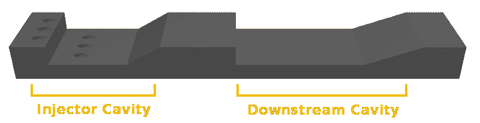

# 3D 打印可能是实用超燃冲压发动机的关键

> 原文：<https://hackaday.com/2019/09/03/3d-printing-may-be-the-key-to-practical-scramjets/>

第一个超燃冲压发动机，一种能够推动飞机超过 5 马赫的吸气式喷气发动机，在 20 世纪 90 年代初成功飞行。但是，尽管在过去的近 30 年里，你能想象到的几乎所有其他技术都取得了突飞猛进的进步，但高超声速超音速燃烧冲压发动机的最新技术却没有太大进展。我们仍然没有实用的高超音速飞机，无论是军用的还是其他的，任何以这种速度飞行的导弹都是由火箭驱动的。

NASA’s X-43 hit Mach 9.6 in 2004

这有点令人惊讶，因为至少在理论上，超燃冲压发动机的工作原理本身就是简单的。冲入发动机的空气被进气口的几何形状压缩，燃料被添加，混合物被点燃，产生的膨胀气流离开发动机的速度比进入发动机的速度快。超燃冲压发动机内部甚至没有任何移动部件，它只不过是一个精心成形的管子，里面有燃料喷射器和点火器。

不幸的是，[在实践中成功要困难得多](https://hackaday.com/2019/01/16/scramjet-engines-on-the-long-road-to-mach-5/)。部分问题在于，直到进入发动机进气口的空气以大约 4 马赫的速度流动，超燃冲压发动机才真正开始工作，这使得测试它们变得困难和昂贵。在一个特别设计的风洞中做这件事是可能的，但实际上来说，将发动机安装在传统火箭的前面更容易，这样可以让它加速。不利的一面是，这种飞行是单程机票，一旦燃料耗尽，试验品就会坠入大海。

但更大的问题是，核心概念看似简单。说起来容易，你只需向压缩空气流中喷射一些喷气燃料并点燃它，但当空气以每小时数千英里的速度移动时，保持它燃烧可不是一件容易的事。正因为如此，超燃冲压发动机的操作经常被比作试图在飓风中点燃一根火柴；挑战不在于任务，而在于你试图执行任务的环境。

现在，Aerojet Rocketdyne 和 Northrop Grumman 都认为他们可能已经找到了解决方案:增材制造。通过 3D 打印他们的超燃冲压发动机，他们不仅可以更快地迭代设计修改，而且生产成本远低于过去。更重要的是，它使复杂的发动机内部几何形状成为可能，而传统制造方式很难生产这种形状的发动机。

## 更多时间燃烧

超音速燃烧冲压喷气发动机是“超音速燃烧冲压喷气发动机”的缩写，它实际上给了我们一个很好的线索，让我们知道其中发生了什么。虽然超燃冲压发动机在超过 5 马赫的高超音速下工作，但冲压发动机的工作速度从略低于音速到大约 3 马赫。它们的工作原理基本相同，但有一个非常重要的区别:冲压发动机内部的空气在燃烧阶段被减速到亚音速，而在超燃冲压发动机中，空气以超音速穿过发动机。

不减缓发动机内部的气流是超燃冲压发动机更高运行速度的关键，但它也是使持续燃烧如此困难的因素。想象一个假想的超燃冲压发动机，它的燃烧室有一米长；在 5 马赫的速度下，沿直线运动的空气只会在室内停留几分之一毫秒。这并没有给它足够的时间与燃料混合并点燃。

增加发动机燃烧燃料和空气混合物的时间(称为“停留时间”)的最佳选择是使其内部几何形状复杂化。燃烧室内部点缀着小型火焰稳定器空腔，使气体有地方逗留，研究表明，这大大提高了高超音速时发动机的整体稳定性。

关于这些空腔的形状，有一些不同的想法，但最常见的方法是使用前缘为 90°且后壁倾斜的压痕。根据研究论文 [*超燃冲压发动机*](https://pdfs.semanticscholar.org/d0ea/32fd17eadf65c58f383f7105c8eec7c9c0c4.pdf) 中用于点火和火焰 *稳定的空腔火焰稳定器，当这些凹口位于燃料喷射口的尾部时，台阶前部的突然下降产生了气体将在其中再循环的空隙。成角度的后壁有助于防止冲击波，否则，如果气流在下降到空腔后撞击平面，就会产生冲击波。*

在传统制造的超燃冲压发动机中，这些凹痕将被铣入燃烧室的壁中。但是对于添加制造，它们可以在制造时集成。这不仅在发动机的生产过程中节省了时间和金钱，而且还允许通过实验来调整空腔的尺寸和位置。迄今为止的研究表明，空腔越多越好，燃烧室内部的“波浪形”表面可能是理想的。

## 更快更小

如果只生产少数几个超燃冲压发动机，比如一小队高超音速侦察机，那么增材制造的成本和时间节约可能就不是什么大事。当谈到发展尖端军用飞机时，历史告诉我们，美国政府非常愿意花费任何金钱来保持技术优势。但至少在短期内，高超音速超燃冲压发动机最有可能的应用不是飞机。

Boeing X-51 Waverider mounted to the wing of a B-52

Aerojet Rocketdyne 和 Northrop Grumman 分别与洛克希德·马丁公司和雷神公司合作，为国防高级研究计划局(DARPA)的[高超音速空气呼吸武器概念(HAWC)计划](https://www.darpa.mil/program/hypersonic-air-breathing-weapon-concept)开发项目，该计划旨在开发一种可负担得起的空射高超音速导弹。该计划是波音 X-51 乘波飞机开发期间进行的研究的逻辑进展，该飞机在 2013 年创造了世界上高超音速超燃冲压发动机最长飞行时间的记录。

虽然乘波者是成功的，但它是作为技术验证机建造的，并没有被设计成作战武器。DARPA 和美国空军现在希望将在 X-51 项目中获得的知识应用于大规模生产的导弹。随着这种转变，自然需要尽可能快、尽可能便宜地制造发动机。还有一个愿望是将武器小型化；乘波飞机必须由 B-52 轰炸机携带升空，但一种足够小的高超音速巡航导弹可以由战斗机携带，部署起来速度更快，成本更低。

为了实现这一目标，两个团队都宣布他们正在利用 3D 打印的超燃冲压发动机。据《航空周刊》报道，雷神公司和诺斯罗普·格鲁曼公司团队开发的超燃冲压发动机的质量还不到波音 X-51 waveder 的一半。

## 跟上速度

正如你所料，在一场正在进行的武器开发竞赛中，我们对 HAWC 项目及其竞争对手有很多不了解。但我们知道，由 Aerojet Rocketdyne 和 Northrop Grumman 制造的 3D 打印引擎都处于研发的前沿。虽然这些测试的确切时间表自然是保密的，但 DARPA 主任 Steven Walker 在 5 月份告诉记者，至少有一个 HAWC 项目的飞行测试将在年底前进行。

随着俄罗斯和中国发展高超音速武器库，美国军方非常积极地将他们自己的 5 马赫以上导弹和飞机提升到作战状态。一些分析人士认为，这可能是美国在武器技术上落后的一个相对罕见的例子，但随着 HAWC 等项目和解决十年老问题的创新方法，这场竞赛可能很快就会升温。