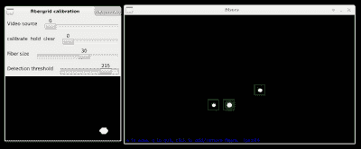

# 光纤网格:一种廉价的光学传感器框架

> 原文：<https://hackaday.com/2019/08/30/fibergrid-an-inexpensive-optical-sensor-framework/>

当建造机器人，或者其他复杂的机械系统时，随着项目的发展，越来越多的限位开关、光闸和传感器会聚集在一起。每次增加都会带来更多的 IO 引脚使用、成本、潜在的新接口要求以及随之而来的微控制器或 ADC。如果你没有太多的电子经验，那就不理想了。考虑到这一点，【rand3289】正在开发 [FiberGrid，这是一种无需复杂硬件即可连接多个传感器的巧妙捷径](https://hackaday.io/project/167317-fibergrid)。它没有完全解决上述问题，但它旨在成为一种廉价、安全的方式，以最少的硬件需求轻松添加传感器。

想法很简单:使用光纤从光闸制作传感器，将塑料纤维的末端放入网格，然后用相机拍摄网格。校准用 OpenCV 构建的[软件](https://github.com/rand3289/FiberGrid)后，您可以通过一个简洁的抽象层对传感器进行“采样”。这种方法比你想象的更简单、更便宜，而且很容易添加新的传感器。

自然，它对采样率来说并不理想，除非你想花钱买一台漂亮的高帧率相机，即使这样，你也可能不得不依赖操作系统及时处理帧。它也不是很紧凑，但幸运的是，你可以将相当多的传感器连接到一台相机上——在[rand3289]的原型中高达 216 个。

这种装置有许多新颖的用途，例如，用偏振滤光器制成的旋转传感器。我们以前甚至写过关于光学弯曲传感器的文章。

The [HackadayPrize2019](https://prize.supplyframe.com) is Sponsored by:     