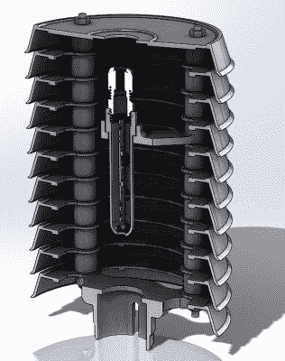

# 一堆花盆托盘，变成了低成本的太阳能罩

> 原文：<https://hackaday.com/2019/09/01/stack-of-plant-saucers-transformed-into-low-cost-solar-shield/>

对于用天气传感器收集的重要数据来说，太阳能罩是至关重要的。该防护罩保护温度和湿度传感器免受阳光直射，以及雨水和其他恶劣天气的影响，而不会干扰它们的运行。[Mare]设法用不到三欧元的材料制造了一个经济有效的盾牌。

 它始于一堆用来做花盆底部的塑料托盘。每一个都很像一个小盘子，但高边使它们非常适合这种应用。[Mare]用小型数控机床切割每个碟子的底部，但切割并不重要，手动工具也可以使用。

三个螺杆，螺母，和一些塑料垫片之间的每个茶托产生了组装你在这里看到的。正确安装后，内部的传感器可避免直接暴露在自然环境中，同时仍允许空气流通。因此，读数更加准确和稳定，传感器寿命更长。

防护罩的顶部是安装紫外线和环境光传感器板的最佳位置，【Mare】[也有一个低成本的 DIY 解决方案。传感器板由顶部的透明玻璃盘覆盖，保护板不会干扰读数，o 形环密封间隙。](https://e.pavlin.si/2019/02/05/outdoor-uv-index-sensor/)

3D 打印对于创建有用的组件来说是非常棒的，并且在过去的气象站建设中发挥了重要作用，但是像这样的项目表明并不是所有的东西都需要(也不应该)3D 打印。