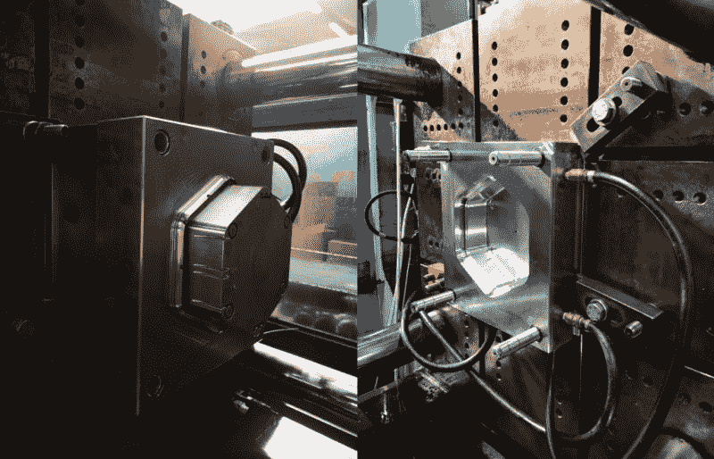

# 当项目圈地变坏:来自战壕的信息

> 原文：<https://hackaday.com/2019/09/03/when-project-enclosures-go-bad-a-message-from-the-trenches/>

壁挂式电动汽车充电站听起来并不需要最令人兴奋或复杂的外壳。当 Mastro Gippo 和他的团队决定将产品设计师[的成果转化为他们开发的“棱镜”充电硬件的真正外壳](https://hackaday.io/project/166859-prism/log/167243-enclosure-hell)时，这几乎就是他们的假设。事实证明，围栏是项目中最具挑战性的部分。

第一个想法是为集成测试制作一个便宜、简单的原型外壳。这让他们尝试了 FDM 3D 打印外壳、木质外壳、折叠(胶合)塑料外壳、铝挤压外壳、Zamac 合金外壳，最后是他们因成本高而一直避免使用的塑料注射成型外壳。

The injection mold used to produce the Prism enclosures with.

即使这意味着需要贷款来支付安装成本，但结果确实不言自明，它有一个很好的集成设计和两个看起来很开心的业务伙伴。这确实让我们想知道，缺乏这种财务回旋余地的项目如何能够在不打破众所周知的银行的情况下获得专业级的封闭。

FDM 3D 打印一直在变得越来越好，通过大量的后处理，你可以拥有一个看起来很棒的外壳，但这并不符合规模。将它外包给 Shapeways 这样的专业 3D 打印公司更好，但它仍然不是注塑质量，如果产品成功，你最终会逆转你最初追求的成本/收益。好看的外壳的中间地带在哪里？请在评论中告诉我们你的经历和想法。

The [HackadayPrize2019](https://prize.supplyframe.com) is Sponsored by:     