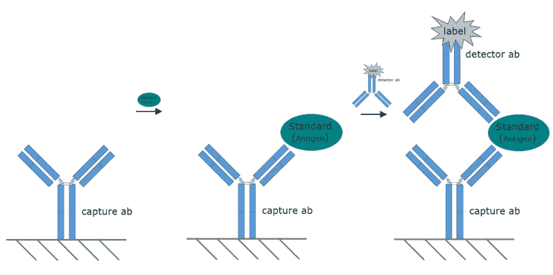
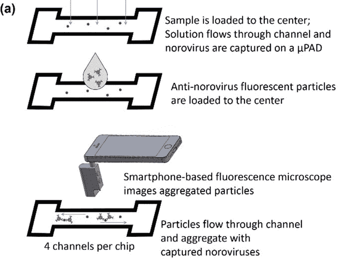
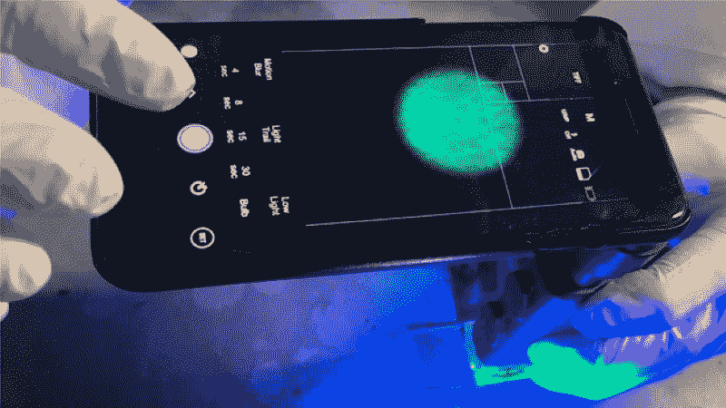

# 诺如病毒智能手机:使用百万像素和微流体对抗另一种病毒感染

> 原文：<https://hackaday.com/2019/09/10/norovirus-smartphone-using-megapixels-and-microfluidics-to-fight-the-other-kind-of-virus-infection/>

很有可能在你生命中的某个时候，你遇到了诺如病毒。你很有可能会清晰地记得那次遭遇，或者至少是它的后果。我记得有一年圣诞节，我的父母不仅仅给来访的孩子们带了玩具，还带了一堆病毒。一天之内，房子里的每个人都分享了喜悦。这是季节；他们称之为冬季呕吐虫并不是没有道理的。

每年 6.85 亿诺如病毒感染中的大部分在几天后就会痊愈，但有些需要住院治疗，其中 20 万人死亡，主要是脱水，主要是儿童。一种易于使用、廉价且准确的现场检测病毒的方法将对公共卫生大有裨益。很快，智能手机可能就能做到这一点。

## 从实验室到现场

关于病毒是否构成生命有很多争论，但有一点是肯定的:病毒完全适应它们的使命。病毒只由一个精简的基因组组成，代表了在宿主细胞中复制所需的最小特征集。因此，当试图识别病毒时，没有太多可做的；它们没有自己的新陈代谢，它们不通过细胞分裂生长，而且它们太小了，除非用电子显微镜才能看到。

在实验室中，病毒通常通过针对基因组或保护基因组的蛋白质外壳的方法来识别。基因组方法包括聚合酶链式反应(PCR)，它放大病毒内微小长度的 DNA 或 RNA(放大 RNA 病毒如诺如病毒的基因组需要首先用一种称为逆转录酶的酶将 RNA 转化为 DNA；这个过程被称为 RT-PCR。)PCR 方法产生数十亿个基因组拷贝，然后使用凝胶电泳或其他方法可以很容易地检测到这些拷贝。用免疫测定法检测蛋白质包膜，其中对一种外壳蛋白特异的抗体结合到病毒颗粒上；这些抗体随后被附着有放射性或荧光示踪剂的抗抗体检测到。

A standard capture or “sandwich” ELISA (enzyme-linked immunosorbent assay). Antibodies to the protein of interest are bound to a matrix. The protein is added, it adheres to the bound antibodies, and then a labeled anti-antibody is added. Source: [AntibodiesOnline.com](https://www.antibodies-online.com/resources/17/1464/an-introduction-to-elisa-part-2/)

虽然这两种方法在实验室都很简单，但在野外却不切实际，并且需要昂贵的仪器。为了解决在现实世界条件下快速识别诺如病毒的问题，亚利桑那大学的一个团队开发了一种独特的微流体病毒检测方法。这个想法类似于实验室中使用的“三明治”免疫测定法，但有一些变化。

## 荧光团

Schematic of microfluidic channels used in the detection of norovirus. Thick black lines are the wax-printed channels; four channels are printed on each piece of nitrocellulose paper. Source: [*ACS Omega* 2019, 4, 6, 11180-11188.](https://pubs.acs.org/doi/10.1021/acsomega.9b00772)

第一个创新是使用微流体纸。这种纸是一小片硝化纤维素滤纸，也称为闪光纸，上面用固体油墨打印机打印了小通道。然后加热纸张，将蜡状固体油墨熔化到纸张的孔隙中，形成疏水屏障。在纸上加入少量疑似被诺如病毒污染的水样；样品通过毛细管作用被吸收到纸的孔隙中，并沿着通道扩散，但是被蜡质屏障限制不能迁移太远。

接下来，将特异于一种诺如病毒外壳蛋白的荧光标记抗体加入到通道中。抗体溶液被迅速拉入纸中，在那里它与任何诺如病毒颗粒结合。抗体堆积在每个粒子上，形成大的荧光团，在显微镜下很容易检测到。通常这是在实验室用荧光显微镜完成的，但是这个团队也有一个窍门。

使用现成的光学显微镜和 480 纳米的带通滤波器，他们将一部普通的智能手机变成了便携式的专用荧光显微镜。显微镜夹在照相机镜头上，同时滤光器经过白色 LED，以提供可视化聚集的荧光抗体缀合物所需的蓝色激发光；该团队指出，单独的蓝色 LED 也可以工作。由于采用了微流体技术，凝块在通道中分布得很好，这使得在手机上运行的图像分析软件更容易对它们进行计数。团块越多，样品中的病毒载量越高。

The smartphone attachment and apps needed to detect norovirus load in field samples. Note the blue light from a 480-nm bandpass filter over the camera’s light; a separate blue LED could be substituted. Source: [*ACS Omega* 2019, 4, 6,11180-11188](https://pubs.acs.org/doi/10.1021/acsomega.9b00772)

手机上的图像分析是基于 MATLAB 的。当用蓝光刺激时，荧光抗体发出约 525 nm 的光。该程序使用相机红色和绿色通道的数据，而忽略蓝色通道，捕捉发射的波长，同时阻止激发光。将荧光体从背景噪声中分离出来，如果它们超过截止尺寸，则进行计数。该应用程序在短短一分钟内产生一个读数，无需互联网连接。

整个硬件安装费用约为 50 美元，不包括手机。该团队能够表明，该系统可以检测低至每微升纯水中一个病毒拷贝的诺如病毒，或者在回收的废水中每微升 10 个病毒拷贝，这是一个更现实的现场场景。整个试剂盒组装简单，成本低廉，不需要特别的专业知识来操作，所有的材料和试剂，包括抗体和荧光标记，都可以从市场上买到。

像这样的传染性病原体检测创新可能真的有利于公共卫生。利用智能手机不断增长的计算能力和传感器能力，可能会导致更广泛的病原体检测模式，灵敏度更高，从而更好地预防和提高数百万人的生活质量。

[via [科技探索](https://techxplore.com/news/2019-08-smartphone-norovirus.html)