# 乐高房子:就在丹麦的乐高乐园旁边，但是更酷

> 原文：<https://hackaday.com/2019/09/09/lego-house-right-next-to-denmarks-legoland-but-way-cooler/>

如果说大多数 Hackaday 的读者对丹麦有什么了解的话，那就是它是乐高积木的故乡。这种玩具在 20 世纪 40 年代末首次出现在丹麦中部比隆的 Ole Kirk Christiansen 的乐高公司的工厂里，从那时起它就与这个城市和这个国家密不可分。

当在丹麦度过为期一周的 BornHack 黑客营(T1)时，花一天时间开车去比伦德，参观著名的 T2 乐高乐园(T3)绝对是明智之举。所有这些童年梦想看到传说中的景点将得到满足，使参观一天记住。

[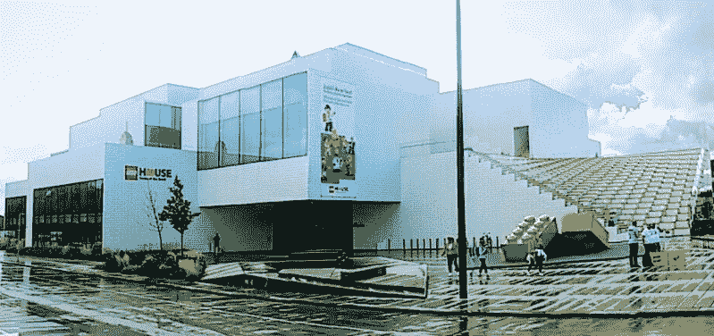](https://hackaday.com/wp-content/uploads/2019/09/legohouse-building-colorcorrect.jpg)

Your first view of the Lego House, in the centre of Billund.

然而，波恩哈克的丹麦人有其他想法。他们说，一定要去乐高乐园，但也要去参观乐高房子。作为一个英国人，我从未听说过它，所以很快就被教育了。看起来，虽然乐高乐园是一个儿童主题公园，但乐高屋是一个更注重乐高积木的体验，在丹麦黑客看来，这要好得多。

## 在公司镇，你坐在主矿脉上

比隆德是一个被农田包围的小镇，如果不是乐高公司镇，它可能仍然是一个死气沉沉的死水。游客的吸引力与乐高工厂和仓库的规模相比相形见绌，它还拥有该国第二大国际机场，该机场也由该公司所有。

当你开车进去的时候，你会毫不怀疑乐高对这个地方的影响，城市的边界是由路边汽车大小的乐高积木标示的。乐高屋就在镇中心，这是一座现代主义建筑，设计得像一大堆乐高积木。从广场对面看，你一定会看到更多的巨型砖块。(我凑近看了看——原来它们是玻璃纤维的，我莫名其妙地想拥有一个。)

 [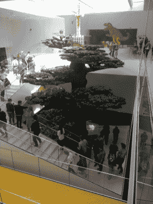](https://hackaday.com/2019/09/09/lego-house-right-next-to-denmarks-legoland-but-way-cooler/legohouse-tree/) The full-sized tree in the atrium of Lego House. [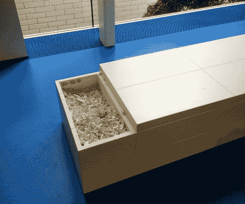](https://hackaday.com/2019/09/09/lego-house-right-next-to-denmarks-legoland-but-way-cooler/legohouse-bench/) Throughout Lego House are these benches with bins of Lego bricks for the casual builder.

一旦进入，中央中庭被几层楼高的真人大小的树占据，当然是由乐高制成的。家具和配件都设计精美，但保留了乐高主题，你永远不会远离乐高积木，大多数座位都有一个装满积木的箱子供你休闲玩耍。从任何意义上来说，这都是一座砖造的庙宇，很明显，大量的思想已经进入了它的创造之中。这不是一个吸引游客的预算，而是一家跨国公司对其产品粉丝的感谢声明，作为一名游客，你可以沉浸其中，而不是成为一名观众。

## 砖块有着迷人的历史

[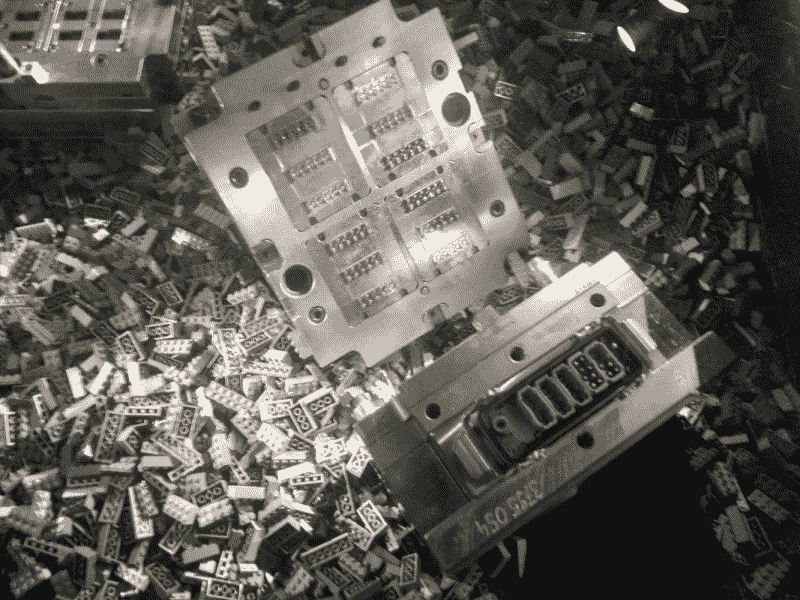](https://hackaday.com/wp-content/uploads/2019/09/legohouse-scrap-moulds.jpg)

Spent Lego moulds, under the museum floor

地下室的博物馆将带领游客了解乐高业务的形成和早期，从家庭木匠店的起源，到木制玩具的多样化，再到塑料成型。不过，首先，你走过一系列从乐高工厂地基中出土的破旧乐高积木模具，有趣的是，我们了解到，该公司过去常常以这种方式掩埋模具，以避免它们落入竞争对手手中。近距离观察这些模具很有趣，而且这个展览有点诡异。

 [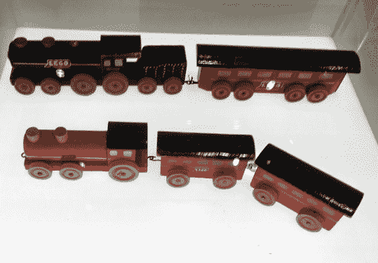](https://hackaday.com/2019/09/09/lego-house-right-next-to-denmarks-legoland-but-way-cooler/legohouse-trains/) Early wooden Lego trains [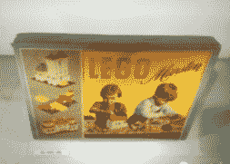](https://hackaday.com/2019/09/09/lego-house-right-next-to-denmarks-legoland-but-way-cooler/legohouse-early-bricks/) Some of the earliest Lego brick sets. [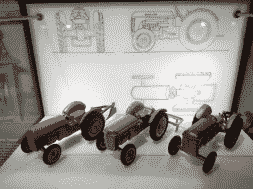](https://hackaday.com/2019/09/09/lego-house-right-next-to-denmarks-legoland-but-way-cooler/legohouse-tractors/) 1950s Ferguson tractors modeled by Lego in plastic.

我们看到该公司的木制玩具从 20 世纪 30 年代延续到 50 年代，顺便提供了当时玩具时尚的快照。例如，20 世纪 30 年代有一股溜溜球热，后来又有一股将假摩托车引擎安装在自行车上的热潮。对于那些把这个名字和塑料砖联系在一起的人来说，在木制卡车或火车上看到“乐高”这个词确实很奇怪。这些都是高质量的玩具，我敢说，如果我有幸在二手商店遇到一个，我肯定会抢购一些。

 [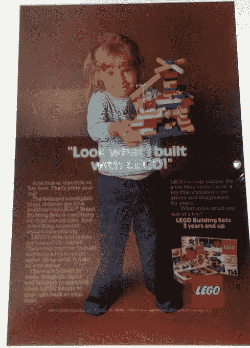](https://i0.wp.com/hackaday.com/wp-content/uploads/2019/09/legohouse-advert.jpg?ssl=1) This 1960s advert captures the creativity of the kit of lego parts so well. [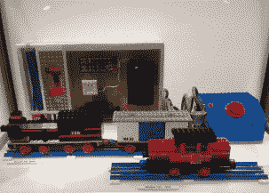](https://i0.wp.com/hackaday.com/wp-content/uploads/2019/09/legohouse-rail.jpg?ssl=1) You can tell someone’s age by the colour of their Lego rails. [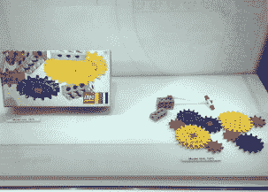](https://i0.wp.com/hackaday.com/wp-content/uploads/2019/09/legohouse-gears.jpg?ssl=1) The 1970s Lego gear sets were extremely versatile, and could operate both in-line and at 90 degrees. [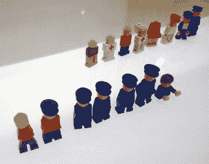](https://i0.wp.com/hackaday.com/wp-content/uploads/2019/09/legohouse-minifigures.jpg?ssl=1) Prototype minfigures. [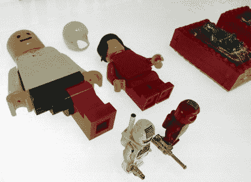](https://i0.wp.com/hackaday.com/wp-content/uploads/2019/09/legohouse-minifigures-2.jpg?ssl=1) More prototype minifigures. [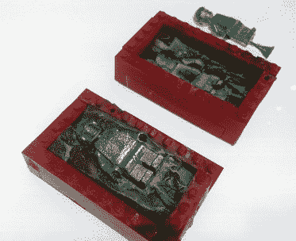](https://i0.wp.com/hackaday.com/wp-content/uploads/2019/09/legohouse-minifigures-mould.jpg?ssl=1) A mould for minifigure prototypes.

20 世纪 40 年代末，该公司开始涉足塑料模制品，随后举办了一系列展览，展示木制玩具行业的衰落和塑料的崛起。它从乐高积木开始，演变成我们今天所知道的无数种形状。大量的设计工作是为了确保砖块相互紧密结合，以确保模型不会倒塌，同时保持易于拆卸，这是一个令人着迷的故事。

在这一点上，你会看到你小时候拥有的设备，例如对我来说，20 世纪 70 年代初的蓝色铁轨和大型齿轮组引发了最大的怀旧情绪。值得注意的是，那个时代的布景更多的是“这里有一堆零件，去建造你想要的任何东西”，而不是“这里有一个制作这个宇宙飞船的布景，去建造那个”，我至少觉得我们的孩子在这个过程中失去了一些创作机会。

## 适合所有年龄的大量乐高活动

 [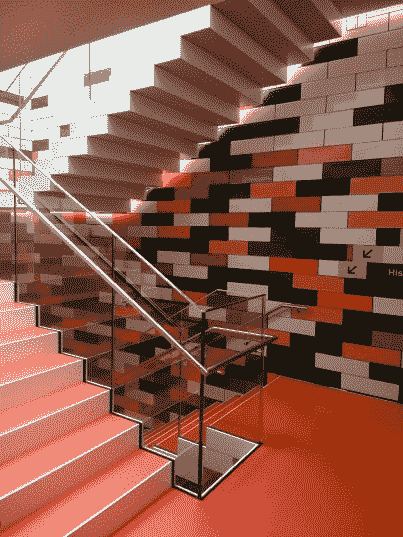](https://hackaday.com/2019/09/09/lego-house-right-next-to-denmarks-legoland-but-way-cooler/legohouse-stairs/) Even the Lego House staircases have a Lego theme. [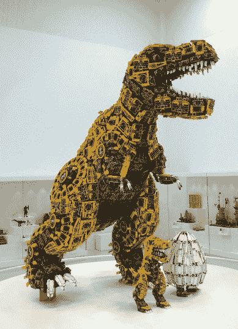](https://hackaday.com/2019/09/09/lego-house-right-next-to-denmarks-legoland-but-way-cooler/legohouse-dinosaur/) One of the dinosaur artworks on show. [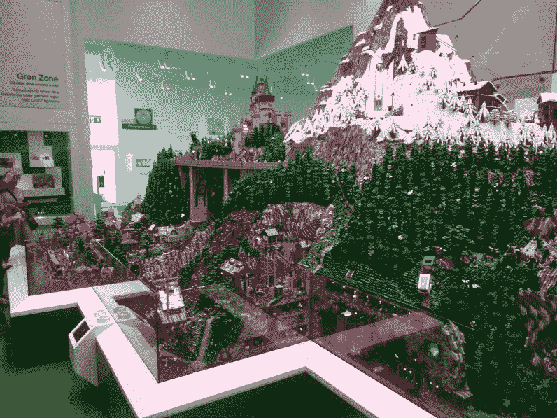](https://hackaday.com/2019/09/09/lego-house-right-next-to-denmarks-legoland-but-way-cooler/legohouse-mountain/) One of many impressive Lego scenes in the building.

光是博物馆就足以成为一个有价值的目的地，但是这座建筑提供了更多。楼上有一系列区域，从以乐高积木为媒介的艺术画廊，到互动的乐高挑战和游戏，包括用乐高制作真实物品并将其与虚拟世界配对，到更传统的乐高活动。如果你想建造一个乐高房子，并把它放在一个虚拟的城市景观中，你可以在这里做。

[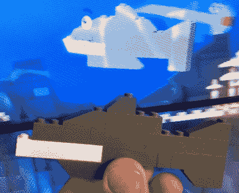](https://hackaday.com/wp-content/uploads/2019/09/legohouse-fish.jpg)

The Hackaday shark. It seems the Lego scanning algorithm doesn’t identify grey bricks very well.

你还可以看到你的乐高鱼在虚拟的海里游泳。我的努力是一条鲨鱼。

## 观看制砖过程的难得机会

从五彩缤纷的塑料砖中走出来，回到中庭，这是最后的款待。丹麦数学家索伦·艾勒斯和他的团队[计算出六块八柱乐高积木的最大组合数](http://web.math.ku.dk/~eilers/lego.html)为 915，103，765，乐高公司正着手建造每一块积木。你可以扫描你的 RFID 通行证，并收到你的个性化组合，但特别的是，在你离开时，你会收到一包六块红色乐高积木，由你面前的一条工作乐高生产线制作。我们被告知，这与乐高工厂使用的工厂是一样的，但大大降低了游客通过景点的速度。

 <https://hackaday.com/wp-content/uploads/2019/09/lego-house-injection-molding.mp4?_=1>

[https://hackaday.com/wp-content/uploads/2019/09/lego-house-injection-molding.mp4](https://hackaday.com/wp-content/uploads/2019/09/lego-house-injection-molding.mp4)

有一台机器处理原始塑料颗粒，为制造砖块的液压注射成型机供料，然后是一系列分拣机器，提取六块砖块，然后是包装器，在称重和分配之前，将它们装入专用的乐高屋包装中。有趣的是，称重过程会剔除几袋砖块，成品砖块上一定有相当精细的公差。这是一个近距离观看工业生产线的难得机会，而且它正在创造标志性的乐高积木是一个额外的奖励。

 [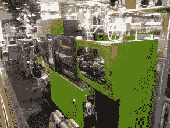](https://i0.wp.com/hackaday.com/wp-content/uploads/2019/09/legohouse-productionline-moulding-machine.jpg?ssl=1) The injection moulding machine.  New bricks being put into the hopper for sorting. [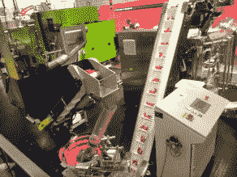](https://i0.wp.com/hackaday.com/wp-content/uploads/2019/09/legohouse-productionline-sorting.jpg?ssl=1) Sorted sets of six bricks being fed to the packager. [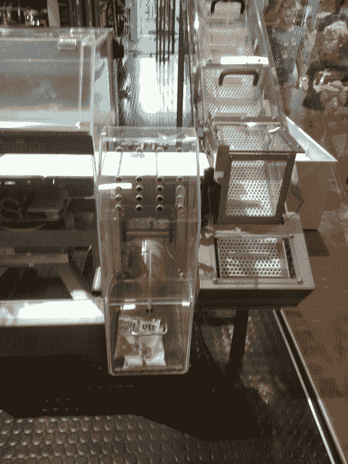](https://i0.wp.com/hackaday.com/wp-content/uploads/2019/09/legohouse-productionline-rejects.jpg?ssl=1) Rejected bags of bricks shunted off to one side. [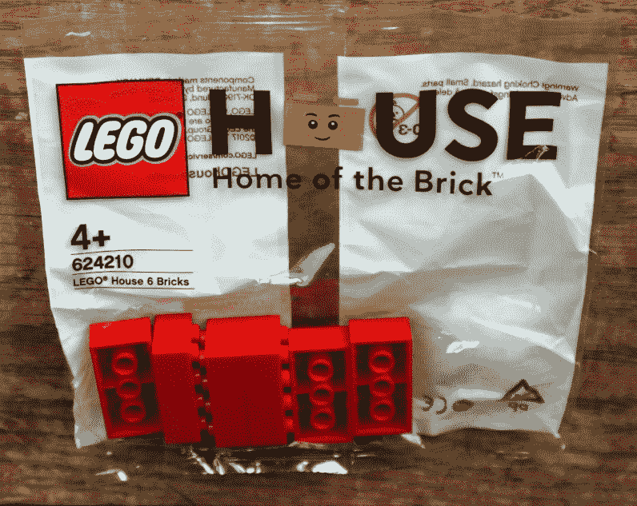](https://i0.wp.com/hackaday.com/wp-content/uploads/2019/09/legohouse-bricks.jpg?ssl=1) My bag of six bricks, a Lego package you can only get at Lego House.

## 比隆还有另一个景点

手里拿着积木，我们离开乐高屋，经过乐高商店，在那里几乎可以找到任何乐高玩具。乐高积木的节日，但当然这不是比伦的唯一游戏。乐高乐园位于市郊，所以第二天我们去了那里。它不值得像 Lego House 这样的杂文，因为我们不是一个主题公园评论网站，但它值得快速提及，因为这里有几个技术兴趣点。

  Disappointingly Lego fries do not stack in the way Lego bricks do.  Program your own path, with the Ice Pilot ride.  Compile your own penguin! (It’s a gentoo penguin, we’re told) [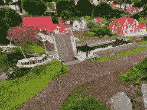](https://hackaday.com/2019/09/09/lego-house-right-next-to-denmarks-legoland-but-way-cooler/legoland-boat/) The miniature towns have plenty of impressive feats of automation to study.

大多数游乐设施都是传统公园食物的乐高主题版本，但值得花时间尝试一下 Ice Pilot 游乐设施，你坐在工业机器人的末端，沿着你自己可以编程的路径行驶。然后是广泛的乐高模型城市，有很多自动化程度令人惊叹。除此之外，你还可以享受单轨铁路、火车和水上游乐设施的乐趣，但不要指望有太多的无障碍技术。给聪明人一个忠告:尽一切可能尝试汉堡店里的乐高积木薯条，但要给多人点一份。丹麦人一定胃口很大。

那么，乐高房子和乐高乐园。既有丹麦风情，又有苏格兰风情，如果你来到这个国家，这绝对是你应该放在行程中的东西。明年腾出时间给博恩哈克怎么样，这样你就可以跟随我们的脚步了？