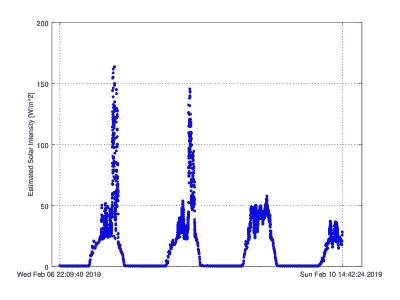

# 太阳能适合你吗？弄清楚！

> 原文：<https://hackaday.com/2019/09/07/is-solar-right-for-you-find-out/>

太阳能电池板正在彻底改变电力行业，但并不是每个人都适合屋顶太阳能。例如，很明显，与生活在赤道附近的人相比，生活在极北或极南纬度的人在冬天不会产生大量的能量，但还有其他因素在起作用，这些因素对每个单独的房子来说更加具体。为了查明是否有人会从太阳能电池板中受益，[杰克]和[瑞安]的[太阳强度传感器将帮助你找出](https://hackaday.io/project/158984-sol-long-term-solar-intensity-sensing)。

 长期强度追踪器配备了一个小型太阳能电池板和一个数据记录设备，正确地包含在一个防水外壳中，并打算放置在潜在太阳能装置的确切位置。一旦完成数据收集，它将有助于确定安装面板是否具有经济意义，因为屋顶坡度可能不理想，景观可能碍事，或者您生活在夏季生产高峰期雨水较多的气候中。

随着我们迈向廉价、可靠的太阳能电池板的未来，像这样的项目将变得越来越有价值。如果你还不相信光伏发电是未来的发展方向，那么还有其他方法来利用这种免费的太阳能。