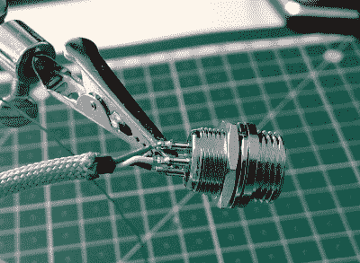

# 工匠 USB 电缆终极指南

> 原文：<https://hackaday.com/2019/09/04/the-ultimate-guide-to-artisan-usb-cables/>

如果你已经经历了制作自己定制的机械键盘的麻烦，你最不想做的事情就是用当地电子商店的普通 USB 电缆将其插入你的计算机。你的生产力，甚至生活，都依赖于那些 1 和 0 的清晰再现，只有高端 USB 电缆才有可能。做不到这一点是不负责任的。

 或者至少，如果我们试图出售由【Josef Adamík】制造的定制 USB 电缆，包装背面的广告会这么说[。但是，唉，他已经决定免费提供所有的细节，这样任何人都可以建立自己的令人愉快的过度设计的 USB 电缆。需要*中间带 GX12 航空接头的 paracord USB 线*吗？当然不是。但你还是想要一个，不是吗？](https://josef-adamcik.cz/electronics/need-a-usb-cable-build-on.html)

正如[约瑟夫]在他的博客中承认的，他在这里做的事情没有什么特别的。如果你能把电线拼接在一起，你就可以制作你自己定制的 USB 电缆。但吸引我们的是他的文章中的惊人细节。每一步都解释得很清楚，包括一张漂亮的、光线充足的照片来说明他在做什么。老实说，当将一些 USB 连接器焊接到电线上的文档看起来这么好时，没有理由为什么更多的实质性项目只得到一些模糊的镜头。

当然，即使对我们这些不熟悉烙铁的人来说，你也可以从这个项目中得到一些想法。我们特别喜欢他的建议，即在焊接 USB 连接器时将其固定在工作台上，而不是试图将其固定在老虎钳中，他用木制夹具和热风枪为电缆添加线圈的方法绝对值得存档以供将来使用。

话说回来，在这个时代，即使是最低端的 USB 电缆也可能是一个安全威胁，或者 T2 根本不符合公布的规格，自己动手可能不是一个坏主意。