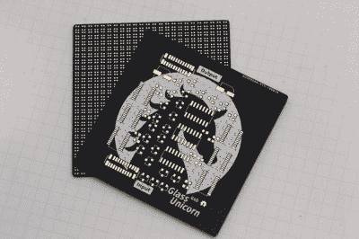

# 手工制作的 LED 立方体是一件艺术品

> 原文：<https://hackaday.com/2019/09/05/handmade-led-cube-is-a-work-of-art/>

我们看到各种各样的项目出现在 Hackaday 的新闻桌上。有时，它是一个精巧的制作，让我们对它简单的独创性放声大笑。其他时候，这是一个伟大的技巧和对细节的关注，带来了巨大的美感。[【Greg Davill】的 LED cube 稳稳就是后者](https://twitter.com/GregDavill/status/1166664600755924993)。

The matte black finish makes the artwork really pop. Note the matrix of tiny pads for the LEDs on the backside.

构建从定制的四层 PCB 开始，亚光黑色，带镀金焊盘。这是一个经典的配色方案，并为项目的其余部分设置了标准。[Greg]没有继续将一些商用微控制器连接到现成的面板上，而是走自己的路。每个 PCB 都有一个 24×24 的原始 LED 矩阵，直接焊接在背面。通过制造一个“哑”矩阵，与现在流行的智能弦相比，可以节省大量电流。

然后，这些面板被装入一个整洁的 3D 打印立方体中，内部空间用于运行节目的 FPGA 和电源。五个面板用双面胶带和螺丝固定，最后一个安装了磁铁，以便进入内部。整齐折叠的扁平柔性电缆被压入服务中，将所有东西连接起来。

这种构建表明，以自己的方式做事是有价值的，而且新方法并不总是胜过旧方法。从项目开始到结束，【Greg】仔细考虑了美学，建造了一个 LED 立方体，其简单性令人惊叹，其制作也非常漂亮。我们以前也看过[Greg]的作品——[手工焊接 BGA 跨越这些页面的情况并不常见](https://hackaday.com/2019/07/08/bga-hand-soldering-uses-tombstone-resistor-technique-demands-surgical-precision/)。休息后的视频。

> 😳[pic . Twitter . com/1 afw 3 luiy](https://t.co/1aqFw3LUiy)
> 
> —格雷格(@ GregDavill)[2019 年 9 月 2 日](https://twitter.com/GregDavill/status/1168357550523183105?ref_src=twsrc%5Etfw)