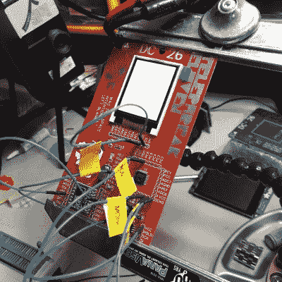

# 这些技巧使组装几百块印刷电路板变得更加容易

> 原文：<https://hackaday.com/2019/09/12/these-tips-make-assembling-a-few-hundred-pcbs-easier/>

任何承担数百块 PCB 组装任务的人都会重复一些常见的经验，但也有一些独特的见解。[DominoTree] [在为 DEFCON 26 制作了几百个电子徽章](https://spun.io/2018/12/15/lessons-from-running-a-small-scale-electronics-factory-in-my-guest-bedroom-part-1-design/)后，分享了他的收获(如果有人在跟踪的话，这是刚刚结束的那一个之前的一个)。)[DominoTree]收集了 200 多个 Telephreak 徽章，在结束时，他列出了一个清单，上面列有他希望在设计阶段就能实现的改进。

一些技巧显然是明智的，比如添加适当的调试和编程接口，或者在固件中加入有效的测试周期。其他的就不那么明显了，比如“在你的板上加几个洞”洞可以以意想不到的方式发挥作用，而且成本基本为零。即使电路板不会安装到任何东西上，几个孔也可以提供一种方法来连接夹具或其他硬件，如测试夹具。

【DominoTree】最终不得不在组装后连接多根跳线来重新编程电路板，并向我们保证“这样做一堆次真的很糟糕。”其他建议更普通，但同样重要，比如“尽可能减少步骤”当重复数百次时，几乎任何事情都会增加大量的时间。对于地下室黑客来说，预切割和预镀锡的电线可能看起来像是可耻的放纵。但是切割、剥离、镀锡、然后手工焊接一根电线，在第 400 次迭代中增加了大量的时间和精力(也就是说每个徽章有两根电源线)，即使有一根*没有*盯着迫近的最后期限。

[DominoTree]还跟进了关于简化组装的[附加建议](https://spun.io/2019/04/28/lessons-from-running-a-small-scale-electronics-factory-in-my-guest-bedroom-part-2-assembly/)。我们自己的[Brian Benchoff]也[分享了他对开发和组装大量](https://hackaday.com/2017/11/15/the-perils-of-developing-the-hackaday-superconference-badge/)[hack aday super conference](https://hackaday.com/2019/05/28/hackaday-superconference-tickets-and-proposals-are-live-right-now/)徽章的经验的观察，包括当不可避免的问题出现时如何让事情继续进行。

你不需要为了这些课程的回报而批量制作数百个，所以记住它们，并在你的下一个项目中实践它们。