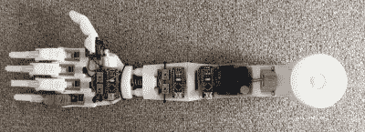
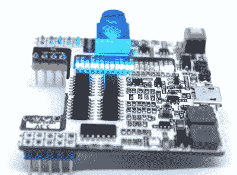

# 认识 2019 年 Hackaday 奖的 20 名决赛选手

> 原文：<https://hackaday.com/2019/09/10/meet-the-20-finalists-in-the-2019-hackaday-prize/>

Hackaday 奖是我们的全球工程计划，现已进入第六年。对于 2019 年，重点是产品开发:有了伟大的工程和工作原型，你还能坚持不懈地拥抱用户的需求，并确保该项目可以大量生产吗？整个春季和夏季，我们一直在关注数百人步入聚光灯下，与世界分享他们的项目。现在我们进入了最后阶段，这 20 名参赛者都试图赢得 125，000 美元的大奖。我们来看看吧！

下面列出了所有 20 名决赛选手(排名不分先后)。但只是为了好玩，我们想分享一些我们在这些决赛选手中看到的很酷的东西。

当我们说“技巧投篮”时，你可能会想到台球，但在这种情况下，我们谈论的是相机。 [PiXPi 是一款智能相机控制器](https://hackaday.io/project/166730-pixpi-dslr-camera-controller)。虽然常见的相机触发项目可以让你用遥控器拍照，根据声音触发或通过阻断红外光束来捕捉快速移动的物体，甚至定格闪电，但这款控制器旨在为所有摄影师提供一切。它有单独的端口来触发你的相机和两个闪光灯，多个传感器的输入，甚至可以连接到你的智能手机。项目页面很大，当你认为已经看到了它所提供的一切时，又有一个项目日志展示了另一个外围设计。这里有一个捕捉到了标志性的灯泡破碎。

 说起添加 smarts 的有趣方式，[这个义肢就能看出它要抓的是什么](https://hackaday.io/project/165075-3d-printed-prosthesis-with-cv-bci-and-emg)。通过在手掌中嵌入摄像头，它使用计算机视觉来识别物体并选择相关的抓握模式。还有许多其他功能，设计分为不同的模块，使其可重新配置，以满足多种需求。

 这些年来，我们已经看到了 EDA 工具中 3D 渲染功能的兴起，这个项目展示了这些工具的强大。在为试验板友好型台式电源进行至少八次不同设计迭代的过程中，[开放电源项目](https://hackaday.io/project/164913-open-power)制作了许多高端渲染图，以在扣下 PCB 和组件的扳机之前确切地看到电路板的样子。

你在这里看到的是真实的，而不是渲染的版本-1A 提供 3V，5V 和可调轨的锂电池支持的电源，带有可热插拔的 USB 充电。但是一定要看看 3C 版本，它有早期的原型，但目前仍在渲染中，因为该团队一直在努力开发具有彩色显示和逻辑分析仪和示波器功能的全功能 PSU。

所有 20 个竞争者都需要你的帮助。从现在起到 10 月 1 日，他们必须润色他们的作品，在我们的工程名人评委名单做出最终决定之前，展示他们最好的产品开发成果。进去看看每个项目是关于什么的，在这个过程中留下你有用的评论。Hackaday 奖是一场马拉松，但现在是冲刺结束的时候了。

## 2019 年 Hackaday 奖的二十名决赛选手:

*   [带有 CV、BCI 和 EMG 的 3D 打印假体](https://hackaday.io/project/165075-3d-printed-prosthesis-with-cv-bci-and-emg)
*   [开启硬件快速高分辨率激光器](https://hackaday.io/project/21933-open-hardware-fast-accurate-laser)
*   [克诺博](https://hackaday.io/project/166947-knobo)
*   波波机器人
*   DLT 一号——一个该死的 Linux 平板电脑！
*   [Weller RT 吸头用 USB-C-PD 焊接笔](https://hackaday.io/project/163827-usb-c-pd-soldering-pen-for-weller-rt-tips)
*   [PiXPi dslr 相机控制器](https://hackaday.io/project/166730-pixpi-dslr-camera-controller)
*   [展开空间](https://hackaday.io/project/163784-unfolding-space)
*   [DrumKid:任意鼓机](https://hackaday.io/project/164521-drumkid-aleatoric-drum-machine)
*   SmallKat:一只可爱的动态导向机器猫
*   如果——编码:这是小孩子的游戏！
*   [公理:100+kW 电机控制器](https://hackaday.io/project/164932-axiom-100kw-motor-controller)
*   [现场工具包](https://hackaday.io/project/26354-fieldkit)
*   [电子骰子](https://hackaday.io/project/28377-electronic-dice)
*   [黑鸟双足机器人](https://hackaday.io/project/160882-blackbird-bipedal-robot)
*   单倍体游戏
*   [直立激光竖琴](https://hackaday.io/project/167163-upright-laser-harp)
*   [uECG——一款非常小的可穿戴式 ECG](https://hackaday.io/project/164486-uecg-a-very-small-wearable-ecg)
*   [棱镜](https://hackaday.io/project/166859-prism)
*   [开启电源](https://hackaday.io/project/164913-open-power)

The [HackadayPrize2019](https://prize.supplyframe.com) is Sponsored by:     