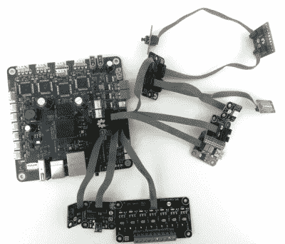

# Smoothieboard 为 V2 获得了一个雄心勃勃的更新

> 原文：<https://hackaday.com/2019/09/12/smoothieboard-gets-an-ambitious-update-for-v2/>

如果你阅读 Hackaday 已经有一段时间了，那么你很有可能已经看过一两个由 Smoothieboard 驱动的项目。开源控制器在 2013 年席卷了 Kickstarter，由于其强大的 32 位 ARM 处理器，它有望成为 CNC 的最终产品。从那时起，我们看到它不仅被用于 3D 打印机和激光切割机等显而易见的应用，还被用于机械臂和取放机器。如果它动了，很有可能你可以用滑板控制它。

但是在上市六年后，这个运动控制巨头背后的团队决定是时候更新换代了。Smoothieboard v2 的 Kickstarter 最近上线了，可能不出所料，已经超过了它的融资目标。该团队并没有简单地推出升级版的 Smoothieboard，而是针对不同的使用案例整合了几个“副产品”。如果 Smoothie v1 是 CNC 主板之王，那么 v2 的目标是成为皇室。

Smoothieboard v2-Prime with breakouts

最初主板的直接继任者被称为 v2-Prime，它是你在这样的更新中所期望的一切。更快的处理器、更多的 RAM、更多的闪存和改进的步进驱动器。还有可用的 GPIO 扩展端口来连接各种分线板，甚至还有一个插头供您插入 Raspberry Pi。如果你想把你现有的滑板机升级到最新最好的，最好的可能就是你想要的。

然后是 v2-Mini，旨在尽可能便宜，同时仍然提供 Smoothieboard 体验。Mini 的基本硬件规格与 Prime 相同，但使用了低端步进驱动器，并删除了更昂贵型号上的一些保护功能。对于基本的 3D 打印机或激光切割机来说，Mini 及其预计 80 美元的价格将是一个非常有吸引力的选择。

在另一个极端，我们有 v2-Pro，它旨在实现实验者的梦想。它具有更多步进驱动器、扩展端口，甚至集成 FPGA。实际上，这种板可能不会像其他两个版本那样受欢迎，但事实上，他们甚至已经制作了它，这表明该团队是如何致力于推动开源运动控制的信封。

[我们在 2013 年报道了最初的 Smoothieboard 活动](https://hackaday.com/2013/09/30/smoothieboard-the-be-all-end-all-cnc-controller/)看到了一些非常强烈的社区反应，评论从兴奋到不屑一顾不等。六年后，我们认为 Smoothieboard 背后的团队在黑客中赢得了尊重，我们非常兴奋地看到下一代硬件的发展方向。

 [https://www.youtube.com/embed/vGpA_oNiEmY?version=3&rel=1&showsearch=0&showinfo=1&iv_load_policy=1&fs=1&hl=en-US&autohide=2&wmode=transparent](https://www.youtube.com/embed/vGpA_oNiEmY?version=3&rel=1&showsearch=0&showinfo=1&iv_load_policy=1&fs=1&hl=en-US&autohide=2&wmode=transparent)

