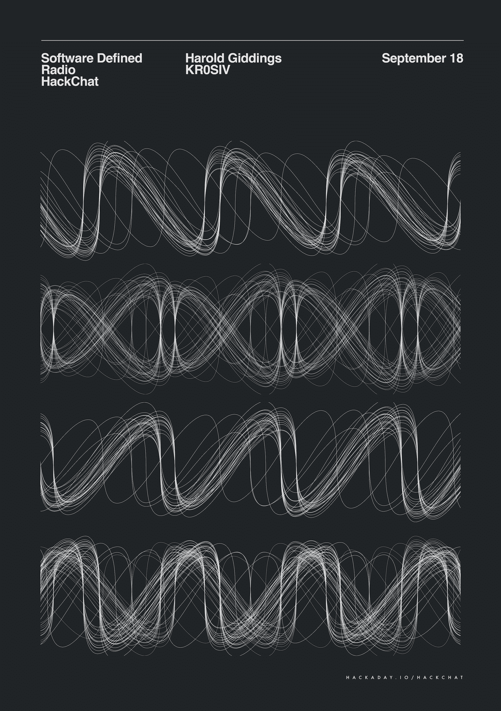

# 软件定义的无线电黑客聊天

> 原文：<https://hackaday.com/2019/09/16/software-defined-radio-hack-chat/>

加入我们太平洋时间 9 月 18 日星期三中午的[软件定义无线电黑客聊天](https://hackaday.io/event/167395-software-defined-radio-hack-chat)与[腐蚀剂](https://hackaday.io/hacker/31596-kr0siv)！

如果你对电子产品感兴趣的时间很短，那么你很可能已经拥有了至少一台软件无线电。从最初用于在笔记本电脑上观看数字电视的廉价加密狗，到 HackRF 等专门构建的具有传输能力的无线电游乐场，SDR 已经开展了大量的 RF 实验。在 SDR 出现之前，频段或模式的每次改变都需要新的硬件；今天，启动一个新项目就像在屏幕上拖拽几个街区一样简单，而可以监控大范围无线电频谱中最微弱信号的 SDR 已经成为各地逆向工程师的福音。

腐蚀剂是 Harold Giddings 的手柄，业余呼号 KR0SIV，他已经大规模进入 SDR。他的博客、[他的 YouTube 频道](https://www.youtube.com/user/pspheaven/videos)和他的播客都打着[信号无处不在](https://signalseverywhere.com/)的旗号，他已经覆盖了 SDR 社区。无论是卫星通信、飞机跟踪、业余无线电，甚至是监听铁路运营，Harold 都尝试过，并且有丰富的 SDR 智慧可以分享。加入我们，讨论 SDR 生态系统的状态，为您的应用购买哪种 SDR，甚至如何使用 SDR 进行传输(提示:您可能需要一个 [ham 许可证](https://hackaday.com/2019/03/08/the-50-ham-getting-your-ticket-punched/))。)

 我们的黑客聊天是 [Hackaday.io 黑客聊天群发消息](https://hackaday.io/messages/room/2369)中的社区直播活动。本周，我们将于太平洋时间 9 月 18 日星期三中午 12:00 坐下来讨论。如果时区让你烦恼，我们有[一个方便的时区转换器](https://www.timeanddate.com/countdown/generic?iso=20190918T12&p0=224&msg=Software+Defined+Radio+Hack+Chat&font=cursive)。

点击右边的那个发言气泡，你会被直接带到 Hackaday.io 上的黑客聊天群，不用等到周三；随时加入，你可以看到社区在谈论什么。

