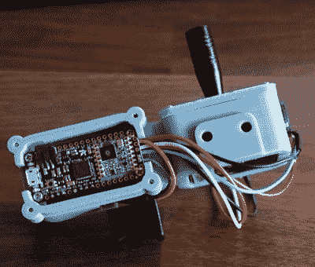

# 用于远程机器人的手持式 LoRa 操纵杆

> 原文：<https://hackaday.com/2019/09/11/handheld-lora-joystick-for-long-range-bots/>

想要一个简单的工具来帮助开发 LoRa 控制的机器人项目， [[Jay Doscher]基于 900 MHz Adafruit Feather M0 组装了这个非常光滑的单手控制器](https://www.thingiverse.com/thing:3839282)。它有一个触发器和一个微型模拟操纵杆，是一个相当简单的输入设备，但应该足以测试你可能会发现自己正在工作的任何移动小工具的基本功能。

 这个项目的布线和你想象的一样简单，触发器和操纵杆挂在羽毛的数字端口上。CircuitPython 代码也非常简单明了，尽管[Jay]说将来他可能会对其进行一些扩展以支持 LoRaWAN。该控制器被设计为一个准系统诊断工具，但其当前形式的硬件和软件提供了一个在已知良好的基础上增加额外功能的绝佳机会。

一切都保存在一个设计非常好的 3D 打印外壳中，这是[Jay]在他的 ELEGOO Mars 上运行的，这是一种新型的低成本树脂 3D 打印机。这台机器可能很便宜，但结果是不言自明的。虽然树脂印刷肯定有其缺点，但很难不对这种外壳的表面质量印象深刻。

虽然 LoRa 通常用于远距离传输少量信息，如来自远程传感器的信息，但这并不是我们第一次看到它用于直接控制移动物体。如果你对 LoRa 还不熟悉，可以看看这个来自[Reinier van der Lee]的[精彩演讲，它讲述了该技术的基础知识](https://hackaday.com/2018/10/25/vinduino-water-smart-farming-now-with-lora/)以及他如何用它来建立一个社区传感器网络。