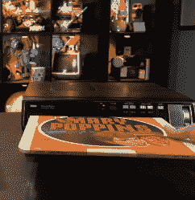

# RCA 创建视频记录太晚了

> 原文：<https://hackaday.com/2019/09/14/rca-created-video-records-too-late/>

很容易找到技术成功的故事:个人电脑、DVD 和手机都是有据可查的故事。然而，要找到那些没有按计划起飞的事情背后的故事就有点难了。俗话说，“成功有许多父母，但失败是孤儿。”[Technology Connections]有一个关于 RCA 命运多舛的 SelectaVision 视频光盘系统的精彩视频。你可以在下面看到视频的第一部分。

美国无线电公司在 20 世纪 60 年代就开始研究这个系统，如果他们能更早一点把它推向市场，它可能会大获全胜。毕竟，在录像机出现之前，我们大多数人只能在电视播放的时候观看，别无选择。你不能录制东西或流式传输东西，如果你没有及时赶回家看《星际迷航》，你只是错过了那一集，并希望如果他们在夏天重播的话，你会更幸运。这在今天似乎很难想象，但像 SelectaVision 这样的产品在它是唯一选择的时候可能会真正流行起来。当然，问题是他们太晚才把它推向市场。该视频还指出，该系统包含了太多的技术妥协。

关于 RCA 和它与无线电交流发电机的渊源有很多历史。你可以快速通过这一部分，然后你就可以上一堂关于[留声机唱片](https://hackaday.com/2017/03/28/retrotechtacular-stereo-records/)如何工作的课。毕竟，RCA 的概念是创造一个视频唱机。当然，技术上的挑战是，一台录音机只需要大约 20 千赫的带宽。一台录像机必须容纳数百倍的数据量。SelectaVision 系统在大碟的每一面都保存了约 60 分钟的 3 MHz 视频。

 从 1964 年开始，到 1972 年，他们意识到他们不能使用标准的黑胶唱片，即使使用易碎的金属化光盘，他们也只能保存大约 10 分钟的视频。到 1981 年，他们已经有了每面可以放一个小时的光盘架。你不得不为这个播放器支付 500 美元——相当于今天的 1500 美元。很贵，但许多读者会为一个科技产品付那么多钱。这些光盘大约 20 美元。

当然，问题是录像机虽然更贵，但有四小时的磁带，而且从 20 世纪 70 年代末就有了。不出所料，RCA 甚至有自己的录像机系列，名为 SelectaVision。人们能够在录像机上录制，这更有意义，尤其是因为并非所有东西都有预先录制的选项。

如果你想直接跳到拆卸，滑到 15 分钟左右。玩家不是很复杂。它只不过是一台转速为 450 转、带有特殊拾音器的唱机。该拾音器使用钛电极来测量导电盘和拾音器电极之间的电容变化。这些圆盘是聚氯乙烯制成的，含碳导电。凹槽的深度控制着电容，播放器用它来产生视频信号。

如果你记得记录，他们很容易卡住，需要一个很好的快速踢。玩家实际上可以用电磁铁踢自己，因为这确实经常发生。许多光盘老化得不好。

我们期待着第二部分，这是由于现在任何一天。现在，如果你不介意有非常短的视频，你[有其他选择](https://hackaday.com/2018/10/01/vinylvideo-is-literally-video-on-vinyl/)。如果你认为家庭录像之路很容易，[再想想](https://hackaday.com/2016/09/05/retrotechtacular-home-video-recording/)。

 [https://www.youtube.com/embed/PnpX8d8zRIA?version=3&rel=1&showsearch=0&showinfo=1&iv_load_policy=1&fs=1&hl=en-US&autohide=2&wmode=transparent](https://www.youtube.com/embed/PnpX8d8zRIA?version=3&rel=1&showsearch=0&showinfo=1&iv_load_policy=1&fs=1&hl=en-US&autohide=2&wmode=transparent)

