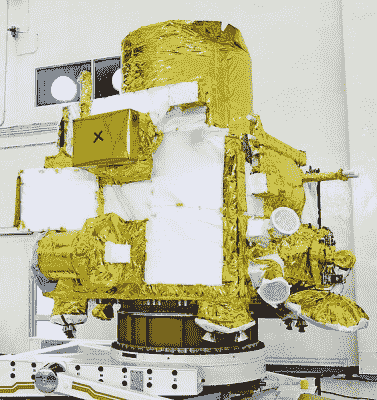
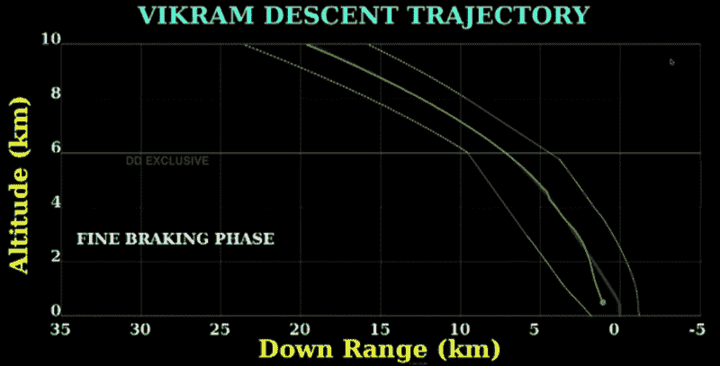

# 印度的登月任务远未结束

> 原文：<https://hackaday.com/2019/09/17/indias-moon-mission-is-far-from-over/>

简而言之，印度的月船 2 号登月计划雄心勃勃。这项任务于 7 月 22 日从萨迪什·达万航天中心发射升空，希望能够同时向我们最近的天体邻居运送一个轨道飞行器、着陆器和漫游车。发射和飞往月球的过程一帆风顺，虽然肯定有一些紧张的时刻，但飞船最终将自己送入了稳定的月球轨道，并释放了自由飞行的着陆器，以便它可以开始独立的任务。

不幸的是，就在维克拉姆号着陆器着陆前几秒钟，一个异常发生了。在这一点上，印度空间研究组织(ISRO)仍然不知道到底发生了什么，但根据来自着陆器的实时遥测流，一些人推测飞行器在距离表面 3 到 4 公里的地方开始翻滚或变得不稳定。

Telemetry indicates a suboptimal landing orientation

事实上，在一个短暂的瞬间，遥测显示器实际上显示了*维克拉姆*着陆器完全倒置，发动机似乎在加速航天器向月球表面移动。目前还不清楚这是对着陆器在撞击前最后时刻方向的准确描述，还是实时显示中的一个小故障，但当你的飞行器距离着陆只有几秒钟时，这肯定不是你想看到的。

但是对于月船 2 号来说，故事并没有到此结束。这项任务的大部分科学目标总是由轨道飞行器本身来完成。当然,*维克拉姆*着陆器上有许多科学载荷，甚至还有它带到地表的*普拉吉安*漫游者，但它们充其量只是次要目标。ISRO 充分意识到在月球上软着陆的困难，并相应地计划了他们的任务目标。

与其为“维克拉姆号”和“T2 号”的毁灭感到悲伤，不如让我们看看“月船 2 号”轨道飞行器上的科学硬件，以及仍然摆在它面前的长期任务。

## 长期目标

Chandrayaan-2 轨道飞行器是 ISRO 在 2008 年 Chandrayaan-1 任务中发射到月球的航天器的进化版本。682 公斤(1504 磅)的飞行器比你的普通中型汽车稍长，设计用于一年的名义任务长度。但是考虑到飞船被精确地放置在绕月 100 公里的极地轨道上，任务规划者现在希望飞船能够在更长的时间内保持稳定，也许比最初估计的时间多六年。

Chandrayaan-2 Orbiter

虽然轨道飞行器负责将维克拉姆号着陆器带到月球，但这从来不是它的主要目标。[根据 ISRO 主席 Kailasavadivoo Sivan](https://timesofindia.indiatimes.com/india/orbiter-will-have-a-lifespan-of-7-5-years-its-possible-to-find-vikram-lander-from-orbiter-isro-chief/articleshow/71028078.cms) 的说法，该任务大约 90-95%的科学目标总是由轨道飞行器本身完成。着陆器和漫游车的损失无疑是不幸的，但对整个任务成功的影响被认为是最小的。

有点讽刺的是，轨道飞行器上的科学仪器已经被很好地用于寻找表面上的维克拉姆着陆器。轨道飞行器上最重要的设备之一是轨道飞行器高分辨率相机(OHRC)，它能够达到每像素 30 厘米的分辨率；在解析表面细节的能力方面，略胜美国宇航局的月球勘测轨道飞行器一筹。

该轨道飞行器还带有地形测绘相机-2 (TMC-2)，这是一种 3D 成像仪，将创建月球表面的详细高度图。结合轨道飞行器的地面穿透合成孔径雷达和 X 射线光谱仪收集的数据，Chandrayaan-2 将能够创建一个月球地图，不仅可以精确定位潜在的地下水冰沉积，还可以为未来的着陆计划提供必要的地形细节。

表面扫描和测绘将是 Chandrayaan-2 开始其扩展任务的主要优先事项之一，但它也将在月球稀薄且基本上未经探索的大气层中进行科学研究。轨道器上的四极质量分析器将分析外逸层的成分，还有一个无线电实验来研究电离层的电子密度。

## 决定维克拉姆的命运

虽然目前还没有向公众发布任何图像，但 ISRO 已经证实，月船 2 号轨道飞行器上的高分辨率相机能够定位表面的维克拉姆号着陆器。分辨率为 0.3 米/像素，2.54 米宽的着陆器在图像中只会显示为一个小斑点，但显然这足以让该机构确定[该飞行器似乎完好无损，并处于一个角度](https://timesofindia.indiatimes.com/india/isro-not-losing-hope-continues-to-make-all-out-efforts-to-restore-link-with-lander-vikram/articleshow/71045854.cms)。有鉴于此，ISRO 号目前正试图与*号维克拉姆*号取得联系，希望它能在硬着陆中幸存下来。

Plot of Vikram’s trajectory, note deviation below 2 km.

可以肯定的是，*维克拉姆*对他们的欢呼做出回应的可能性极小。一些估计指出，潜在的撞击速度超过每秒 100 米，即使车辆的防撞结构能够吸收这么多能量，内部仪器的损坏也可能是灾难性的。除了撞击过程中遭受的损坏，着陆器没有保持水平的简单事实就足以使通信变得复杂。天线对准是一项微妙的操作，航天器方位的意外变化[很容易阻止它与地面控制建立联系](https://hackaday.com/2018/08/28/martian-dust-storm-may-spell-doom-for-rover/)。

无论如何，时间紧迫。着陆器在月球表面的着陆计划与太阴日的开始相一致，这是为期两周的时间，太阳在地平线以上足够高，可以为飞船提供热量和电力。一旦光线变暗，温度骤降，维克拉姆的生存机会实际上为零。如果潜在的[太空探索历史上最伟大的回归故事之一](https://hackaday.com/2018/07/31/kepler-nears-end-of-epic-journey/)将要发生，它需要很快发生。