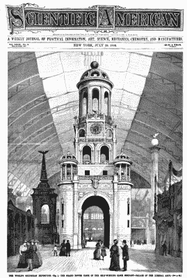
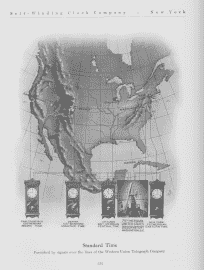
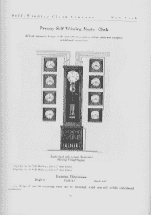
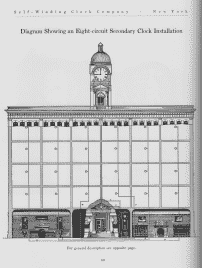
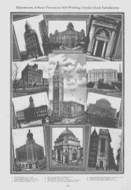
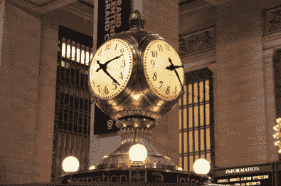
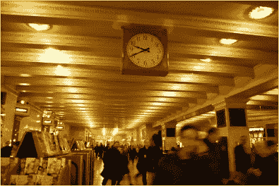
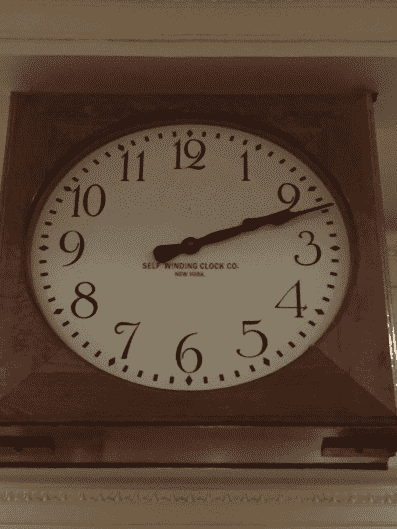
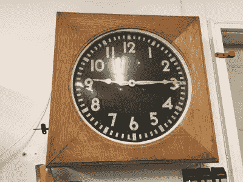

# 100 岁的原子钟

> 原文：<https://hackaday.com/2019/09/25/100-year-old-atomic-clock/>

多亏了 GPS 和 WWVB，精确时间如今无处不在。甚至你的 Macbook 或智能手机显示的时间也与 [NIST-F1](https://www.nist.gov/pml/time-and-frequency-division/primary-standard-nist-f1) 时钟同步，这是一个铯喷泉原子钟(又名“原子钟”)，是全球原子钟联盟的一部分，名为协调世界时(UTC)。没有精确的时间，火车就会相撞，市场会崩溃，学校不会准时开学，飞机会从天上掉下来。

但是在 19 世纪的蒸汽、黄铜和螺线管时代，精确计时是如何实现的呢？第一批精确计时系统之一通过使用自动上链时钟公司设计的特殊时钟，保持火车安全准时运行，敲响学校的钟声，并保持市场交易。通过美国海军天文台对天体的测量，以及西部联合电报网络广播的时间同步脉冲，该系统在我们的火车系统速度快于我们时钟精度的时代，在美国各地同步时间。

这些钟设计得如此之好，以至于许多钟仍然存在并正常工作。其中一个有 100 年历史的自动上弦钟出现在了我的工作台上。我做了任何好奇的黑客都会做的事情，弄清楚了同步是如何工作的，并以原子精度将其连接到一个时钟源。我们来看看吧！

## 超前的时钟同步

Self Winding Clock Company, Grand Tower Clock, displayed at the Palace of Liberal Arts at the 1893 Columbian Exposition, image from [Scientific American, July 29, 1893](https://archive.org/details/scientific-american-1893-07-29).

在 1893 年的哥伦比亚博览会上，世界发生了变化。电力时代到来，成千上万的灯泡装饰着建筑物，交流电赢得了电流之战，一个横跨整个美国的精确同步时钟系统由[自动上弦时钟公司](https://en.wikipedia.org/wiki/Self_Winding_Clock_Company)推出。

华盛顿 DC 的美国海军天文台提供日常精确计时，该天文台将测量水星或金星的太阳凌日，以同步天文台的主时钟(有三个主时钟来检查其他主时钟)。这是整个美国的主时钟。这个官方时间被传送到西联，以便通过西联网络再传送到地区和地方办事处。

时间同步脉冲将在“整点”从本地西联局每小时一次发送给预订了同步服务的客户。每个客户每月为每个自动上弦时钟支付 1.25 美元——一些用户只会同步一个时钟，但也有整栋建筑、办公室、工厂、学校和火车站都连接到这项服务。

下面的框图显示了从西联汇款接收同步信号的主时钟。通过精确的定时，主时钟控制多个辅助时钟。

  US Naval Observatory transmitting the time standard via Western Union (image from Self-Winding Clocks as Manufactured by the Self-Winding Clock Company. 1908, Brooklyn, NY.      

辅助时钟是电子中继器，它使用电磁螺线管简单地重复主时钟上显示的时间，每 30 秒更新一次钟面上显示的时间。在大规模安装中可以使用任意数量的辅助时钟。这个时钟系统及其精确计时服务非常受欢迎。下图展示了自 1908 年以来许多自动上弦时钟装置的杰出范例。

## 你可能见过这些自动上弦的钟

虽然西部联盟时间服务在 20 世纪 60 年代就结束了，但是自动上弦钟仍然在全国各地使用，[包括纽约中央车站的几个:](https://cityroom.blogs.nytimes.com/2011/03/25/a-clock-moves-in-grand-central-and-memories-stir/?mtrref=www.google.com&gwh=1E0A919DCCD7BD06AFD2C7B76758E3BF&gwt=pay&assetType=REGIWALL)

  Self Winding Clock Company clocks at Grand Central in NYC    

在外观上类似于纽约中央车站的橡木钟，我很幸运地从我的一个朋友那里得到了一个自动上弦的钟。我的另一个朋友，[拉里·麦格林](https://www.spaceartifactsarchive.com/)，根据序列号帮我确定了这场运动的时间，从 1910 年到 1930 年。所以我认为这是一个有 100 年历史的钟。

通常，当我得到一个旧钟时，我会花一些时间认真修理。这意味着拆卸、清洗、上油，然后重新组装整个机芯，让它像新的一样工作。我在这里很幸运，因为乔希已经维修了机芯，而且运转得很好。但在运动开始后，它在一小时内死亡。这很奇怪，通常摆式挂钟在风中可以持续 8 天，我当然希望它在如此强劲的开始后可以持续一个多小时。

事实证明，这是一个功能，而不是一个错误。我了解到，在时钟停止之前，这个时钟机芯的主发条盒只能支持 1 小时的输出。它使用电池电源自动上弦，并故意只在主发条上施加一小时的张力，以保持齿轮系上的扭矩一致，从而保持精度并最大限度地减少枢轴磨损。它在风的作用下只能运行一个小时。

## 自动上弦时钟的工作原理

它是这样工作的:这个钟上紧发条，运行大约一个小时。一个小时后，一个凸轮闭合电路，打开自动上弦马达，马达给主弹簧上弦，直到另一个凸轮关闭马达。卷绕张力保持约 1 小时，然后整个过程重新开始。

这不是一个有电刷和定子的旋转电机。相反，它是一对螺线管，通过推动齿轮的爪齿轮来拉动杠杆臂。一旦杠杆臂被螺线管抬起，与螺线管的电气连接就被断开，导致杠杆臂立即再次回落。这种动作以类似千斤顶锤子的动作不断重复，缠绕主发条，直到主发条上的开关停止马达。突突突突。

 [https://www.youtube.com/embed/Fi_VQJGgy1A?version=3&rel=1&showsearch=0&showinfo=1&iv_load_policy=1&fs=1&hl=en-US&autohide=2&wmode=transparent](https://www.youtube.com/embed/Fi_VQJGgy1A?version=3&rel=1&showsearch=0&showinfo=1&iv_load_policy=1&fs=1&hl=en-US&autohide=2&wmode=transparent)

使用一对串联的 1.5V 干电池，这个时钟在电池耗尽之前至少可以工作一年。有趣的是，现代的 D-细胞在功能上等同于旧的干电池，所以一对 D-细胞可以工作一年。

这款钟表机芯的工程师本可以使用带电刷的 DC 电机，但他们选择了这款电机。我只能猜测，为了长期可靠性，决定使用这种电机架构。我可以告诉你，我的马达已经 100 岁了，仍然工作可靠。相比之下，我发现即使是 75 年前的军用规格有刷 DC 电机也需要非常小心才能让它们再次旋转。

## 用 GPS 同步一个 100 年前的钟

有一段时间，我订阅了 Hackerboxes，强迫自己学习如何使用 Ardunio 和其他易于使用的嵌入式控制器。其中一个项目叫做[‘时钟’](https://www.instructables.com/id/HackerBoxes-0008-Clockwork/)，包括一个 GPS 模块。我写了一个简单的草图，将 GPS 时间输入到 7 段显示器中，[将所有这些放在一起](https://youtu.be/5STQnJ31yWM)到一个漂亮的项目框中，产生了这个 Arduino 控制的 GPS 时钟，它覆盖了两个时区并显示 GMT。

这个 Arduino-GPS 时钟在控制我 100 岁的自动上发条时钟同步螺线管时派上了用场。为了同步自宽时钟，我添加了一个中继板，并写了一个草图来模拟西部联盟时间协议，从而使大时钟与 GPS 同步。这个协议很简单，J. Alan Bloore 在这个视频中做了很好的描述。在整点时，一个 3 伏脉冲被发送到同步电磁阀，持续时间不到 1 秒钟。同步电磁阀随后将分针直接拉至 12 点位置。

我选择使用 5V 脉冲给它额外的扭矩，并决定让脉冲持续 500 毫秒。我整理了整个项目的视频概览。如果你想跳到我的时钟与全球定位系统同步的演示，开始大约 14 分钟的视频。

 [https://www.youtube.com/embed/mnDY7ecgLmw?version=3&rel=1&showsearch=0&showinfo=1&iv_load_policy=1&fs=1&hl=en-US&autohide=2&wmode=transparent](https://www.youtube.com/embed/mnDY7ecgLmw?version=3&rel=1&showsearch=0&showinfo=1&iv_load_policy=1&fs=1&hl=en-US&autohide=2&wmode=transparent)

## 经过近一年的运行

每小时都会有一种类似缝纫机的轧轧声，这是自动上弦的动作。在每个小时的开始，会有一个响亮而令人满意的沉闷金属声，这是同步螺线管将分针拉到位的声音。如果我把我的 R390A 通讯接收器调到 10 兆赫，那么沉闷金属声就会和整点时从 WWV 传来的长哔哔声同时发生。所有这些都为我们的房客带来了令人印象深刻的钟表演示。

该时钟在 2018 年新年之前重新投入持续服务，并继续提供可靠准确的服务，至今没有发生任何事故。它不仅用作商店的时钟，我还用它来同步我摆弄的各种其他[钟表](https://hackaday.com/2018/11/28/collecting-repairing-and-wearing-vintage-digital-watches/)。

我很乐意在下面的评论中听到你们中有自己的自动上链钟的人的意见。如果你对精确计时感兴趣，那么我建议你加入这个电子邮件列表。在这里，您将收到大量关于精确测量时间、振荡器频率、振荡器漂移、相位噪声和许多其他主题的电子邮件讨论。